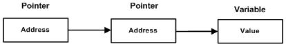

# 概括
```c++
int *p    //声明指针变量
int i      //声明变量
int temp //声明变量temp
p=&i    //&为取地址符，获取变量i的地址
temp = *p   //获取地址p的值
```
<!--more-->
# 指针的声明
```c++
int    *ip;    /* 一个整型的指针 */
double *dp;    /* 一个 double 型的指针 */
float  *fp;    /* 一个浮点型的指针 */
char  *ch;    /* 一个字符型的指针 */
int  *ptr = NULL;   /* 声明空的指针 */
```
# 指针的算术运算
指针是一个用数值表示的地址。因此，您可以对指针执行算术运算。可以对指针进行四种算术运算：++、--、+、-。假设 ptr 是一个指向地址 1000 的整型指针，是一个 32 位的整数，让我们对该指针执行下列的算术运算：
```c++
#include <iostream>
using namespace std;

int main()
{
	//
	int *ptr;
	int a;

	ptr = &a;

	// 输出返回值
	cout << "&a是：" << &a << endl;
	cout << "ptr：" << ptr << endl;
	cout << "ptr++：" << ptr++ << endl;
	cout << "ptr：" << ptr << endl;
	cout << "++ptr：" << ++ptr << endl;

	return 0;
}
```
在执行完上述的运算之后，ptr 将指向位置 1004，因为 ptr 每增加一次，它都将指向下一个整数位置，即当前位置往后移 4 个字节。这个运算会在不影响内存位置中实际值的情况下，移动指针到下一个内存位置。如果 ptr 指向一个地址为 1000 的字符，上面的运算会导致指针指向位置 1001，因为下一个字符位置是在 1001。
```C++
&a是：007FFDB0
ptr：007FFDB0
ptr++：007FFDB0
ptr：007FFDB4
++ptr：007FFDB8
```

# 指针数组
一个数组，数组的数据类型为指针
## 示例一
```c++
#include <stdio.h>

const int MAX = 3;

int main()
{
    int  var[] = { 10, 100, 200 };    //数组
    int i, *ptr[MAX];                 //指针数组

    for (i = 0; i < MAX; i++)
    {
        ptr[i] = &var[i];             /* 将var元素的地址赋值给对应的ptr */
    }
    for (i = 0; i < MAX; i++)
    {
        printf("Value of *ptr[%d] = %d\n", i, *ptr[i]);     //打印*ptr的值,ptr存储的地址所指向的值
    }

    for (i = 0; i < MAX; i++)
    {
        printf("Value of var[%d] = %d\n", i, var[i]);       //打印var数组的值
    }

    for (i = 0; i < MAX; i++)
    {
        printf("Value of ptr[%d] = %d\n", i, ptr[i]);       //打印ptr的值,ptr存储的地址
    }


    return 0;
}
```

- 输出
```c++
Value of *ptr[0] = 10
Value of *ptr[1] = 100
Value of *ptr[2] = 200
Value of var[0] = 10
Value of var[1] = 100
Value of var[2] = 200
Value of ptr[0] = 19921128
Value of ptr[1] = 19921132
Value of ptr[2] = 19921136
```
## 示例二
```c++
#include <stdio.h>

const int MAX = 4;

int main ()
{
  char *names[] = {
                  "Zara Ali",
                  "Hina Ali",
                  "Nuha Ali",
                  "Sara Ali",
  };
  int i = 0;

  for ( i = 0; i < MAX; i++)
  {
      printf("Value of names[%d] = %s\n", i, names[i] );
  }
  return 0;
}
```

- 输出
```c++
Value of names[0] = Zara Ali
Value of names[1] = Hina Ali
Value of names[2] = Nuha Ali
Value of names[3] = Sara Ali
```
# 指针的指针——二级指针
**二级指针作为函数参数的作用:在函数外部定义一个指针p，在函数内给指针赋值，函数结束后对指针p生效，那么我们就需要二级指针。**


```c++
#include<iostream>
using namespace std;

int a = 10;
int b = 100;
int *q;
void func(int *p)
{
	cout << "func:&p(p的地址)=" << &p << ",p(p指向的地址)=" << p << endl;  //note:3
	p = &b;
	cout << "func:&p(p的地址)=" << &p << ",p(p指向的地址)=" << p << endl;  //note:4
}
int main()
{
	cout << "&a(a的地址)=" << &a << ",&b(b的地址)=" << &b << ",&q(q的地址)=" << &q << endl;  //note:1
	q = &a;
	//q指向的地址为&a ,q=&a;q 指向地址的取值 即a; &q为指针q的取值
	cout << "*q(指向地址的取值)=" << *q << ",q(指向的地址)=" << q << ",&q(q的地址)=" << &q << endl;  //note:2
	func(q);  //p与q指向同一个地址，但是p与q为不同的指针，所以p=q但是&p不封于&q
	cout << "*q=" << *q << ",q=" << q << ",&q=" << &q << endl;  //note:5
	system("pause");
	return 0;
}
```
- 输出
```c++
&a(a的地址)=00C3F000,&b(b的地址)=00C3F004,&q(q的地址)=00C3F364
*q(指向地址的取值)=10,q(指向的地址)=00C3F000,&q(q的地址)=00C3F364
func:&p(p的地址)=008FFC80,p(p指向的地址)=00C3F000
func:&p(p的地址)=008FFC80,p(p指向的地址)=00C3F004
*q=10,q=00C3F000,&q=00C3F364
```
# 传递指针给函数
```c++
#include <stdio.h>

/* 函数声明 */
double getAverage(int *arr, int size);

int main ()
{
  /* 带有 5 个元素的整型数组  */
  int balance[5] = {1000, 2, 3, 17, 50};
  double avg;

  /* 传递一个指向数组的指针作为参数 */
  avg = getAverage( balance, 5 ) ;

  /* 输出返回值  */
  printf("Average value is: %f\n", avg );

  return 0;
}

double getAverage(int *arr, int size)
{
  int i, sum = 0;
  double avg;

  for (i = 0; i < size; ++i)
  {
    sum += arr[i];
  }

  avg = (double)sum / size;

  return avg;
}
```
# 从函数返回指针
函数返回数组
```c++
#include <stdio.h>
#include <time.h>
#include <stdlib.h>

/* 要生成和返回随机数的函数 */
int * getRandom( )
{
  static int  r[10];
  int i;

  /* 设置种子 */
  srand( (unsigned)time( NULL ) );
  for ( i = 0; i < 10; ++i)
  {
      r[i] = rand();
      printf("%d\n", r[i] );
  }

  return r;
}

/* 要调用上面定义函数的主函数 */
int main ()
{
  /* 一个指向整数的指针 */
  int *p;
  int i;

  p = getRandom();
  for ( i = 0; i < 10; i++ )
  {
      printf("*(p + [%d]) : %d\n", i, *(p + i) );
  }

  return 0;
}
```
- 输出
```C++
1523198053
1187214107
1108300978
430494959
1421301276
930971084
123250484
106932140
1604461820
149169022
*(p + [0]) : 1523198053
*(p + [1]) : 1187214107
*(p + [2]) : 1108300978
*(p + [3]) : 430494959
*(p + [4]) : 1421301276
*(p + [5]) : 930971084
*(p + [6]) : 123250484
*(p + [7]) : 106932140
*(p + [8]) : 1604461820
*(p + [9]) : 149169022
```
# 函数指针
通常我们说的指针变量是指向一个整型、字符型或数组等变量，而函数指针是指向函数。
```c++
#include<iostream>
using namespace std;

/* 要生成和返回随机数的函数 */
int *getRandom()
{
	static int  r[10];
	int i;

	/* 设置种子 */
	srand((unsigned)time(NULL));
	for (i = 0; i < 10; ++i)
	{
		r[i] = rand();
		printf("%d\n", r[i]);
	}

	return r;
}

#include <stdio.h>

int max(int x, int y)
{
	return x > y ? x : y;      //如果x>y，返回x否则返回y
}

int main(void)
{
	/* p 是函数指针 */
	int(*p)(int, int) = &max; // &可以省略
	int a, b, c, d;

	cout << "请输入三个数字:" <<endl;
	cin >> a >> b >> c;

	/* 与直接调用函数等价，d = max(max(a, b), c) */
	d = p(p(a, b), c);

	printf("最大的数字是: %d\n", d);

	return 0;
}
```
# 回调函数
函数指针作为某个函数的参数，函数指针变量可以作为某个函数的参数来使用的，回调函数就是一个通过函数指针调用的函数。简单讲：回调函数是由别人的函数执行时调用你实现的函数。
```c++
#include<iostream>
using namespace std;

// 回调函数
void populate_array(int *array, size_t arraySize, int(*getNextValue)(void))
{
	for (size_t i = 0; i<arraySize; i++)
		array[i] = getNextValue();
}

// 获取随机值
int getNextRandomValue(void)
{
	return rand();
}

int main(void)
{
	int myarray[10];
	populate_array(myarray, 10, getNextRandomValue);
	for (int i = 0; i < 10; i++) {
		cout << myarray[i] << endl;
	}

	return 0;
}
```
