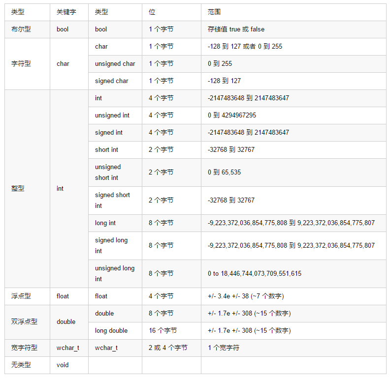

# 数据类型

<!--more-->
# 初始值
数据类型 | 初始化默认值
-|-
int | 0
char | '\0'
float | 0
double | 0
pointer | NULL

# typedef 声明
例如，下面的语句会告诉编译器，feet 是 int 的另一个名称：
```C++
typedef int feet;
```

# 枚举类型
枚举类型(enumeration)是C++中的一种派生数据类型，它是由用户定义的若干枚举常量的集合。

如果一个变量只有几种可能的值，可以定义为枚举(enumeration)类型。所谓"枚举"是指将变量的值一一列举出来，变量的值只能在列举出来的值的范围内。

创建枚举，需要使用关键字 **enum**。枚举类型的一般形式为：
```C++
enum 枚举名{
     标识符[=整型常数],
     标识符[=整型常数],
...
    标识符[=整型常数]
} 枚举变量;
```
如果枚举没有初始化, 即省掉"=整型常数"时, 则从第一个标识符开始。

例如，下面的代码定义了一个颜色枚举，变量 c 的类型为 color。最后，c 被赋值为 "blue"。
```C++
enum color { red, green, blue } c;
c = blue;
```
默认情况下，第一个名称的值为 0，第二个名称的值为 1，第三个名称的值为 2，以此类推。但是，您也可以给名称赋予一个特殊的值，只需要添加一个初始值即可。例如，在下面的枚举中，green 的值为 5。
```C++
enum color { red, green=5, blue };
```
在这里，blue 的值为 6，因为默认情况下，每个名称都会比它前面一个名称大 1，但 red 的值依然为 0。

# C++ 中的左值（Lvalues）和右值（Rvalues）

C++ 中有两种类型的表达式：

- 左值（lvalue）：指向内存位置的表达式被称为左值（lvalue）表达式。左值可以出现在赋值号的左边或右边。
- 右值（rvalue）：术语右值（rvalue）指的是存储在内存中某些地址的数值。右值是不能对其进行赋值的表达式，也就是说，右值可以出现在赋值号的右边，但不能出现在赋值号的左边。

变量是左值，因此可以出现在赋值号的左边。数值型的字面值是右值，因此不能被赋值，不能出现在赋值号的左边。下面是一个有效的语句：
···C++
int g = 20;
···
