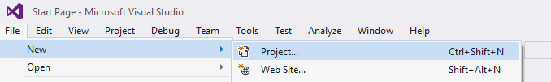
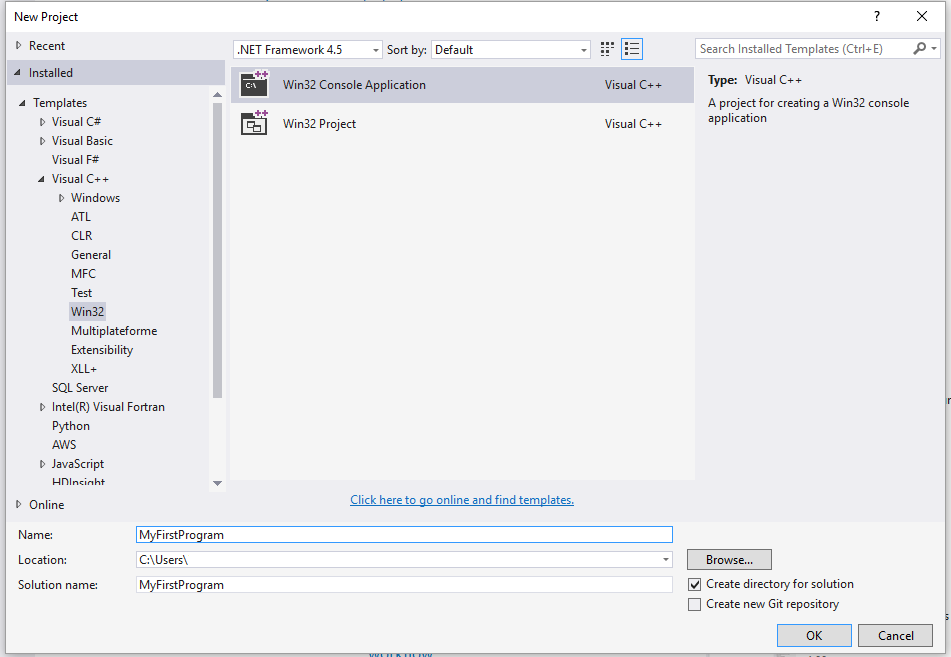
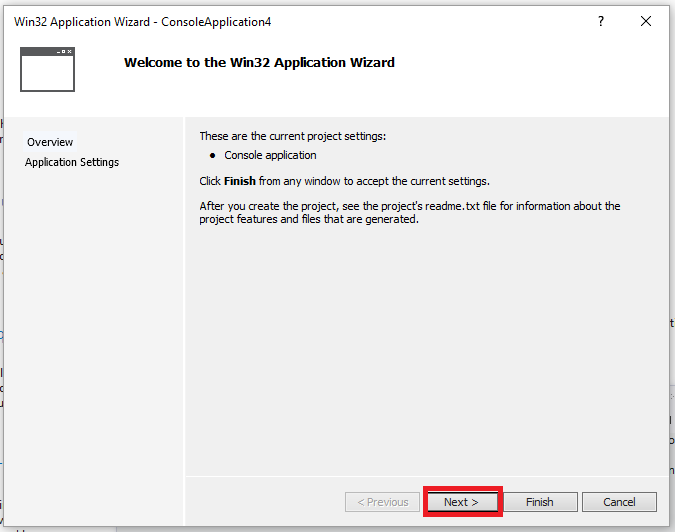
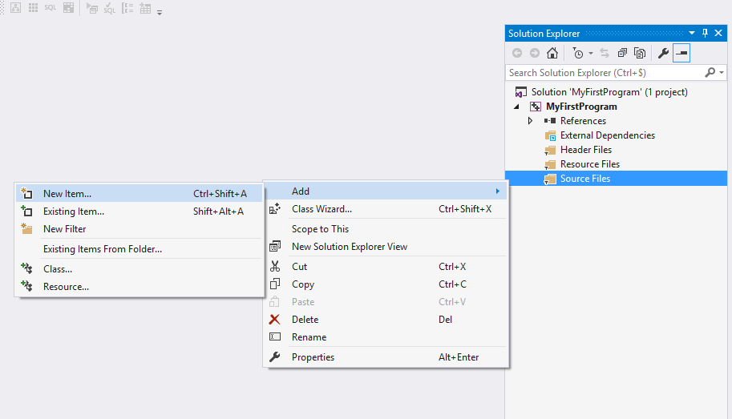
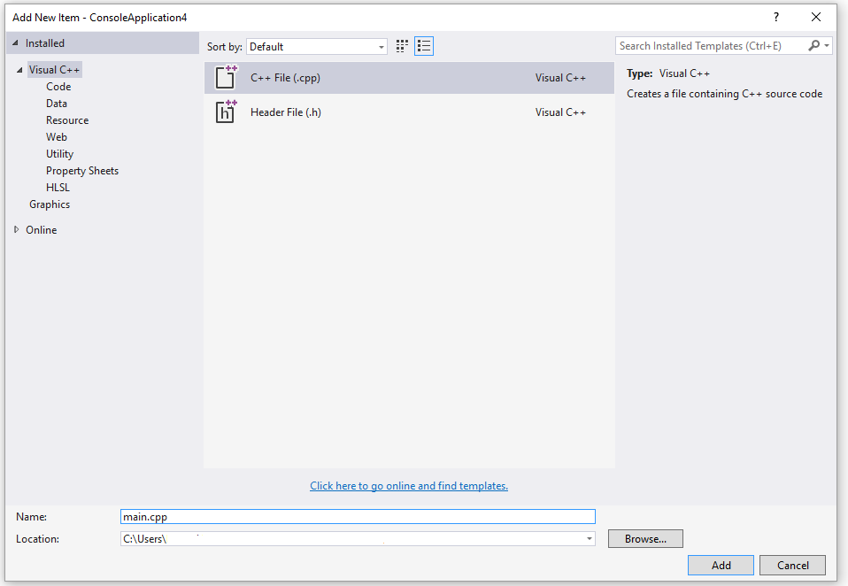
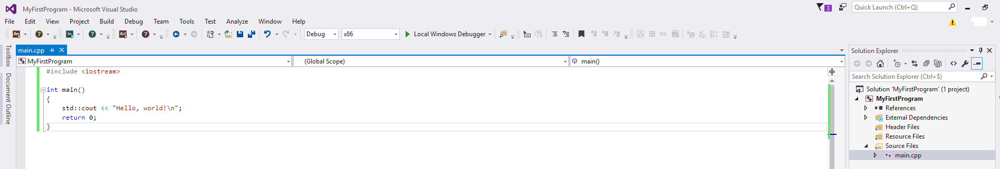
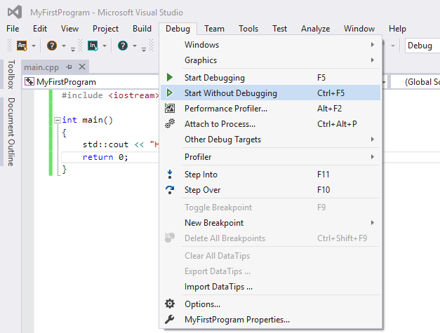
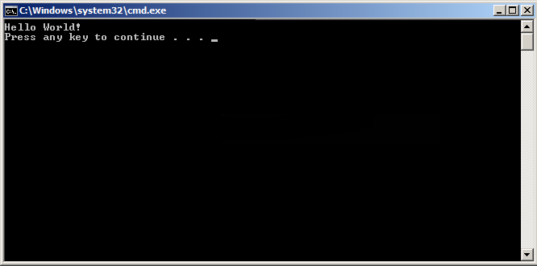

# 使用 Visual Studio (Graphical Interface) 编译
1、下载及安装 Visual Studio Community 2015。
2、打开 Visual Studio Community
3、点击 File -> New -> Project
<!--more-->


4、左侧列表选择 Templates -> Visual C++ -> Win32 Console Application，并设置项目名为 MyFirstProgram。



5、点击 OK。
6、在以下窗口中点击 Next



7、在弹出的窗口中选择 Empty project 选项后，点击 Finish 按钮：
8、右击文件夹 Source File 并点击 Add --> New Item... :



9、选择 C++ File 然后设置文件名为 main.cpp，然后点击 Add：



10、拷贝以下代码到 main.cpp 中：
```C++
#include <iostream>

int main()
{
    std::cout << "Hello World!\n";
    return 0;
}
```
界面如下所示：



11、点击菜单上的 Debug -> Start Without Debugging (或按下 ctrl + F5) :



12、完成以上操作后，你可以看到以下输出


