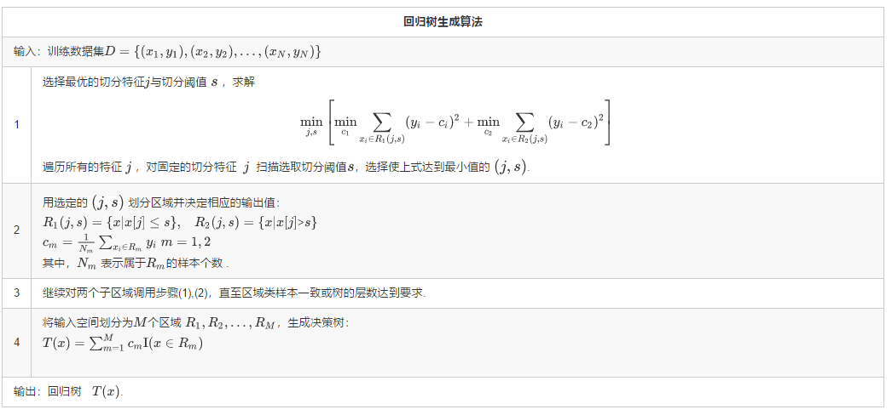
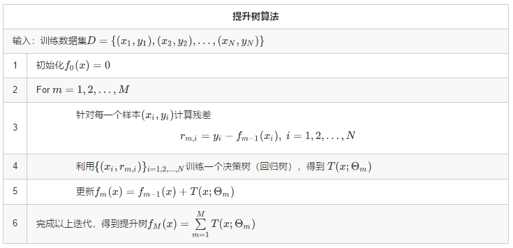
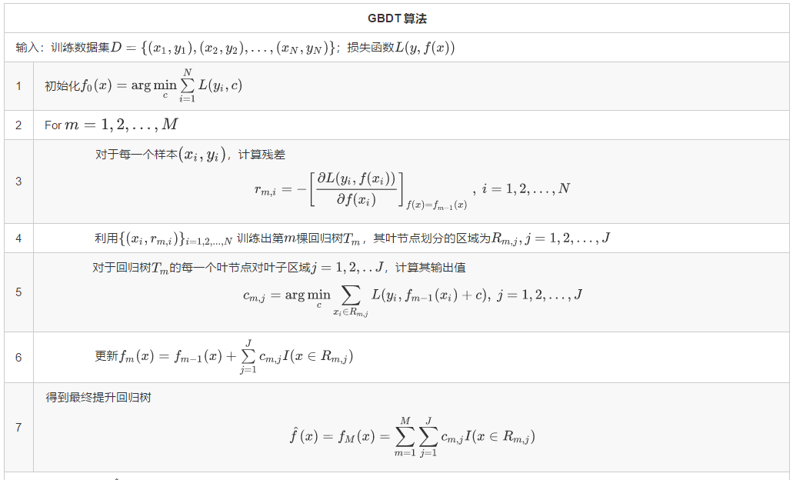
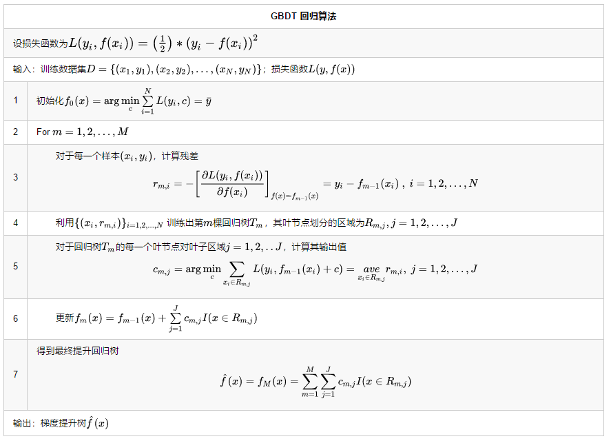
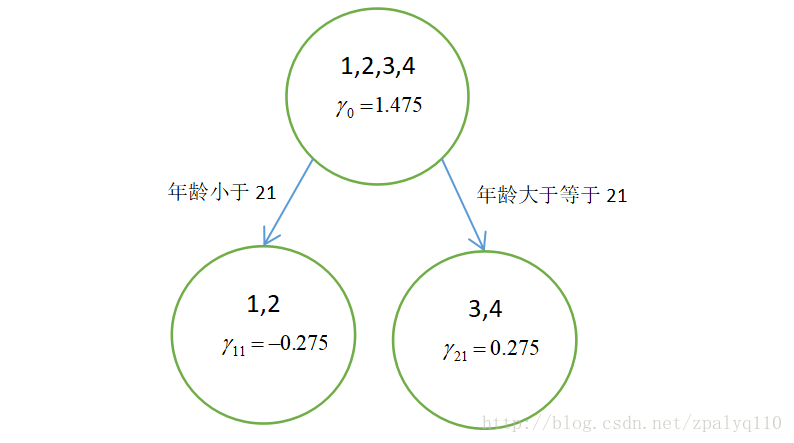
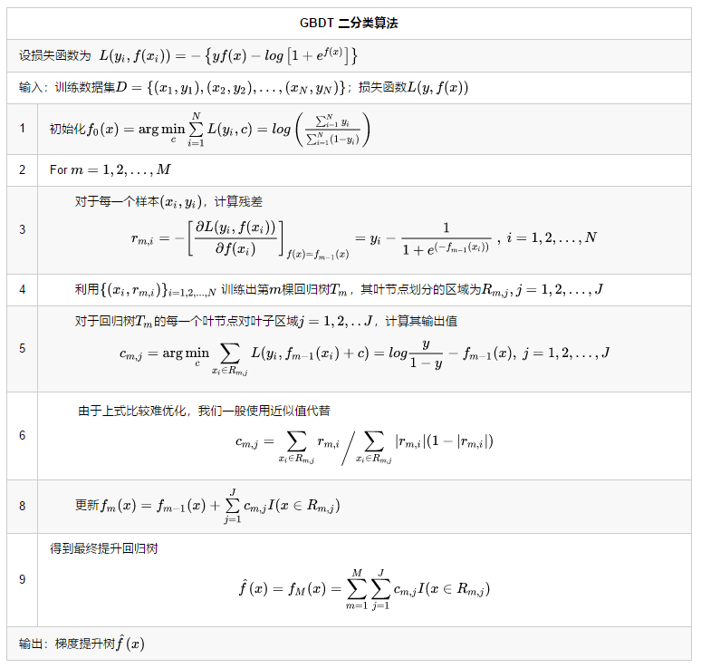
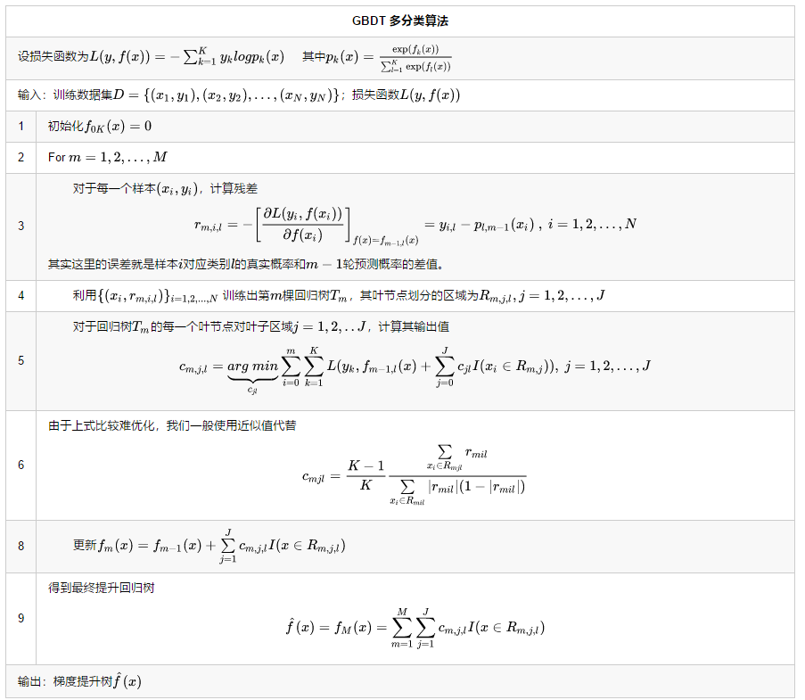

# [简介](https://www.cnblogs.com/pinard/p/6140514.html)
GBDT也是集成学习Boosting家族的成员,由梯度提升方法与回归树结合而成。
分类|损失函数
回归|$(y-\hat y)^2$
分类|$p_K log_2 \; p_K$

<!--more-->
## [回归树](/2017/07/21/回归树)
回归树生成算法

## 提升树
提升树可以表示为以下形式：这里我们约定 $T(x;Θ_m)$ 表示第 $m$ 棵决策树；$Θ_m$表示决策树的参数；$M$ 为树的个数。强分类器 $f_M(x)$ 可以由多个弱分类器 $T(x;Θ_m)$ 线性相加而成
$$f_M (x)=\sum_{m=1}^MT(x;Θ_m )$$
提升树的前向分步算法。第$m$步的模型可以写成
$$f_m (x)=f_{m-1} (x)+ T(x;Θ_m )$$
然后得到损失函数
$$L(f_m (x),y)=L(f_{m-1} (x)+ T(x;Θ_m ),y)$$
迭代的目的是构建 $T(x;Θ_m)$，使得本轮损失 $L(f_m(x),y)$ 最小。思想其实并不复杂，但是问题也很明显，对于不同的任务会有不同的损失函数，当损失函数是平方损失和指数损失函数时，每一步的优化还是简单的。但是对于一般损失函数而言，每一步的优化并不容易
### 提升树算法

## 梯度提升树
**采用泰勒展开式将上式中的残差展开，**
### [泰勒公式](/2017/08/14/微积分)
一元函数在点$x_k$处的泰勒展开式为：
$$f(x) = f(x_k)+(x-x_k)f'(x_k)+\frac{1}{2!}(x-x_k)^2f''(x_k)+o^n$$

### 拟合残差的近似
梯度提升思想正是为了解决上面的问题。它的主要思想是先求$h_m$，再求$β_m$。观察式子
$$\sum _{i=1}^N = L(y_i,f_{m-1}(x_i)+\beta h_m(x_i))$$
我们要最小化的式子由N部分相加而成，如果能够最小化每一部分，自然也就最小化了整个式子。考察其中任一部分，并将其进行泰勒一阶展开
$$L(y_i,f_{m-1}(x_i)+\beta h_m(x_i))=L(y_i,f_{m-1}(x_i))+\beta h_m(x_i)\frac{\partial L(y_i,f_{m-1}(x_i))}{\partial f_{m-1}(x_i)} \\
L(y_i,f_{m-1}(x_i)+\beta h_m(x_i))-L(y_i,f_{m-1}(x_i))=\beta h_m(x_i)\frac{\partial L(y_i,f_{m-1}(x_i))}{\partial f_{m-1}(x_i)} $$
由于需要
$$L(y_i,f_{m-1}(x_i)+\beta h_m(x_i))-L(y_i,f_{m-1}(x_i))<0\Rightarrow \beta h_m(x_i)\frac{\partial L(y_i,f_{m-1}(x_i))}{\partial f_{m-1}(x_i)} <0$$
由于$β$是大于0的，则$$h_m(x_i)=-\frac{\partial L(y_i,f_{m-1}(x_i))}{\partial f_{m-1}(x_i)}$$
这说明，我们已经成功地降低了在第$i$个样本点上的预测损失。同理，我们可以降低在每一个样本点上的预测损失。条件就是
$$h_m(x_i)=-\frac{\partial L(y_i,f_{m-1}(x_i))}{\partial f_{m-1}(x_i)}$$
这个条件其实告诉了我们如何去寻找基学习器$h_m$，用回归树拟合$h_m(x_i)$。我们已经有了$h_m$，下面优化求解$β$，很显然，这是一个一维搜索问题，如下：
$$β_m=\underset{β}{argmin}\sum_{i=1}^{N}L(y_i,f_{m-1}(x_i)+βh_m(x_i))$$
在上面的泰勒一阶展开时，有一个条件就是$βh_m(x_i)$要足够小，显然，执行一维搜索后得到的β会满足这个条件
# GBDT算法

以上算法将回归树和提升树的算法结合起来，在第5步中求解 $c_{m,j}$ ，如果损失函数为平方损失函数，则解法与前面的回归树一致，直接取均值即可。如果是其他损失函数，则需要具体进行求解。具体而言，就是取导数为零来解等式

# GBDT回归算法

## 实例

编号 | 年龄(岁) | 体重（kg） | 身高(m)(标签值)
-|-|-|-
1 | 5 | 20 | 1.1
2 | 7 | 30 | 1.3
3 | 21 | 70 | 1.7
4 | 30 | 60 | 1.8
5(要预测的) | 25 | 65 | ？

**设损失函数为平方差函数**
$$ L(y_i,f(x_i))=\left(\frac{1}{2}\right)*(y_i-f(x_i))^2$$

### 1、初始化学习器 $f_0(x)$
$$f_0(x) =arg\; \underset{c}{min}\sum\limits_{i=1}^{N}L(y_i, c)=arg\; \underset{c}{min}\sum _{i=1}^N(y_i-c)^2$$
由于此时只有根结点，样本１,２，３,４都在根结点，此时要找到使得平方损失函数最小的参数$c$，怎么求呢？平方损失显然是一个凸函数，直接求导，倒数等于零，得到$c$。
$$\frac{\partial L(y_i,c)}{\partial c}=\sum _{i=1}^N \frac{\partial (\frac{1}{2}[y_i-c]^2)}{\partial c}=\sum _{i=1}^N (c-y_i)$$
令$\sum _{i=1}^N (c-y_i)=0$，得$c=\overline{y}$。
所以初始化时，$c$取值为所有训练样本标签值的均值。$c=(1.1+1.3+1.7+1.8)/4=1.475$，此时得到初始学习器 $f_0(x)$。
$$f_0(x)=c=1.475$$
### 2、对迭代轮数m=1:
计算负梯度——残差
$$r_{i1} = -\bigg[\frac{\partial L(y_i, f(x_i))}{\partial f(x_i)}\bigg]_{f(x) = f_{0} (x)}=-\frac{\partial \sum _{i=1}^N(y_i- f_0(x_i))^2}{2\partial f_0(x_i)}=\sum _{i=1}^N(y_i- f_0(x_i))$$
说白了，就是残差（上面已经解释过了），在此例中，残差在下表列出：

编号 | 年龄(岁) | 体重（kg） | 身高(m)(标签值) | $f_0(x)$ | 残差
:-:|:-:|:-:|:-:|:-:|:-:
1 | 5 | 20 | 1.1 | 1.475 | -0.375
2 | 7 | 30 | 1.3 | 1.475 | -0.175
3 | 21 | 70 | 1.7 | 1.475 | 0.225
4 | 30 | 60 | 1.8 | 1.475 | 0.325

此时将残差作为样本的目标值训练$f_1(x)$，寻找回归树的最佳划分结点，遍历每个特征的每个可能取值。从年龄特征的5开始，到体重特征的70结束，分别计算方差，找到使损失函数最小的那个划分结点即为最佳划分结点。例如：以年龄7为划分结点，将小于7的样本划分为一类，大于等于7的样本划分为另一类。样本1为一组，样本2，3，4为一组，两组的方差分别为0，0.047，两组方差之和为0.047。所有可能划分情况如下表所示
$$\overline{x} = (-0.175+0.225+0.325)/3=0.125\\
0.047 =[ (-0.175-\overline{x})^2+(0.225-\overline{x})^2+(0.325-\overline{x})^2]/3
$$

划分点 | 小于划分点的样本 | 大于等于划分点的样本 | 总方差
-|-|-|-
年龄5 | / | 1，2，3，4 | 0.082
年龄7 | 1 | 2，3，4 | 0.047
年龄21 | 1，2 | 3，4 | 0.0125
年龄30 | 1，2，3 | 4 | 0.062
体重20 | / | 1，2，3，4 | 0.082
体重30 | 1 | 2，3，4 | 0.047
体重60 | 1，2 | 3，4 | 0.0125
体重70 | 1，2，4 | 3 | 0.0867

以上划分点的损失函数最小为0.0125，有两个划分点分别为年龄21和体重60，所以随机选一个作为划分点，这里我们选年龄21。
此时还需要做一件事情，给这两个叶子结点分别赋一个参数，来拟合残差。
$$c_{j1} =arg\; \underset{c}{min}\sum\limits_{x_i \in R_{j1}} L(y_i,f_{0}(x_i) +c)$$

这里其实和上面初始化学习器是一个道理，平方损失，求导，
$$\frac{\partial L(y_i,f_0(x_i)+c)}{\partial c}=\sum _{i=1}^N \frac{\partial (\frac{1}{2}[y_i-f_0(x_i)-c]^2)}{\partial c}=\sum _{i=1}^N (c-y_i+f_0(x_i))$$
令导数等于零$\sum _{i=1}^N (c-y_i+f_0(x_i))=0$化简之后得到每个叶子结点的参数$c$，其实就是标签值的均值$c=\overline{y_i-f_0(x_i)}$。
根据上述划分结点：
- 样本1，2为左叶子结点，$(x_1,x_2 \in R_{11})$，所以$c_{11}=(−0.375−0.175)/2=−0.275。 $
- 样本3，4为右叶子结点，$(x_3,x_4 \in R_{11})$，所以$c_{21}=(0.225+0.325)/2=0.275。 $

此时可更新强学习器 $$f_{1}(x) = f_{0}(x) + \sum\limits_{j=1}^{2}c_{j1}I(x \in R_{j1})$$

### 3、对迭代轮数m=2,3,4,5,…,M:
循环迭代$M$次，$M$是人为控制的参数，迭代结束生成M棵树

### 4、得到最后的强学习器：
为了方别展示和理解，我们假设$Ｍ＝１$，根据上述结果得到强学习器：
$$f(x) = f_M(x) =f_0(x) + \sum\limits_{m=1}^{M}\sum\limits_{j=1}^{J}c_{jm}I(x \in R_{jm})$$

# GBDT分类算法
## 二元GBDT分类算法
### 假设条件
- 类别1的概率为:$p_1=\frac{e^{f_1(x)}}{e^{f_1(x)}+e^{f_2(x)}}$
- 类别2的概率为:$p_2=1-p_2=\frac{e^{f_2(x)}}{e^{f_1(x)}+e^{f_2(x)}}$

$$\begin{align*}
p_1 &= \frac{e^{f_1(x)}}{e^{f_1(x)}+e^{f_2(x)}} = \frac{1}{1+e^{f_2(x)/f_1(x)}}=\frac{1}{1+e^{f(x)}}   \\
p_2 &= 1-p_1  =\frac{e^{f(x)}}{1+e^{f(x)}}
\end{align*}$$

### 损失函数化简
对于二元GBDT，如果用类似于逻辑回归的对数似然损失函数，则损失函数为：
$$\large L\left(y,f(x)\right)=-\left\{ylog\;p+(1-y)log(1-p)\right\}$$
其中$\large p=\frac{1}{1+e^{f(x)}}$
$$\begin{align*}
\large L\left(y,f(x)\right)&=-\left\{ylog\;p+(1-y)log(1-p)\right\}\\
 &=-\left \{ ylog\frac{e^{f(x)}}{1+e^{f(x)}} + (1-y)log\frac{1}{1+e^{f(x)}} \right \} \\
 &=-\left \{ ylog\frac{1}{1+e^{f(x)}} + ylog\; e^{f(x)}+ (1-y)log\frac{1}{1+e^{f(x)}} \right \} \\
 &=- \left \{ yf(x)-log\left [ 1+e^{f(x)} \right ] \right \}
\end{align*}$$

### 算法简介

### 实例

$x_i$ | 1 | 2 | 3 | 4 | 5 | 6 | 7 | 8 | 9 | 10
:-:|:-:|:-:|:-:|:-:|:-:|:-:|:-:|:-:|:-:|:-:
$y_i$ | 0 | 0 | 0 | 1 | 1 | 0 | 0 | 0 | 1 | 1

#### 第一棵树
##### 推导
$$\begin{align*}
L\left(y_i,c\right)&=-\left\{y_ic-log\left(1+e^{c}\right)\right\} \\
\frac{\partial L\left(y_i,c\right)}{\partial c} &= \frac{e^{c}}{1+e^{c}}-y=0 \\
\frac{e^{c}}{1+e^{c}}&=y \\
c &= log \frac{y}{1-y}=log\left(\frac{\sum_{i=1}^N y_i}{\sum_{i=1}^N(1-y_i)}\right)
\end{align*}$$
##### 计算
$$f_0(x)=log\left(\frac{\sum_{i=1}^N y_i}{\sum_{i=1}^N(1-y_i)}\right)=log\left(\frac{4}{6}\right)=-0.4054$$

#### 对迭代轮数m=1
$$r_{m,i} = -\left[ \frac{\partial L(y_i,f(x_i))}{\partial f(x_i)} \right]_{f(x)=f_{m-1}(x)}=y_i-\frac{1}{1+e^{\left(-f_{m-1}(x_i)\right)}} ~,~i=1,2,...,N$$

$$r_{1,i}=y_1-\frac{1}{1+e^{-f_{0}(x_1)}}=0-\frac{1}{1+e^{-0.4054}}=-0.4$$

$x_i$ | 1 | 2 | 3 | 4 | 5 | 6 | 7 | 8 | 9 | 10
 :-:| :-:| :-:| :-:| :-: |  :-:| :-: |  :-: |  :-: |  :-: |  :-:
$r_{1,i}$ | -0.4 | -0.4 | -0.4 | 0.6 | 0.6 | -0.4 | -0.4 | -0.4 | 0.6 | 0.6

接着，我们需要以$r_{1,i}$为目标，拟合一颗树。

划分点 | 小于等于划分点的样本 | 大于划分点的样本 | 总方差
-|-|-|-
1 | 1 | 2，3，4，5，6，7，8，9，10 | 0.2469
2 | 1，2 | 3，4，5，6，7，8，9，10 | 0.25
3 | 1，2，3 | 4，5，6，7，8，9，10 | 0.2449
4 | 1，2，3，4 | 5，6，7，8，9，10 | 0.4375
5 | 1，2，3，4，5 | 6，7，8，9，10 | 0.48
6 | 1，2，3，4，5，6 | 7，8，9，10 | 0.4722
7 | 1，2，3，4，5，6，7 | 8，9，10 | 0.4263
8 | 1，2，3，4，5，6，7，8 | 9，10 | 0.1875
9 | 1，2，3，4，5，6，7，8，9 | 10 | 0.2222
10 | 1，2，3，4，5，6，7，8，9，10 | \ | 0.24

由此可知当切分点为8时，总方差最小。所以$R_{11}:x_i\leqslant 8,R_{11}:x_i> 8$

##### 输出$c_{m,j}$
$$c_{m,j} =\left. \sum_{x_i\in R_{m,j}} r_{m,i} \middle / \sum_{x_i\in R_{m,j}} |r_{m,i}|(1-|r_{m,i}|) \right. $$

$$c_{1,1}=-0.625 \;\;\;\;\;\;\; c_{1,2}=2.5$$

$$f_{1,i}=\sum_{j=1}^Jc_{jm}I(x \in R_{jm})=\left\{\begin{matrix}
-0.4054-0.625=--1.0304\\
-0.4054+2.5=2.0946
\end{matrix}\right.$$

$x_i$ | 1 | 2 | 3 | 4 | 5 | 6 | 7 | 8 | 9 | 10
 :-:| :-:| :-:| :-:| :-: |  :-:| :-: |  :-: |  :-: |  :-: |  :-:
$f_{1,i}(x_i)$ | -1.0304 | -1.0304 | -1.0304 | -1.0304 | -1.0304 | -1.0304 | -1.0304 | -1.0304 | 2.0946 | 2.0946

#### 对迭代轮数m=2

其残差为
$$$$r_{m,i} = -\left[ \frac{\partial L(y_i,f(x_i))}{\partial f(x_i)} \right]_{f(x)=f_{m-1}(x)}=y_i-\frac{1}{1+e^{\left(-f_{m-1}(x_i)\right)}} ~,~i=1,2,...,N$$$$

$x_i$ | 1 | 2 | 3 | 4 | 5 | 6 | 7 | 8 | 9 | 10
 :-:| :-:| :-:| :-:| :-: |  :-:| :-: |  :-: |  :-: |  :-: |  :-:
$f_{1,i}(x_i)$ | -0.3569  | -0.3569  | -0.3569  | 0.6431  | 0.6431  | -0.3569  | -0.3569  | -0.3569  | -7.1222  | -7.1222

继续拟合第二可数

#### 综上
一共拟合$M$棵树

## 多元GBDT分类算法

### 示例

$x_i$ | 6 | 12 | 14 | 18 | 20 | 65 | 31 | 40 | 1 | 2 | 100 | 101 | 65 | 54
:-:|:-:|:-:|:-:|:-: | :-:|:-: | :-: | :-: | :-: | :-: | :-: | :-: | :-: | :-:
$y_i$ | 0 | 0 | 0 | 0 | 0 | 1 | 1 | 1 | 1 | 1 | 2 | 2 | 2 | 2
$y_{i,0}$ | 1 | 1 | 1 | 1 | 1 | 0 | 0 | 0 | 0 | 0 | 0 | 0 | 0 | 0
$y_{i,1}$ | 0 | 0 | 0 | 0 | 0 | 1 | 1 | 1 | 1 | 1 | 0 | 0 | 0 | 0
$y_{i,2}$ | 0 | 0 | 0 | 0 | 0 | 0 | 0 | 0 | 0 | 0 | 1 | 1 | 1 | 1

#### 根学习器
首先进行初始化$f_{k0}(x_i)=0$，对所有的样本
$$ \begin{align*}
p_{m,k}(x)&=\frac{e^{f_{m,k}(x)}}{\sum_{l=1}^K e^{f_{m,l(x)}}}\\
p_{0,0}(x)&=\frac{e^{f_{0,0}(x)}}{\sum_{l=1}^K e^{f_{0,l(x)}}}=0.3333
\end{align*}$$
#### 迭代轮数m=1
##### 第一个类别$(y_i=0)$拟合第一棵树$(m=1)$

$$\begin{align*}
r_{m,i,k}=y_{i,k}-p_{m-1,k}\\
r_{1,i,0}=y_{i,0}-p_{0,0}
\end{align*}$$

$x_i$|6|12|14|18|20|65|31|40|1|2|100|101|65|54
:-:|:-:|:-:|:-:|:-: | :-:|:-: | :-: | :-: | :-: | :-: | :-: | :-: | :-: | :-:
$y_{i,0}$ | 1 | 1 | 1 | 1 | 1 | 0 | 0 | 0 | 0 | 0 | 0 | 0 | 0 | 0
$p_{0,0}$|0.3333|0.3333|0.3333|0.3333|0.3333|0.3333|0.3333|0.3333|0.3333|0.3333|0.3333|0.3333|0.3333|0.3333
$r_{1,i,0}$|0.6667|0.6667|0.6667|0.6667|0.6667|-0.3333|-0.3333|-0.3333|-0.3333|-0.3333|-0.3333|-0.3333|-0.3333|-0.3333

- 选择切分点进行拟合
计算完后可以发现，当选择31做为分裂点时，可以得到最小的$MSE，MSE=0.4879$

划分点 | 小于等于划分点的样本 | 大于划分点的样本 | 总方差
-|-|-|-
1 | 1 | 2，6，12，14，18，20，31，40，54，65，65，100，101| 1.0036
2 | 1，2 | 6，12，14，18，20，31，40，54，65，65，100，101 | 0.5063
6 | 1，2，6 | 12，14，18，20，31，40，54，65，65，100，101 | 0.5149
12 | 1，2，6，12 | 14，18，20，31，40，54，65，65，100，101 | 0.5222
14 | 1，2，6，12，14 | 18，20，31，40，54，65，65，100，101 | 0.5270
18 | 1，2，6，12，14，18 | 20，31，40，54，65，65，100，101 | 0.5270
20 | 1，2，6，12，14，18，20 | 31，40，54，65，65，100，101 | 0.5175
31 | 1，2，6，12，14，18，20，31 | 40，54，65，65，100，101 | 0.4879
40 | 1，2，6，12，14，18，20，31，40 | 54，65，65，100，101 | 0.5163
54 | 1，2，6，12，14，18，20，31，40，54 | 65，65，100，101 | 0.9012
65 | 1，2，6，12，14，18，20，31，40，54，65，65 | 100，101 | 1.060
100 | 1，14，18，20，31，40，54，65，65，100| 101 | 0.5045
101 | 1，2，6，12，14，18，20，31，40，54，65，65，100，101| \ | 0.5149

- 计算$c_{m,j,l}$
$$\begin{align*}
c_{mjl}&=\frac{K-1}{K}\frac{\sum\limits_{x_i \in R_{mjl}}r_{mil}}{\sum\limits_{x_i \in R_{mil}}|r_{mil}|(1-|r_{mil}|)}\\
c_{110} &= 0.8751 \\
c_{120} &= -0.9999
\end{align*}$$

$$f_{mk}(x_i)=f_{m-1,k}(x_i)+\sum_{x_i \in R_{mjk}}c_{mjk}*I(x_i \in R_{mjk})$$

$x_i$ | 6 | 12 | 14 | 18 | 20 | 65 | 31 | 40 | 1 | 2 | 100 | 101 | 65 | 54
:-:|:-:|:-:|:-:|:-: | :-:|:-: | :-: | :-: | :-: | :-: | :-: | :-: | :-: | :-:
$f_{m,k}(x_i)=f_{1,0}(x_i)$ | 1.1428 | 1.1428 | 1.1428 | 1.1428 | 1.1428 | -0.999 | -0.999 | -0.999 | 1.1428 | 1.1428 | -0.999 | -0.999 | -0.999 | -0.999

##### 第二个类别（y_i=1)拟合第一颗树$(m=1)$
$$\begin{align*}
r_{m,i,k}=y_{i,k}-p_{m-1,k}\\
r_{1,i,0}=y_{i,0}-p_{0,0}
\end{align*}$$

$x_i$|6|12|14|18|20|65|31|40|1|2|100|101|65|54
:-:|:-:|:-:|:-:|:-: | :-:|:-: | :-: | :-: | :-: | :-: | :-: | :-: | :-: | :-:
$y_{i,1}$ | 0 | 0 | 0 | 0 | 0 | 1 | 1 | 1 | 1 | 1 | 0 | 0 | 0 | 0
$p_{0,1}$|0.3333 | 0.3333 | 0.3333 | 0.3333 | 0.3333 | 0.3333 | 0.3333 | 0.3333 | 0.3333 | 0.3333 | 0.3333 | 0.3333 | 0.3333 | 0.3333
$r_{1,i,1}$|-0.3333 | -0.3333 | -0.3333 | -0.3333 | -0.3333 | 0.6667 | 0.6667 | 0.6667 | 0.6667 | 0.6667 | -0.3333 | -0.3333 | -0.3333 | -0.3333

以$r_{1,i,1}$拟合一颗回归树，（以6为分裂点）,可计算得到叶子结点
$$c_{111}=2 \;\;\;\;\;c_{121}=0.2499$$

$$f_{mk}(x_i)=f_{m-1,k}(x_i)+\sum_{x_i \in R_{mjk}}c_{mjk}*I(x_i \in R_{mjk})$$

$x_i$ | 6 | 12 | 14 | 18 | 20 | 65 | 31 | 40 | 1 | 2 | 100 | 101 | 65 | 54
:-:|:-:|:-:|:-:|:-: | :-:|:-: | :-: | :-: | :-: | :-: | :-: | :-: | :-: | :-:
$f_{m,k}(x_i)=f_{1,1}(x_i)$ | -0.2499 | -0.2499 | -0.2499 | -0.2499 | -0.2499 | -0.2499 | -0.2499 | -0.2499 | 2 | 2 | -0.2499 | -0.2499 | -0.2499 | -0.2499

### 综上
然后再拟合第三个类别（类别2）的第一颗树，过程也是重复上述步骤，所以这里就不再重复了。在拟合完所有类别的第一颗树后就开始拟合第二颗树。反复进行，直到训练了$M$轮。
