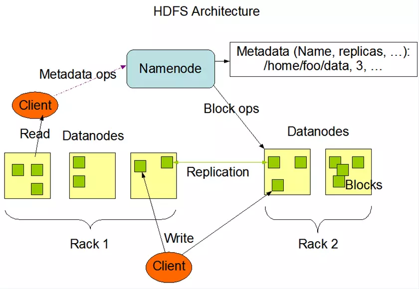

# HDFS框架

- 主从结构：
  1. 主节点，只有一个  ： `namenode`
  2. 从节点，有很多个  ：`datanodes`
- `namenode`负责：
     1. 接收用户请求操作
     2.  维护文件信息系统的目录结构
     3. 管理文件与`block`之间的关系，`block`与`datanade`之间的关系
        注意：`namenode`归根结底要放在磁盘上的以保证数据的持久性，但是为了提高效率，一般在`hadoop`运行时时放在内存中的
- `datanode`负责：
        1. 存储文件
           2. 文件被分成`block`存储字磁盘上
           3. 为保证数据安全，文件会有多个副本

# HDFS shell命令

**命令格式：** `bin/hadoop fs <args> URI`

&nbsp;&nbsp;&nbsp;&nbsp;&nbsp;&nbsp;&nbsp;&nbsp;&nbsp;&nbsp;&nbsp;&nbsp;&nbsp;&nbsp;&nbsp;&nbsp;&nbsp;&nbsp;&nbsp;&nbsp;&nbsp;`URI`：`scheme://authority/path`—HDFS文件系统
&nbsp;&nbsp;&nbsp;&nbsp;&nbsp;&nbsp;&nbsp;&nbsp;&nbsp;&nbsp;&nbsp;&nbsp;&nbsp;&nbsp;&nbsp;&nbsp;&nbsp;&nbsp;&nbsp;&nbsp;&nbsp;&nbsp;&nbsp;&nbsp;&nbsp;&nbsp;&nbsp;&nbsp;&nbsp;&nbsp;&nbsp;&nbsp;`file://authority/path`—本地文件系统

| 命令            | 说明                                                         |
| --------------- | ------------------------------------------------------------ |
| `cat`           | 使用方法：`hadoop fs -cat URI [URI …]` **将路径指定文件的内容输出到`stdout,`成功返回0，失败返回-1。** eg:`hadoop fs -cat hdfs://host1:port1/file1 hdfs://host2:port2/file2` &emsp;&nbsp;&nbsp;`hadoop fs -cat file:///file3 /user/hadoop/file4` |
| `chgrp`         | 使用方法：`hadoop fs -chgrp [-R] GROUP URI [URI …]` &nbsp;&nbsp; &nbsp; &nbsp; &nbsp; &nbsp; &nbsp; &nbsp; &nbsp;  &nbsp; `-R`：递归改变文件的目录结构 **改变文件所属的组。** |
| `chmod`         | 使用方法：`hadoop fs -chmod [-R] <MODE[,MODE]...  OCTALMODE> URI [URI …]`  &nbsp; &emsp; &emsp;&emsp;&emsp;`-R`：递归改变文件的目录结构 **改变文件的权限。** |
| `chown`         | 使用方法：`hadoop fs -chown [-R] [OWNER][:[GROUP]] URI [URI ]` &emsp;&emsp;&emsp;&emsp;&emsp;`-R`：递归改变文件的目录结构 **改变文件的拥有者。** |
| `copyFromLocal` | 使用方法：`hadoop fs -copyFromLocal <localsrc> URI` **除了限定源路径是一个本地文件外，和[`put`](https://hadoop.apache.org/docs/r1.0.4/cn/hdfs_shell.html#putlink)命令相似** |
| `copyToLocal`   | 使用方法：`hadoop fs -copyToLocal [-ignorecrc] [-crc] URI <localdst>` **除了限定目标路径是一个本地文件外，和[get](https://hadoop.apache.org/docs/r1.0.4/cn/hdfs_shell.html#getlink)命令类似。** |
| `cp`            | 使用方法：`hadoop fs -cp URI [URI …] <dest>` **将文件从源路径复制到目标路径。这个命令允许有多个源路径，此时目标路径必须是一个目录。成功返回0，失败返回-1。** eg：`hadoop fs -cp /user/hadoop/file1 /user/hadoop/file2 /user/hadoop/dir` |
| `du`            | 使用方法：`hadoop fs -du URI [URI …]` **显示目录中所有文件的大小，或者当只指定一个文件时，显示此文件的大小。成功返回0，失败返回-1。** eg：`hadoop fs -du /user/hadoop/dir1 /user/hadoop/file1 hdfs://host:port/user/hadoop/dir1` |
| `dus`           | 使用方法：`hadoop fs -dus <args>` **显示文件的大小。**    |
| `expunge`       | 使用方法：`hadoop fs -expunge` **清空回收站。**           |
| `get`           | 使用方法：`hadoop fs -get [-ignorecrc] [-crc] <src> <localdst>` **复制文件到本地文件系统。可用`-ignorecrc`选项复制`CRC`校验失败的文件。使用`-crc`选项复制文件以及CRC信息。** eg：`hadoop fs -get /user/hadoop/file localfile` &emsp;&emsp;`hadoop fs -get hdfs://host:port/user/hadoop/file localfile` |
| `getmerge`      | 使用方法：`hadoop fs -getmerge <src> <localdst> [addnl]` 接受一个源目录和一个目标文件作为输入，并且将源目录中所有的文件连接成本地目标文件。`addnl`是可选的，用于指定在每个文件结尾添加一个换行符。 |
| `ls`            | 使用方法：`hadoop fs -ls <args>` 如果是文件，则按照如下格式返回文件信息：`文件名 <副本数> 文件大小 修改日期 修改时间 权限 用户ID 组ID` 如果是目录，则返回它直接子文件的一个列表，就像在Unix中一样。目录返回列表的信息如下`目录名 <dir> 修改日期 修改时间 权限 用户ID 组ID` 成功返回0，失败返回-1。 |
| `lsr`           | `ls`命令的递归版本。类似于Unix中的`ls -R`。                  |
| `mkdir`         | 使用方法：`hadoop fs -mkdir <paths>` **接受路径指定的`uri`作为参数，创建这些目录。其行为类似于`Unix`的`mkdir -p`，它会创建路径中的各级父目录。成功返回0，失败返回-1。** eg：`hadoop fs -mkdir /user/hadoop/dir1 /user/hadoop/dir2` |
| `movefromLocal` | 使用方法：`dfs -moveFromLocal <src> <dst>`                   |
| `mv`            | 使用方法：`hadoop fs -mv URI [URI …] <dest>` **将文件从源路径移动到目标路径。这个命令允许有多个源路径，此时目标路径必须是一个目录。不允许在不同的文件系统间移动文件。** eg：`hadoop fs -mv /user/hadoop/file1 /user/hadoop/file2` |
| `put`           | 使用方法：`hadoop fs -put <localsrc> ... <dst>` **从本地文件系统中复制单个或多个源路径到目标文件系统。也支持从标准输入中读取输入写入目标文件系统。成功返回0，失败返回-1。** eg：`hadoop fs -put localfile /user/hadoop/hadoopfile` |
| `rm`            | 使用方法：`hadoop fs -rm URI [URI …]` **删除指定的文件。只删除非空目录和文件。请参考`rmr`命令了解递归删除。成功返回0，失败返回-1。** eg：`hadoop fs -rm hdfs://host:port/file /user/hadoop/emptydir` |
| `rmr`           | 使用方法：`hadoop fs -rmr URI [URI …]` `delete`的递归版本。 `hadoop fs -rmr /user/hadoop/dir` |
| `setrep`        | 使用方法：`hadoop fs -setrep [-R] <path>` **改变一个文件的副本系数。-R选项用于递归改变目录下所有文件的副本系数。成功返回0，失败返回-1。** `hadoop fs -setrep -w 3 -R /user/hadoop/dir1` |
| `stat`          | 使用方法：`hadoop fs -stat URI [URI …]` **返回指定路径的统计信息。** `hadoop fs -stat path` |
| `tail`          | 使用方法：`hadoop fs -tail [-f] URI` **将文件尾部1K字节的内容输出到`stdout`。支持-f选项，行为和`Unix`中一致。成功返回0，失败返回-1。** |
| `test`          | 使用方法：`hadoop fs -test -[ezd] URI` &emsp;&emsp;&emsp;&emsp;&emsp;`-e` 检查文件是否存在。如果存在则返回`0`。 &emsp;&emsp;&emsp;&emsp;&emsp;`-z` 检查文件是否是`0`字节。如果是则返回`0`。  &emsp;&emsp;&emsp;&emsp;&emsp;`-d `如果路径是个目录，则返回`1`，否则返回`0`。 |
| `text`          | 使用方法：`hadoop fs -text <src>` **将源文件输出为文本格式。允许的格式是`zip`和`TextRecordInputStream`。** |
| `touchz`        | 使用方法：`hadoop fs -touchz URI [URI …]` **创建一个0字节的空文件。成功返回0，失败返回-1。** |

