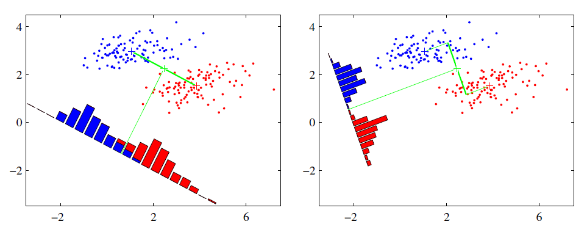

**欲使同类样本的投影点尽可能接近，可以让同类样本的投影点的协方差尽可能小；而欲使异类样本的投影点尽可能远离，可以让异类样本的类中心之间的距离尽可能大**
# LDA思想
LDA是一种监督学习的降维技术，也就是说它的数据集的每个样本是有类别输出的。这点和PCA不同。PCA是不考虑样本类别输出的无监督降维技术。LDA的思想可以用一句话概括，就是“投影后类内方差最小，类间方差最大”。什么意思呢？ 我们要将数据在低维度上进行投影，投影后希望每一种类别数据的投影点尽可能的接近，而不同类别的数据的类别中心之间的距离尽可能的大。
可能还是有点抽象，我们先看看最简单的情况。假设我们有两类数据 分别为红色和蓝色，如下图所示，这些数据特征是二维的，我们希望将这些数据投影到一维的一条直线，让每一种类别数据的投影点尽可能的接近，而红色和蓝色数据中心之间的距离尽可能的大。
<!--more-->
- 同类的数据点尽可能的接近（within class）

- 不同类的数据点尽可能的分开（between class）

上图中国提供了两种投影方式，哪一种能更好的满足我们的标准呢？从直观上可以看出，右图要比左图的投影效果好，因为右图的黑色数据和蓝色数据各个较为集中，且类别之间的距离明显。左图则在边界处数据混杂。以上就是LDA的主要思想了，当然在实际应用中，我们的数据是多个类别的，我们的原始数据一般也是超过二维的，投影后的也一般不是直线，而是一个低维的超平面。
# 算法流程
输入：数据集$D=\{(x_1,y_1), (x_2,y_2), ...,((x_m,y_m))\}$,其中任意样本$x_i$为$n$维向量，$y_i \in \{C_1,C_2,...,C_k\}$，降维到的维度$d$。
输出：降维后的样本集$D′$

1. 计算类内散度矩阵$S_w$
$X_j(j=1,2...k)$为第$j$类样本的集合;$\mu_j(j=1,2...k)$为第$j$类样本的均值向量
$$S_w = \sum\limits_{j=1}^{k}S_{wj} = \sum\limits_{j=1}^{k}\sum\limits_{x \in X_j}(x-\mu_j)(x-\mu_j)^T$$

1.  计算类间散度矩阵$S_b$
$N_j(j=1,2...k)$为第$j$类样本的个数;$μ$为所有样本均值向量。
$$S_b = \sum\limits_{j=1}^{k}N_j(\mu_j-\mu)(\mu_j-\mu)^T$$

1.  计算矩阵$S^{−1}wS_b$
1. 计算$S^{−1}wS_b$的最大的$d$个特征值和对应的$d$个特征向量($w_1,w_2,...w_d)$,得到投影矩阵
1. 对样本集中的每一个样本特征$x_i$,转化为新的样本$z_i=W^Tx_i$
1.  得到输出样本集$D'=\{(z_1,y_1), (z_2,y_2), ...,((z_m,y_m))\}$

# [推导](http://www.cnblogs.com/pinard/p/6244265.html)
**欲使同类样本的投影点尽可能接近，可以让同类样本的投影点的协方差尽可能小；而欲使异类样本的投影点尽可能远离，可以让异类样本的类中心之间的距离尽可能大**
## 二分类
假设我们的数据集$D=\{(x_1,y_1), (x_2,y_2), ...,((x_m,y_m))\}$,其中任意样本$x_i$为$n$维向量，$y_i \in \{0,1\}$。我们定义$N_j(j=0,1)$为第$j$类样本的个数，$X_j(j=0,1)$为第$j$类样本的集合，而$\mu_j(j=0,1)$为第j类样本的均值向量，定义$\Sigma_j(j=0,1)$为第$j$类样本的协方差矩阵（严格说是缺少分母部分的协方差矩阵）。

$\mu_j $的表达式为：
$$\mu _j = \frac{1}{N_j}\sum\limits_{x \in X_j}x\;\;(j=0,1)$$

$Σ_j$的表达式为：
$$\Sigma_j = \sum\limits_{x \in X_j}(x-\mu_j)(x-\mu_j)^T\;\;(j=0,1)$$

由于是两类数据，因此我们只需要将数据投影到一条直线上即可。假设我们的投影直线是向量$w$,则对任意一个样本本$x_i$,它在直线$w$的投影为$w^Tx_i$,对于我们的两个类别的中心点$μ_0,μ_1$,在直线$w$的投影为$w^Tμ_0$和$w^Tμ_1$。由于LDA需要让不同类别的数据的类别中心之间的距离尽可能的大，也就是我们要最大化$||w^Tμ_0−w^Tμ_1||_2^2$,同时我们希望同一种类别数据的投影点尽可能的接近，也就是要同类样本投影点的协方差$w^TΣ_0w$和$w^TΣ_1w$尽可能的小，即最小化$w^TΣ_0w+w^TΣ_1w$。投影之后的协方差$WX(WX)^T$则$WXX^TW^T=WΣW^T$综上所述，我们的优化目标为：

$$\underbrace{arg\;max}_w\;\;J(w) = \frac{||w^T\mu_0-w^T\mu_1||_2^2}{w^T\Sigma_0w+w^T\Sigma_1w} = \frac{w^T(\mu_0-\mu_1)(\mu_0-\mu_1)^Tw}{w^T(\Sigma_0+\Sigma_1)w}$$

我们一般定义类内散度矩阵 $S_w$ 为： $S_w = \Sigma_0 + \Sigma_1 = \sum \limits_{x \in X\_0}(x-\mu_0)(x-\mu_0)^T + \sum \limits_{x \in X_1}(x-\mu_1)(x-\mu_1)^T$

同时定义类间散度矩阵$S_b$为：$S_b = (\mu_0-\mu_1)(\mu_0-\mu_1)^T$

这样我们的优化目标重写为：

$$\underbrace{arg\;max}_w\;\;J(w) = \frac{w^TS_bw}{w^TS_ww}$$

因为分子分母都是关于$w$的二次型，若$w$是一个解，则对任意常数$α$，$αw$也是一个解。因此解与w的长度无关，只与其方向有关。不妨令$w^TS_ww=1$，则最优化目标等价于

$$\begin{eqnarray}
&\min_w& -w^TS_bw\\
&s.t.& w^TS_ww=1
\end{eqnarray}$$

引入拉格朗日乘子，上式等价于

$$\begin{eqnarray}
&\min& c(w)=-w^TS_bw+\lambda(w^TS_ww-1)
\end{eqnarray}$$

求导得

$$\frac{dc}{dw}=-2S_bw+2\lambda S_ww$$

令其等于0，得

$$S_bw=\lambda S_ww$$
如果$S_w$可逆，等式两边同乘$S_w^{-1}$有

$$S_w^{-1}S_bw=\lambda w$$

可喜的发现$w$就是矩阵 $S_w^{-1}S_b$ 的特征向量，因此求解问题转化成求矩阵特征值问题上了，首先求出 $S_w^{-1}S_b$ 的特征值，然后取前 $K$ 个特征向量按列组成 w 矩阵即可
## 多分类
假设我们的数据集$D=\{(x_1,y_1), (x_2,y_2), ...,((x_m,y_m))\}$其中任意样本$x_i$为$n$维向量，$y_i \in \{C_1,C_2,...,C_k\}$。我们定义$N_j(j=1,2...k)$为第$j$类样本的个数，$X_j(j=1,2...k)$为第$j$类样本的集合，而$\mu_j(j=1,2...k)$为第$j$类样本的均值向量，定义$\Sigma_j(j=1,2...k)$为第$j$类样本的协方差矩阵。在二类LDA里面定义的公式可以很容易的类推到多类LDA。

由于我们是多类向低维投影，则此时投影到的低维空间就不是一条直线，而是一个超平面了。假设我们投影到的低维空间的维度为$d$，对应的基向量为$(w_1,w_2,...w_d)$，基向量组成的矩阵为$W$, 它是一个$n×d$的矩阵。

此时我们的优化目标应该可以变成为:$$\frac{W^TS_bW}{W^TS_wW}$$

其中类间散度$S_b = \sum\limits_{j=1}^{k}N_j(\mu_j-\mu)(\mu_j-\mu)^T$,$μ$为所有样本均值向量。

类内散度$S_w = \sum\limits_{j=1}^{k}S_{wj} = \sum\limits_{j=1}^{k}\sum\limits_{x \in X_j}(x-\mu_j)(x-\mu_j)^T$

由于现在分子分母都是矩阵，要将矩阵变成实数，可以取矩阵的行列式或者矩阵的迹。其中，矩阵的行列式等于矩阵特征值之积，矩阵的迹等于矩阵特征值之和。所以优化目标可以转化为：

常见的一个LDA多类优化目标函数定义为：

$$\max_W \frac{tr(W^TS_bW)}{tr(W^TS_wW)}\\

or\\

\max_W \frac{|W^TS_bW|}{|W^TS_wW|}$$

可以通过如下广义特征值求解： $$S_bW=\lambda S_wW$$

$W$的解则是$S_w^{-1}S_b$的$N-1$个最大广义特征值所对应的特征向量按列组成的矩阵。
