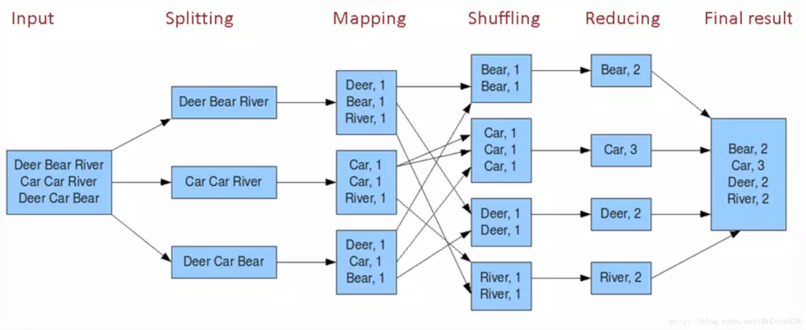
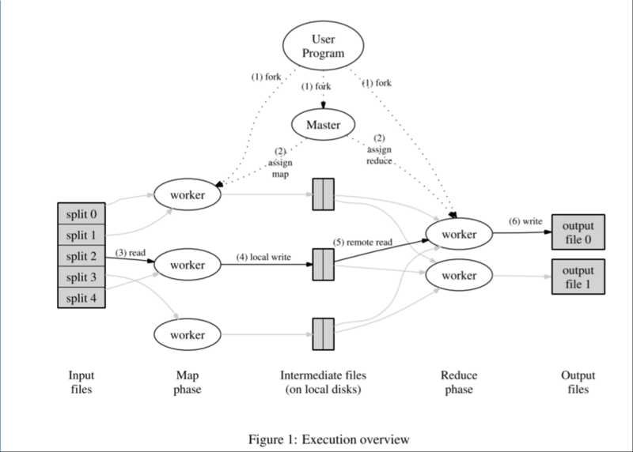

`Map/Reduce` 是一个分布式运算程序的编程框架，`Map/Reduce` 核心功能是将用户编写的业务逻辑代码和自带默认组件整合成一个完整的分布式运算程序，并发运行在一个 `hadoop` 集群上。每个`Map/Reduce`任务都被初始化为一个`Job`，每个`Job`又可以分为两种阶段：`map`阶段和`reduce`阶段。这两个阶段分别用两个函数表示，即`map`函数和`reduce`函数。一个`Map/Reduce`作业的输入和输出类型如下所示：

`(input) <k1, v1> -> map-> <k2, v2> -> Shuff-> <k2, list[v2]> -> reduce -> <k3, v3> (output)`

简单在于其编程模型只包含`map`和`reduce`两个过程，`map`的主要输入是一对`<key , value>`值，经过`map`计算后输出一对`<key , value>`值；然后将相同`key`合并，形成`<key , value集合>`；再将这个`<key , value集合>`输入`reduce`，经过计算输出零个或多个`<key , value>`对。

# [原理](https://songlee24.github.io/2015/07/29/mapreduce-word-count/)

系统中有两类主要的进程节点：`master`（单点），`worker`（多个）。其中，`worker`根据不同的计算任务，又分为`map worke`r（对应上图中的`Map phase`）、`reduce worker`（对应上图中的`Reduce phase`）。

- `master`是系统的中心节点，负责为`worker`节点分配计算任务，同时监控`worker`节点的状态。如果某个`worker`计算太慢，或者宕机，`master`会将该`worker`进程负责的计算任务转移到其他进程。
- `worker`包括`Map`与`Reduce`

1. 首先将文件分割成`<key,value>`的键值对。`Map`通过 `RecordReader` 读取Input的`<key,value>`对，`map`根据用户自定义的任务，运行完毕后，输出另外一系列`<key,value>`，
2. `Shuffle` 阶段需要从所有`map`主机上把相同的`key` 的 `key value`对组合在一起，（也就是这里省去的`Combine`阶段）。
3. `Partitioner`组件会把 `key `放进一个 `hash`函数里，然后得到结果。如果两个 `key` 的哈希值 一样，他们的 `<key,value>`对就被放到同一个 `reduce` 函数里。我们也把分配到同一个 `reduce`函数里的` <key,value>`对叫做一个`reduce partition`。
4. `reduce()` 函数以 `key` 及对应的 `value` 列表作为输入，按照用户自己的程序逻辑，经合并 `key` 相同的 `value` 值后，产 生另外一系列 `<key,value>` 对作为最终输出写入` HDFS`。

# 应用

