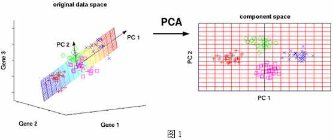
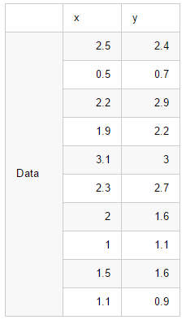
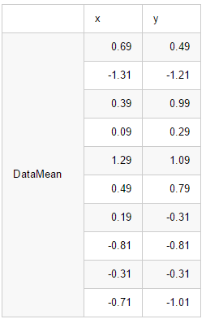

1 | 特征中心化。即每一维的数据都减去该维的均值。
-|-
2|计算协方差矩阵.协方差就是衡量两个变量相关性的变量
3|计算协方差矩阵的特征值和特征向量
4|选取从大到小依次选取若干个的特征值对应的特征向量，映射得到新的样本集：样本乘以特征向量

<!--more-->
# PCA简介
PCA的思想是将$n$维特征映射到$k$维空间上$k<n$，这$k$维特征是全新的正交特征，是重新构造出来的$k$维特征，而不是简单地从$n$维特征中去除其余$n−k$维特征。那么如何衡量投影向量的优劣呢？在数学上有三种方法衡量投影的优劣！PCA可以被定义为数据在低维线性空间上的正交投影。如下图所示，将3维空间中的数据映射到2维空间。
- 映射的基本原则
1. 使得投影数据的⽅差被最⼤化（Hotelling, 1933），即最大方差理论。即数据映射之后差异性最大，方法最大
2. 使得平均投影代价最⼩的线性投影，即最小误差理论。平均投影代价是指数据点和它们的投影之间的平均平⽅距离

假设三维空间中有一系列点，这些点分布在一个过原点的斜面上，如果你用自然坐标系x,y,z这三个轴来表示这组数据的话，需要使用三个维度，而事实上，这些点的分布仅仅是在一个二维的平面上。我们所需要做得就是旋转x、y平面使其与数据点重合

# PCA实现步骤

1. 特征中心化。即每一维的数据都减去该维的均值。
2. **计算协方差矩阵.**协方差就是衡量两个变量相关性的变量。当协方差为正时，两个变量呈正相关关系（同增同减）；当协方差为负时，两个变量呈负相关关系（一增一减）PCA为什么使用协方差.md
$$cov=\bigl(\begin{smallmatrix}
cov(x,x) & cov(x,y)\\
cov(y,x) & cov(y,y)
\end{smallmatrix}\bigr)$$

3. 计算协方差矩阵的特征值和特征向量。
4. 选取从大到小依次选取若干个的特征值对应的特征向量，映射得到新的样本集。样本乘以特征向量

# PCA实例
现在假设有一组数据如下：

解决步骤：
1、 分别求x和y的平均值，然后对于所有的样例，都减去对应的均值。这里x的均值是1.81，y的均值是1.91。

2、 求特征[协方差矩阵](方差、协方差、协方差矩阵.md)，如果数据是3维，那么协方差矩阵是$$C = \begin{pmatrix}
cov(x,x) & cov(x,y) & cov(x,z)\\
cov(y,x) & cov(y,y) & cov(y,z)\\
cov(z,x) & cov(z,y) & cov(z,z)
\end{pmatrix}$$

这里只有x和y，求解得$$cov=\bigl(\begin{smallmatrix}
cov(x,x) & cov(x,y)\\
cov(y,x) & cov(y,y)
\end{smallmatrix}\bigr)=\bigl(\begin{smallmatrix}
0.5549 &0.5539 \\
0.5539 &0.6449
\end{smallmatrix}\bigr)$$对角线上分别是x和y的方差，非对角线上是协方差。协方差是衡量两个变量同时变化的变化程度。协方差大于0表示x和y若一个增，另一个也增；小于0表示一个增，一个减。如果ｘ和ｙ是统计独立的，那么二者之间的协方差就是０；但是协方差是０，并不能说明ｘ和ｙ是独立的。协方差绝对值越大，两者对彼此的影响越大，反之越小。
3、 求协方差的特征值和特征向量，得到$$eigenvalues = \begin{pmatrix}
0.0490833989\\
1.28402771
\end{pmatrix}$$

$$eigenvectors = \begin{pmatrix}
-0.735178656 & -0.677873399\\
0.677873399 & -0.735178656
\end{pmatrix}$$

4、 将特征值按照从大到小的顺序排序，选择其中最大的k个，然后将其对应的k个特征向量分别作为列向量组成特征向量矩阵。
5、 将样本点投影到选取的特征向量上
[参考文献](https://blog.csdn.net/u013719780/article/details/78352262)
