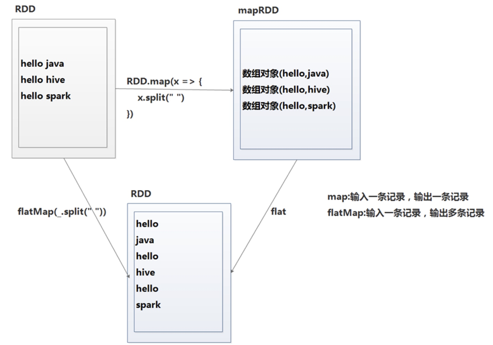
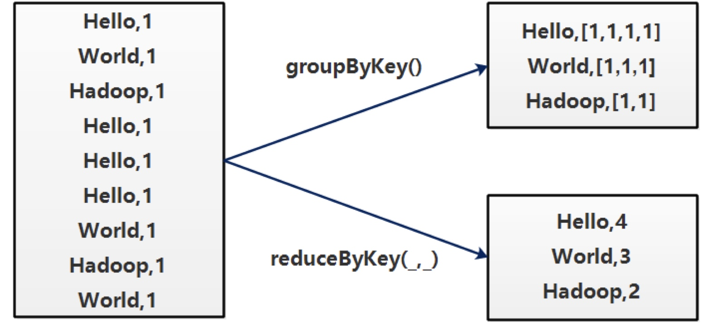
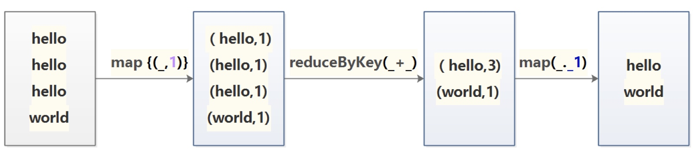
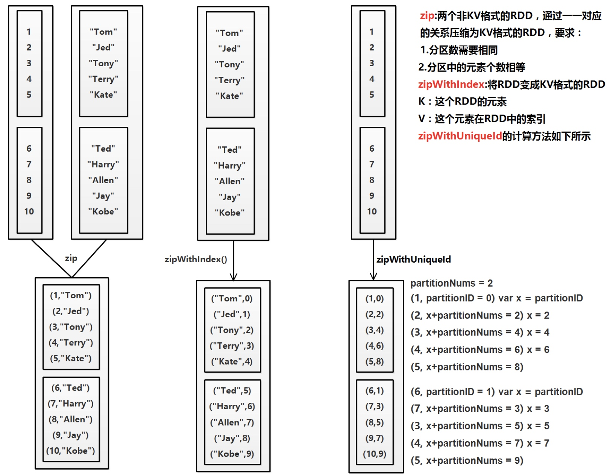

# Actions

| 命令                       | 说明                                                         |
| -------------------------- | ------------------------------------------------------------ |
| `reduce(func)`             | 通过函数`func`聚集数据集中的所有元素。`func`函数接受2个参数，返回一个值。这个函数必须是关联性的，确保可以被正确的并发执行 |
| `collect()`                | 在`Driver`的程序中，以数组的形式，返回数据集的所有元素。这通常会在使用`filter`或者其它操作后，返回一个足够小的数据子集再使用，直接将整个`RDD`集Collect返回，很可能会让`Driver`程序OOM |
| `count()`                  | 统计`RDD`中元素的个数                                        |
| `take(n)`                  | 取`RDD`中的前`n`个元素。注意，这个操作目前并非在多个节点上，并行执行，而是`Driver`程序所在机器，单机计算所有的元素(Gateway的内存压力会增大，需要谨慎使用） |
| `first()`                  | 返回数据集的第一个元素（类似于`take(1)`  ）                  |
| `reduce(func)`             | 按照指定规则聚合`RDD`中的元素                                |
| `countByValue()`           | 统计出`RDD`中每个元素的个数                                  |
| `countByKey()`             | 统计出`KV`格式的`RDD`中相同的K的个数                         |
| `foreach(func)`            | 以元素为单位，遍历`RDD`，运行`func`函数。                    |
| `foreachPartition(func)`   | 以分区为单位，遍历`RDD`，运行`func`函数。                    |
| `saveAsTextFile(path)`     | 将数据集的元素，以t`extfile`的形式，保存到本地文件系统，`hdfs`或者任何其它`hadoop`支持的文件系统。Spark将会调用每个元素的`toString`方法，并将它转换为文件中的一行文本 |
| `saveAsSequenceFile(path)` | 将数据集的元素，以`sequencefile`的格式，保存到指定的目录下，本地系统，`hdfs`或者任何其它`hadoop`支持的文件系统。`RDD`的元素必须由`key-value`对组成，并都实现了`Hadoop`的`Writable`接口，或隐式可以转换为`Writable`（Spark包括了基本类型的转换，例如`Int`，`Double`，`String`等等） |

```scala
//collect 把运行结果拉回到Driver端
val rdd = sc.makeRDD(Array(
  (5,"Tom"),(10,"Jed"),(3,"Tony"),(2,"Jack")
))
val resultRDD = rdd.sortByKey()
val list = resultRDD.collect()
list.foreach(println)

val rdd = sc.makeRDD(Array(
  (5,"Tom"),(10,"Jed"),(3,"Tony"),(2,"Jack")
))
val resultRDD = rdd.sortByKey()
val list = resultRDD.collect()
list.foreach(println)

//take(n)：取RDD中的前n个元素
val rdd = sc.makeRDD(Array("hello","hello","hello","world"))
rdd.take(2).foreach(println)

//first 相当于take(1)
val rdd = sc.makeRDD(Array("hello","hello","hello","world"))
println(rdd.first)

// count 统计RDD中元素的个数
val rdd = sc.makeRDD(Array("hello","hello","hello","world"))
val num = rdd.count()

// reduce 按照指定规则聚合RDD中的元素
val numArr = Array(1,2,3,4,5)
val rdd = sc.parallelize(numArr)
val sum = rdd.reduce(_+_)
println(sum)

//countByValue 统计出RDD中每个元素的个数
val rdd = sc.parallelize(Array(
  "Tom","Jed","Tom",
  "Tom","Jed","Jed",
  "Tom","Tony","Jed"
))
val result = rdd.countByValue();
result.foreach(println)

// countByKey 统计出KV格式的RDD中相同的K的个数
val rdd = sc.parallelize(Array(
  ("销售部","Tom"), ("销售部","Jack"),("销售部","Bob"),("销售部","Terry"),
  ("后勤部","Jack"),("后勤部","Selina"),("后勤部","Hebe"),
  ("人力部","Ella"),("人力部","Harry"),
  ("开发部","Allen")
))
val result = rdd.countByKey();
result.foreach(println)

// foreach 遍历RDD中的元素
val rdd = sc.makeRDD(Array("hello","hello","hello","world"))
rdd.foreach(println)

//foreachPartition 以分区为单位遍历RDD
val rdd = sc.parallelize(1 to 6, 2)
rdd.foreachPartition(x => {
  println("data from a partition:")
  while(x.hasNext) {
    println(x.next())
  }
})
```

# Transformations

| 命令                                  | 说明                                                         |
| ------------------------------------- | ------------------------------------------------------------ |
| `filter(func)`                        | 返回一个新的数据集，由经过`func`函数后返回值为`true`的原元素组成 |
| `map(func)`                           | 返回一个新的分布式数据集，由每个原元素经过`func`函数转换后组成 |
| `flatMap(func)`                       | 类似于`map`，但是每一个输入元素，会被映射为0到多个输出元素（因此，`func`函数的返回值是一个`Seq`，而不是单一元素） |
| `sample(withReplacement, frac, seed)` | 随机抽样<br>`withReplacement`：是否是放回式抽样<br>`frac`:：抽样的比例<br>`seed`：随机种子 |
| `reduceByKey(func, [numTasks])`       | 在一个`(K,V)`对的数据集上使用，返回一个`(K,V)`对的数据集，`key`相同的值，都被使用指定的`reduce`函数聚合到一起。和`groupbykey`类似，任务的个数是可以通过第二个可选参数来配置的。 |
| `groupByKey([numTasks])`              | 在一个由`（K,V）`对组成的数据集上调用，返回一个`(K，Seq[V])`对的数据集。注意：默认情况下，使用8个并行任务进行分组，你可以传入`numTask`可选参数，根据数据量设置不同数目的`Task` |
| `sortByKey(func, [numTasks])`         | 按`key`值进行排序                                            |
| `union(otherDataset)`                 | 返回一个新的数据集，由原数据集和参数联合而成                 |
| `join(otherDataset, [numTasks])`      | 在类型为`(K,V)`和`(K,W)`类型的数据集上调用，返回一个`(K,(V,W))`对，每个key中的所有元素都在一起的数据集 |
| `cartesian(otherDataset)`             | 笛卡尔积。但在数据集T和U上调用时，返回一个(T，U) 对的数据集，所有元素交互进行笛卡尔积。 |
| `map(func)`                           | 以元素为单位，遍历`RDD`，运行`func`函数。                    |
| `mapPartitions(func)`                 | 以分区为单位，遍历`RDD`，运行`func`函数。                    |
| `mapPartitionsWithIndex`              | 与`mapPartitions`基本相同，只是在处理函数的参数是一个二元元组，元组的第一个元素是当前处理的分区的`index`，元组的第二个元素是当前处理的分区元素组成的`Iterator` |
| `coalesce(n,shuffle)`                 | 改变RDD的分区数<br>n：新的分区数目<br>shuffle：false:不产生shuffle；true:产生shuffle，如果重分区的数量大于原来的分区数量,必须设置为true,否则分区数不变 |
| `repartition(n)`                      | 改变RDD分区数。`repartition(int n) = coalesce(int n, true)`  |
| `partitionBy`                         | 通过自定义分区器改变RDD分区数                                |
| `randomSplit(Array)`                  | 根据传入的 `Array`中每个元素的权重将`rdd`拆分成`Array.size`个`RDD`拆分后的`RDD`中元素数量由权重来决定， |
| `groupWith(otherDataset, [numTasks])` | 在类型为（K,V)和(K,W)类型的数据集上调用，返回一个数据集，组成元素为（K, Seq[V], Seq[W]) Tuples。这个操作在其它框架，称为CoGroup |

## map和flatMap



## filter、sample、sortByKey、sortBy


```scala
//filter：过滤
val rdd = sc.makeRDD(Array("hello","hello","hello","world"))
rdd.filter(!_.contains("hello")).foreach(println)

/********** map和flatMap**************
*map: 输入一条记录，输出一条记录
*flatmap：输入一条记录，输出多头记录
*************************************/

//sample ：随机抽样
val rdd = sc.makeRDD(Array(
  "hello1","hello2","hello3","hello4","hello5","hello6",
  "world1","world2","world3","world4"
))
rdd.sample(false, 0.3).foreach(println)

//sortByKey：按key进行排序
val rdd = sc.makeRDD(Array(
  (5,"Tom"),(10,"Jed"),(3,"Tony"),(2,"Jack")
))
rdd.sortByKey().foreach(println)

//sortBy：自定义排序规则
object SortByOperator {
  def main(args: Array[String]): Unit = {
   val conf = new SparkConf().setAppName("TestSortBy").setMaster("local")
    val sc = new SparkContext(conf)
    val arr = Array(
        Tuple3(190,100,"Jed"),
        Tuple3(100,202,"Tom"),
        Tuple3(90,111,"Tony")
    )
    val rdd = sc.parallelize(arr)
    rdd.sortBy(_._1).foreach(println)   //按照190、100、90排序
```

## groupByKey和reduceByKey



## distinct：去掉重复数据



```scala
val rdd = sc.makeRDD(Array(
      "hello",
      "hello",
      "hello",
      "world"
))
val distinctRDD = rdd
      .map {(_,1)}
      .reduceByKey(_+_)
      .map(_._1)
distinctRDD.foreach {println}    //等价于：rdd.distinct().foreach {println}
```

## map和mapPartitions

```scala
val arr = Array("Tom","Bob","Tony","Jerry")
//把4条数据分到两个分区中
val rdd = sc.parallelize(arr,2)
   
/*
 * 模拟把RDD中的元素写入数据库的过程
 */
rdd.map(x => {
  println("创建数据库连接...")
  println("写入数据库...")
  println("关闭数据库连接...")
  println()
}).count()
结果：
创建数据库连接...
写入数据库...
关闭数据库连接...
创建数据库连接...
写入数据库...
关闭数据库连接...
创建数据库连接...
写入数据库...
关闭数据库连接...
创建数据库连接...
写入数据库...
关闭数据库连接...
```

```scala
/*
 * 将RDD中的数据写入到数据库中，绝大部分使用mapPartitions算子来实现
 */
rdd.mapPartitions(x => {
  println("创建数据库")
  val list = new ListBuffer[String]()
  while(x.hasNext){
    //写入数据库
    list += x.next()+":写入数据库"
  }
  //执行SQL语句  批量插入
  list.iterator
})foreach(println)
结果：
创建数据库
Tom:写入数据库
Bob:写入数据库 
创建数据库
Tony:写入数据库
Jerry:写入数据库
```

## mapPartitionsWithIndex

```scala
val dataArr = Array("Tom01","Tom02","Tom03"
                  ,"Tom04","Tom05","Tom06"
                  ,"Tom07","Tom08","Tom09"
                  ,"Tom10","Tom11","Tom12")
val rdd = sc.parallelize(dataArr, 3);
val result = rdd.mapPartitionsWithIndex((index,x) => {
    val list = ListBuffer[String]()
    while (x.hasNext) {
      list += "partition:"+ index + " content:" + x.next
    }
    list.iterator
})
println("分区数量:" + result.partitions.size)
val resultArr = result.collect()
for(x <- resultArr){
  println(x)
}
```

## coalesce：改变RDD的分区数

```scala
/*
 * false:不产生shuffle
 * true:产生shuffle
 * 如果重分区的数量大于原来的分区数量,必须设置为true,否则分区数不变
 * 增加分区会把原来的分区中的数据随机分配给设置的分区个数
 */
val coalesceRdd = result.coalesce(6,true)
   
val results = coalesceRdd.mapPartitionsWithIndex((index,x) => {
  val list = ListBuffer[String]()
  while (x.hasNext) {
      list += "partition:"+ index + " content:[" + x.next + "]"
  }
  list.iterator
})
   
println("分区数量:" + results.partitions.size)
val resultArr = results.collect()
for(x <- resultArr){
  println(x)
}

```


## randomSplit：拆分RDD

```scala
/**
 * randomSplit:
 *   根据传入的 Array中每个元素的权重将rdd拆分成Array.size个RDD
 *  拆分后的RDD中元素数量由权重来决定，数据量不大时不一定准确
 */
val rdd = sc.parallelize(1 to 10)
rdd.randomSplit(Array(0.1,0.2,0.3,0.4)).foreach(x => {println(x.count)})
```

## zip



