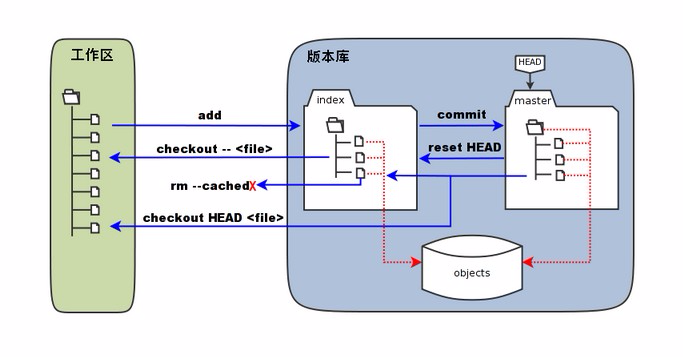
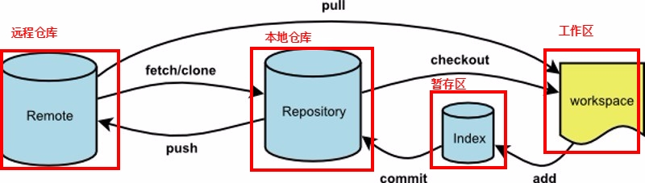
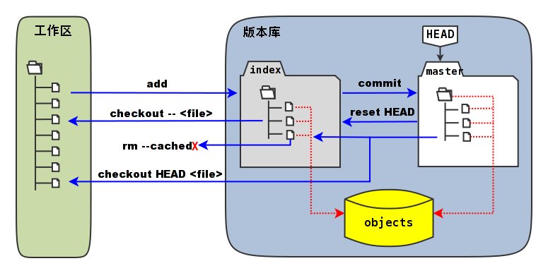

Git 是一个开源的分布式版本控制系统，用于敏捷高效地处理任何或小或大的项目。知名的`git`管理平台有`github`

# 本地git

## 简介

git分为工作区、暂存器和版本库。

- **工作区**：就是你在电脑里能看到的目录。
- **暂存区**：英文叫stage, 或index。一般存放在 ".git目录下" 下的index文件（.git/index）中，所以我们把暂存区有时也叫作索引（index）。
- **版本库**：工作区有一个隐藏目录.git，这个不算工作区，而是Git的版本库。图中"HEAD" 实际是指向 master 分支的一个"游标"。所以图示的命令中出现 HEAD 的地方可以用 master 来替换。
- **object：**Git 的对象库，实际位于 ".git/objects" 目录下，里面包含了创建的各种对象及内容。



## 命令说明

<table>
  <tr>
    <th rowspan="7">基本操作</th>
    <th>git init</th>
    <th>创建版本库</th>
  </tr>
  <tr>
    <td>git add &lt;文件&gt;</td>
    <td>将文件从工作区添加到暂存区</td>
  </tr>
  <tr>
    <td>git commit -m“&lt;说明&gt;”</td>
    <td>将文件从暂存区添加到版本库</td>
  </tr>
  <tr>
    <td>git checkout  &lt;文件&gt;</td>
    <td>将文件从暂存区添加到工作区</td>
  </tr>
  <tr>
    <td>git rm --cached &lt;文件&gt;</td>
    <td>将暂存区中的文件删除</td>
  </tr>
  <tr>
    <td>git reset head</td>
    <td>将文件从版本库添加到暂存区</td>
  </tr>
  <tr>
    <td>git checkout head &lt;文件&gt;</td>
    <td>将文件从版本库添加到工作区</td>
  </tr>
  <tr>
    <td rowspan="3">版本管理</td>
    <td>git log</td>
    <td>查看版本信息 ——查找commit id<br>--graph：以图的形式展现信息<br></td>
  </tr>
  <tr>
    <td>git reflog</td>
    <td>查看历史操作信息——查找commit id<br>以防因为版本回滚导致git log中的信息丢失</td>
  </tr>
  <tr>
    <td>git reset --hard HEAD^<br>git reset --hard HEAD^^<br>git reset --HEAD~100<br>git reset --hard 1094<br></td>
    <td># 回退上一个版本<br># 回退上两个版本<br># 回退上100个版本<br># 回退到指定版本，后面的1094a是commit的版本号</td>
  </tr>
  <tr>
    <td rowspan="5">标签</td>
    <td>git tag -a v0.1 -m "version 0.1 released" 1094adb</td>
    <td>-a指定标签名，-m指定说明文字</td>
  </tr>
  <tr>
    <td>git tag v0.1  commit id</td>
    <td>默认标签是打在最新提交的commit id<br>如果添加commit id就会打在指定的commit id上</td>
  </tr>
  <tr>
    <td>git tag -d v0.1</td>
    <td>删除标签</td>
  </tr>
  <tr>
    <td>git push origin v1.0<br>git push origin --tags<br></td>
    <td>推送标签到远程<br>一次性推送全部标签<br></td>
  </tr>
  <tr>
    <td>git tag<br>git show &lt;标签名&gt;<br></td>
    <td>查看标签<br>查看标签的说明文字</td>
  </tr>
  <tr>
    <td rowspan="5">保存工作区与缓存区</td>
    <td>git stash <br></td>
    <td>将工作区与暂存区的内容保存起来</td>
  </tr>
  <tr>
    <td>git stash list </td>
    <td>查看保存的工作区与暂存区  <br></td>
  </tr>
  <tr>
    <td>git stash apply </td>
    <td>恢复制定的stash，但是stash内容并不删除。git stash apply stash@{0}  <br></td>
  </tr>
  <tr>
    <td>git stash drop </td>
    <td>删除制定的stash。git stash drop stash@{0}  <br></td>
  </tr>
  <tr>
    <td>git stash pop </td>
    <td>恢复并删除最新的工作区与暂存区</td>
  </tr>
  <tr>
    <td rowspan="5">分支管理</td>
    <td>git branch</td>
    <td>查看分支</td>
  </tr>
  <tr>
    <td>git branch  &lt;分支名&gt;</td>
    <td>新建分支，并且新分支有老分支的内容</td>
  </tr>
  <tr>
    <td>git checkout &lt;分支名&gt;</td>
    <td>切换分支</td>
  </tr>
  <tr>
    <td>git branch -d &lt;分支名&gt;</td>
    <td>删除分支</td>
  </tr>
  <tr>
    <td>git merge &lt;分支名&gt;<br>git merge --no-ff &lt;分支名&gt;<br></td>
    <td>合并分支到当前分支下<br>如果有冲突修改冲突，使用git add与git commit 提交</td>
  </tr>
  <tr>
    <td rowspan="9">其他</td>
    <td>git status</td>
    <td>查看状态</td>
  </tr>
  <tr>
    <td rowspan="7">git diff<br>git diff [--options] &lt;commit&gt; &lt;commit&gt; [--] [&lt;path&gt;...]<br></td>
    <td>git diff：比较工作区与暂存区</td>
  </tr>
  <tr>
    <td>git diff --cached：比较暂存区与最新本地版本库</td>
  </tr>
  <tr>
    <td>git diff --cached &lt;commit-id&gt;：比较暂存区与版本库指定commit-id的差异</td>
  </tr>
  <tr>
    <td>git diff HEAD：比较工作区与最新本地版本库</td>
  </tr>
  <tr>
    <td>git diff &lt;commit-id&gt;：比较工作区与版本库指定commit-id的差异</td>
  </tr>
  <tr>
    <td>git diff &lt;commit-id&gt;&lt;commit-id&gt;：比较版本库两个commit-id之间的差异</td>
  </tr>
  <tr>
    <td>git diff &lt;分支&gt;&lt;分支&gt;：比较两个分支</td>
  </tr>
  <tr>
    <td>git rm</td>
    <td>删除文件</td>
  </tr>
</table>

# .gitignore

添加到`.gitignore`中的文件，不会被添加到暂存区，因此不会被保存到版本库中，进而不会存在版本管理。在不同文件夹下建立`.gitignore`可以忽略不同的文件。

```shell
├── .vscode   
├── feture        
│   ├── dev.py
│   └── test            #测试文件夹
│   │   ├── test_dev.py #本地仓库对应分支所有操作
│   └── .gitignore      #写入test/ 可以忽略同级目录下test的文件夹 
├── .gitignore   #写入.vscode/ 可以忽略同级目录下.vscode的文件夹   
```


# 远程



| 命令                    | 说明                                                         |
| ----------------------- | ------------------------------------------------------------ |
| git remote              | 查看当前配置有哪些远程仓库<br>-v：执行时加上 -v 参数，你还可以看到每个别名的实际链接地址。 |
| git remote add          | 连接远程版本库<br>git remote add [shortname] [url]<br>shortname：远程版本库的别名<br>url：远程版本库的链接 |
| git remote rm [别名]    | 删除远程仓库                                                 |
| git push                | 本地库内容推送到远程库中 <br>git push [alias] [branch]：推送成为 [alias] 远程仓库上的 [branch] 分支 |
| git clone               | 克隆远程版本库                                               |
| git pull                | 拉取远程分支更新到本地仓库，再与本地指定分支合并。<br>git pull <远程主机名> <远程分支名>:<本地分支名> |
| git fetch               | 拉取远程分支更新到本地仓库                                   |
| git merge origin/master | 把远程下载下来的代码合并到本地仓库，远程的和本地的合并       |


git ls-files查看版本库目录

git指针问题

文件`.git/index`实际上就是一个包含文件索引的目录树，像是一个虚拟的工作区。在这个虚拟工作区的目录树中，记录了文件名、文件的状态信息（时间戳、文件长度等）。文件的内容并不存储其中，而是保存在Git对象库`.git/objects`目录中，文件索引建立了文件和对象库中对象实体之间的对应。下面这个图展示了工作区、版本库中的暂存区和版本库之间的关系。

> [](http://www.worldhello.net/gotgit/images/git-stage.png)
>
> 工作区、版本库、暂存区原理图

在这个图中，可以看到部分Git命令是如何影响工作区和暂存区（stage，亦称index）的。下面就对这些命令进行简要的说明，而要彻底揭开这些命令的面纱要在接下来的几个章节。

- 图中左侧为工作区，右侧为版本库。在版本库中标记为`index`的区域是暂存区（stage，亦称index），标记为`master`的是master分支所代表的目录树。
- 图中可以看出此时HEAD实际是指向master分支的一个“游标”。所以图示的命令中出现HEAD的地方可以用master来替换。
- 图中的objects标识的区域为Git的对象库，实际位于`.git/objects`目录下，会在后面的章节重点介绍。
- 当对工作区修改（或新增）的文件执行**git add**命令时，暂存区的目录树被更新，同时工作区修改（或新增）的文件内容被写入到对象库中的一个新的对象中，而该对象的ID被记录在暂存区的文件索引中。
- 当执行提交操作（**git commit**）时，暂存区的目录树写到版本库（对象库）中，master分支会做相应的更新。即master最新指向的目录树就是提交时原暂存区的目录树。
- 当执行**git reset HEAD**命令时，暂存区的目录树会被重写，被master分支指向的目录树所替换，但是工作区不受影响。
- 当执行**git rm –cached <file>**命令时，会直接从暂存区删除文件，工作区则不做出改变。
- 当执行**git checkout .**或者**git checkout – <file>**命令时，会用暂存区全部或指定的文件替换工作区的文件。这个操作很危险，会清除工作区中未添加到暂存区的改动。
- 当执行**git checkout HEAD .**或者**git checkout HEAD <file>**命令时，会用HEAD指向的master分支中的全部或者部分文件替换暂存区和以及工作区中的文件。这个命令也是极具危险性的，因为不但会清除工作区中未提交的改动，也会清除暂存区中未提交的改动。


git原理与基本命令

https://www.cnblogs.com/kekec/p/9248487.html

https://drprincess.github.io/2018/02/27/Git-%E4%BD%A0%E5%A5%BDHEAD%E5%90%8C%E5%AD%A6/

https://coding.net/help/doc/practice/git-principle.html


https://yanhaijing.com/git/2017/02/08/deep-git-3/