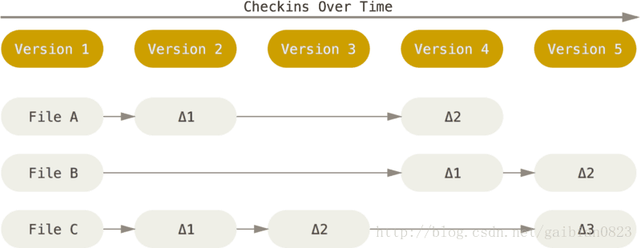
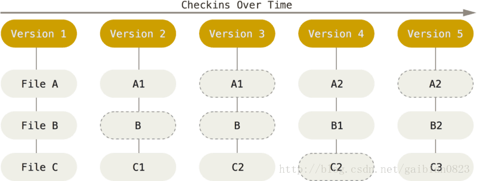

# 简介

 Git 和其它版本控制系统(包括 Subversion 和近似工具)的主要差别在于 Git 对待数据的方法。

- 大部分版本控制系统，例如(CVS、Subversion、Perforce、Bazaar 等等)，采用增量文件系统，存储每个文件版本的差异；

-   Git 更像是把数据看作是对小型文件系统的一组快照。 每次你提交更新，它主要对当时的全部文件制作一个快照并保存这个快照的索引。 为了高效，如果文件没有修改，Git 不再重新存储该文件，而是只保留一个链接指向之前存储的文件；如果文件发生修改，Git 将存储该文件全部内容。

  

<center>增量文件系统</center>


<center>快照文件系统</center>
<!--more-->

# 存储原理

## 目录结构

```shell
sudo apt-get install tree #安装tree命令
```

```shell
$ tree .git
.git
├── COMMIT_EDITMSG     #本地最后一个提交的信息
├── ORIG_HEAD          #当前远程库的HEAD
├── HEAD               #本地库的当前HEAD     
├── config  #git配置信息，包括用户名，email，remote repository的地址，本地branch和remote branch              的follow关系
├── description        #该git库的描述信息，文件仅供 GitWeb 程序使用。
├── index              #文件存储着暂存区的内容信息
├── hooks              #钩子程序，可以被用于在执行git命令时自动执行一些特定操作，例如加入changeid
│   ├── applypatch-msg.sample
│   ├── commit-msg.sample
│   ├── fsmonitor-watchman.sample
│   ├── post-update.sample
│   ├── pre-applypatch.sample
│   ├── pre-commit.sample
│   ├── pre-push.sample
│   ├── pre-rebase.sample
│   ├── pre-receive.sample
│   ├── prepare-commit-msg.sample
│   └── update.sample
├── info               #info目录下的exclude文件包含项目全局忽略匹配模式，与.gitignore文件互补。
│   └── exclude
├── logs        
│   ├── HEAD
│   └── refs
│       ├── heads      #本地仓库对应分支所有操作
│       │   └── hexo
│       └── remotes    #远程仓库对应分支所有操作
│           └── origin
│               ├── HEAD
│               ├── hexo
├── objects            #目录存储着Git数据库的所有内容，包括三类对象commit,tree和blob
│   ├── e8
│   │   └── 4551234f24b6da002d962a26c2495ea16a425f
│   ├── info
│   └── pack
└── refs              
    ├── heads          #本地库各个分支对应的当前指针
    │   └── master
    ├── remotes        #远程库各个分支对应的当前指针
    │   └── origin
    │       ├── HEAD   #远程仓库当前分支
    │       └── master #远程库master分支对应的指针
    └── tags           #本地库tag的当前指针
```

## object对象

object对象包括Blob对象、Tree对象与Commit对象，对象的所有索引全部采用哈希值进行索引。

- `Blob`对象：二进制数据块存储文件的内容，如果两个文件在同一个版本仓库中，那么它们将会共享同一个`blob`对象，例如文件夹`e8`中的文件`4551234f24b6da002d962a26c2495ea16a425f`其中存储的便是文件内容。
- `Tree`对象：存储目录结构，指向其他`tree`对象或`blob`对象。
- `Commit`对象：用于存储版本信息，`tree`存储`tree SHA1`签名；`parent`存储上一个版本的`commit SHA1`签名；`author`，作者的信息；`committer`实际提交者的信息


## git指针

主要介绍`refs/heads`、`refs/tags`、`refs/remotes`、`HEAD`、`ORIG_HEAD`等

- `HEAD`：本地库的`HEAD`，保存`refs/`中的文件。例如`refs/heads/master`

- `ORIG_HEAD`：当进行一些有风险的操作的时候，如`reset`、`merge`或者`rebase`，Git会将`HEAD`原来所指向`commit`对象的`sha-1`值存放于`ORIG_HEAD`文件中。也就是说`ORIG_HEAD`可以让我们找到进行最近一次危险操作之前的`HEAD`位置

  可以使用 `git reset --hard ORIG_HEAD`回退到上一次`reset`之前。

- `refs/heads`：存储各个分支信息，保存有`commit SHA1`签名

- `refs/tags`：存储各个`tag`信息，保存有`commit SHA1`签名

- `refs/remotes/repertoryName/HEAD`：远程库的当前分支

- `refs/remotes/repertoryName/remoteBranchName`：远程仓库对应分支最后一次`commit`

`HEAD`里面的内容是当前的`ref, `而当前`ref`的内容是`commit SHA1`, `commit` 对象内容是`tree SHA1`, `tree`对象的内容是文件夹/文件信息，而`blob`对象存储着文件的具体内容。


# 命令

## git add

将文件添加进暂存区，将文件保存为`blob`对象存储在`object`目录下，但并不会创建`tree`对象与`commit`对象，而是更新`index`文件（即暂存区）。

## git commit

生成`tree`对象与`commit`对象，存储版本信息。`tree`对象用于记录目录信息，将暂存区（`index`文件）转换为`tree`对象；`commit`对象用于记录版本信息，指向`tree`对象。移动指针，并更新`refs\heads`、`refs\tags`里的`commit SHA1`签名，与当前`HEAD`的信息。

## 本地分支

| 命令        | 注释     | 备注                             |
| ----------- | -------- | -------------------------------- |
| `branch`    | 创建分支 | `\ref\heads`创建分支             |
| `check out` | 切换分支 | 将`HEAD`指针指向另一个本地分支。 |
| `merge`     | 合并分支 | 将出现分叉提交的分支整合在一起时 |


<center>分支合并</center>
## 远程分支

| 命令        | 注释 | 备注                       |
| ----------- | ---- | -------------------------- |
| `git clone` | 克隆 | 远程下载                   |
| `git fetch` | 获取 | 将远程内容下拉到本地版本库 |
|             |      |                            |

1. 远程仓库，并且有一些提交记录 。拉取下来

   

2. 其他人提交了一些修改至远程仓库

   

3. 你在本地分支上继续开发

   

4. 你进行拉取你本地没有的数据

   

## 变基合并

1. 创建了一个特性分支 server，为服务端添加了一些功能，提交了 C3 和 C4。 然后从 C3 上创建了特性分支 client，为客户端添加了一些功能，提交了 C8 和 C9。 最后，你回到 server 分支，又提交了 C10。

   

2. 假设你希望将 client 中的修改合并到主分支并发布，但暂时并不想合并 server 中的修改

   ```shell
   $ git rebase --onto master server client
   ```

   

3. 进行合并 client 分支

   ```shell
   $ git checkout master
   $ git merge client
   ```

   

4. 进行合并 server 分支

   ```shell
   $ git rebase master server
   ```

   