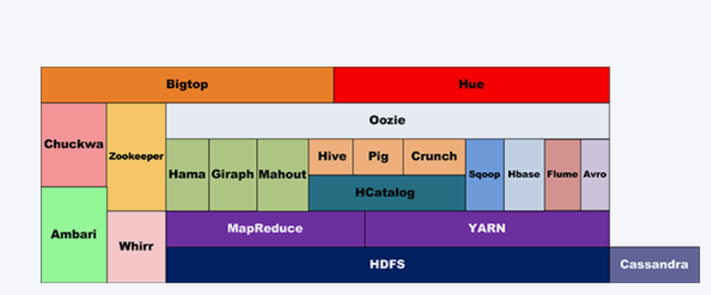

`Apache Hadoop`软件库是一个框架，允许使用简单的编程模型跨计算机集群分布式处理大型数据集。它旨在从单个服务器扩展到数千台计算机，每台计算机都提供本地计算和存储。该库本身不是依靠硬件来提供高可用性，而是设计用于检测和处理应用层的故障，从而在计算机集群之上提供高可用性服务，每个计算机都可能容易出现故障。`Hadoop`的命令众多，本文重点介绍`HDFS`与`MapReduce`

<!--more-->

hadoop.tgn

<table>
  <tr>
    <th>类别</th>
    <th>名称</th>
    <th>说明</th>
  </tr>
  <tr>
    <td rowspan="6">模块</td>
    <td>Hadoop Common</td>
    <td>支持其他Hadoop模块的常用实用程序。</td>
  </tr>
  <tr>
    <td>Hadoop HDFS</td>
    <td>一种分布式文件系统，可提供对应用程序数据的高吞吐量访问</td>
  </tr>
  <tr>
    <td>Hadoop YARN</td>
    <td>作业调度和集群资源管理的框架。</td>
  </tr>
  <tr>
    <td>Hadoop MapReduce</td>
    <td>基于YARN的系统，用于并行处理大型数据集</td>
  </tr>
  <tr>
    <td><a href="https://hadoop.apache.org/ozone/">Hadoop Ozone</a></td>
    <td><a href="https://hadoop.apache.org/ozone/">Hadoop</a>的对象存储</td>
  </tr>
  <tr>
    <td><a href="https://hadoop.apache.org/submarine/">Hadoop Submarine</a></td>
    <td><a href="https://hadoop.apache.org/submarine/">Hadoop</a>的机器学习引擎。</td>
  </tr>
  <tr>
    <td rowspan="8">数据库</td>
    <td><a href="http://hive.apache.org/">Apache Hive</a></td>
    <td>是基于Hadoop的一个数据仓库工具，可以将结构化的数据文件映射为一张数据库表，通过类SQL语句快速实现简单的MapReduce统计，不必开发专门的MapReduce应用，十分适合数据仓库的统计分析。</td>
  </tr>
  <tr>
    <td><a href="http://pig.apache.org/">Apache Pig</a></td>
    <td>是一个基于Hadoop的大规模数据分析工具，它提供的SQL-LIKE语言叫Pig Latin，该语言的编译器会把类SQL的数据分析请求转换为一系列经过优化处理的MapReduce运算</td>
  </tr>
  <tr>
    <td><a href="http://hbase.apache.org/">Apache HBase</a></td>
    <td>是一个高可靠性、高性能、面向列、可伸缩的分布式存储系统，利用HBase技术可在廉价PC Server上搭建起大规模结构化存储集群</td>
  </tr>
  <tr>
    <td><a href="http://cassandra.apache.org/">Apache Cassandra</a></td>
    <td>是一套开源分布式NoSQL数据库系统。它最初由Facebook开发，用于储存简单格式数据，集Google BigTable的数据模型与Amazon Dynamo的完全分布式的架构于一身</td>
  </tr>
  <tr>
    <td><a href="http://incubator.apache.org/hcatalog/">Apache HCatalog</a></td>
    <td>是基于Hadoop的数据表和存储管理，实现中央的元数据和模式管理，跨越Hadoop和RDBMS，利用Pig和Hive提供关系视图。</td>
  </tr>
  <tr>
    <td><a href="http://avro.apache.org/">Apache Avro</a></td>
    <td>是一个数据序列化系统，设计用于支持数据密集型，大批量数据交换的应用。Avro是新的数据序列化格式与传输工具，将逐步取代Hadoop原有的IPC机制</td>
  </tr>
  <tr>
    <td><a href="http://sqoop.apache.org/">Apache Sqoop</a></td>
    <td>是一个用来将Hadoop和关系型数据库中的数据相互转移的工具，可以将一个关系型数据库（MySQL ,Oracle ,Postgres等）中的数据导进到Hadoop的HDFS中，也可以将HDFS的数据导进到关系型数据库中。</td>
  </tr>
  <tr>
    <td><a href="http://incubator.apache.org/chukwa/">Apache Chukwa</a></td>
    <td>是一个开源的用于监控大型分布式系统的数据收集系统，它可以将各种各样类型的数据收集成适合 Hadoop 处理的文件保存在 HDFS 中供 Hadoop 进行各种 MapReduce 操作。</td>
  </tr>
  <tr>
    <td rowspan="3">计算与模型</td>
    <td><a href="http://mahout.apache.org/">Apache Mahout</a></td>
    <td>是基于Hadoop的机器学习和数据挖掘的一个分布式框架。Mahout用MapReduce实现了部分数据挖掘算法，解决了并行挖掘的问题。</td>
  </tr>
  <tr>
    <td><a href="http://hama.apache.org/">Apache Hama</a></td>
    <td>是一个基于HDFS的BSP（Bulk Synchronous Parallel)并行计算框架, Hama可用于包括图、矩阵和网络算法在内的大规模、大数据计算。</td>
  </tr>
  <tr>
    <td><a href="http://giraph.apache.org/">Apache Giraph</a></td>
    <td>是一个可伸缩的分布式迭代图处理系统， 基于Hadoop平台，灵感来自 BSP (bulk synchronous parallel) 和 Google 的 Pregel。</td>
  </tr>
  <tr>
    <td rowspan="6">框架</td>
    <td><a href="http://flume.apache.org/">Apache Flume</a></td>
    <td>是一个分布的、可靠的、高可用的海量日志聚合的系统，可用于日志数据收集，日志数据处理，日志数据传输。</td>
  </tr>
  <tr>
    <td><a href="http://cloudera.github.io/hue/">Cloudera Hue</a></td>
    <td>是一个基于WEB的监控和管理系统，实现对HDFS，MapReduce/YARN, HBase, Hive, Pig的web化操作和管理。</td>
  </tr>
  <tr>
    <td><a href="http://incubator.apache.org/ambari/">Apache Ambari</a></td>
    <td>是一种基于Web的工具，支持Hadoop集群的供应、管理和监控</td>
  </tr>
  <tr>
    <td><a href="http://zookeeper.apache.org/">Apache Zookeeper</a> </td>
    <td>是一个为分布式应用所设计的分布的、开源的协调服务，它主要是用来解决分布式应用中经常遇到的一些数据管理问题，简化分布式应用协调及其管理的难度，提供高性能的分布式服务</td>
  </tr>
  <tr>
    <td><a href="http://bigtop.apache.org/">Apache Bigtop</a></td>
    <td>是一个对Hadoop及其周边生态进行打包，分发和测试的工具。</td>
  </tr>
  <tr>
    <td><a href="http://oozie.apache.org/">Apache Oozie</a></td>
    <td>是一个工作流引擎服务器, 用于管理和协调运行在Hadoop平台上（HDFS、Pig和MapReduce）的任务。</td>
  </tr>
  <tr>
    <td>辅助</td>
    <td><a href="http://incubator.apache.org/crunch/">Apache Crunch</a></td>
    <td>是基于Google的FlumeJava库编写的Java库，用于创建MapReduce程序。与Hive，Pig类似，Crunch提供了用于实现如连接数据、执行聚合和排序记录等常见任务的模式库</td>
  </tr>
</table>

# [HDFS](https://hadoop.apache.org/docs/r1.0.4/cn/hdfs_design.html)

`Hadoop`分布式文件系统(`HDFS`)被设计成适合运行在通用硬件(commodity hardware)上的分布式文件系统。它和现有的分布式文件系统有很多共同点。但同时，它和其他的分布式文件系统的区别也是很明显的。`HDFS`是一个高度容错性的系统，适合部署在廉价的机器上。`HDFS`能提供高吞吐量的数据访问，非常适合大规模数据集上的应用。`HDFS`放宽了一部分`POSIX`约束，来实现流式读取文件系统数据的目的。`HDFS`在最开始是作为`Apache Nutch`搜索引擎项目的基础架构而开发的。`HDFS`是`Apache Hadoop Core`项目的一部分。[`HDFS`使用指南]()

# [Map/Reduce](./MapReduce.md)

`Map/Reduce` 是一个分布式运算程序的编程框架，`Map/Reduce` 核心功能是将用户编写的业务逻辑代码和自带默认组件整合成一个完整的分布式运算程序，并发运行在一个 `hadoop` 集群上。每个`Map/Reduce`任务都被初始化为一个`Job`，每个`Job`又可以分为两种阶段：`map`阶段和`reduce`阶段。这两个阶段分别用两个函数表示，即`map`函数和`reduce`函数。一个`Map/Reduce`作业的输入和输出类型如下所示：

`(input) <k1, v1> -> map -> <k2, v2> -> combine -> <k2, v2> -> reduce -> <k3, v3> (output)`

# [Hive](./hive.md)