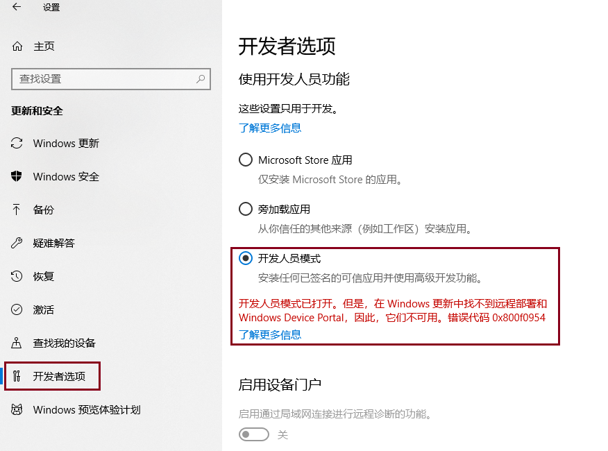
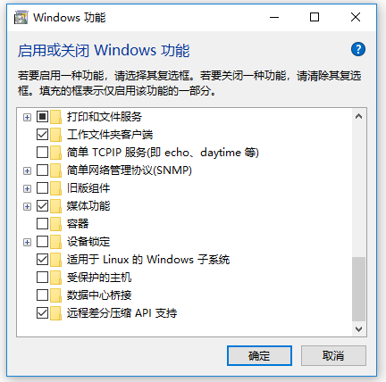
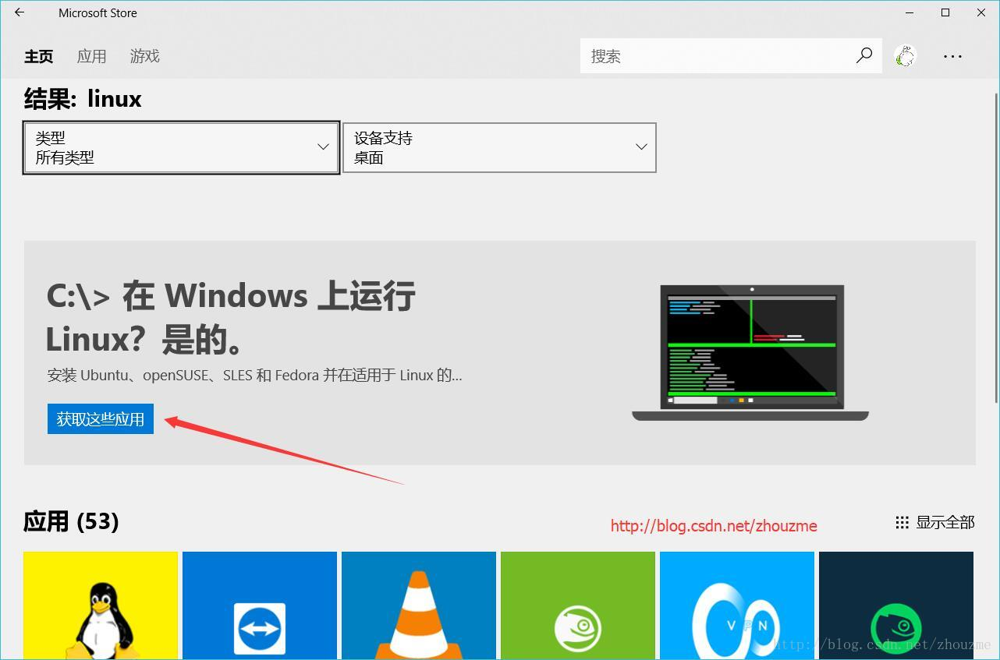
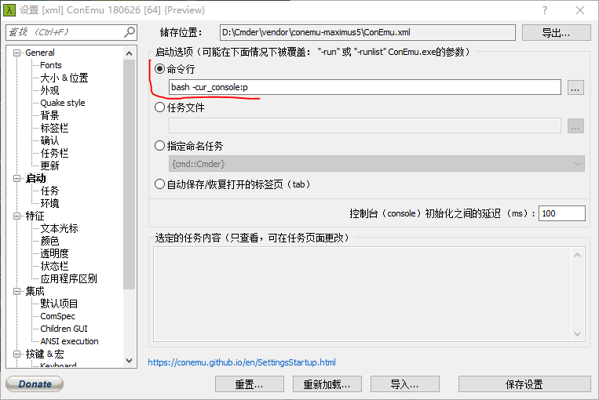
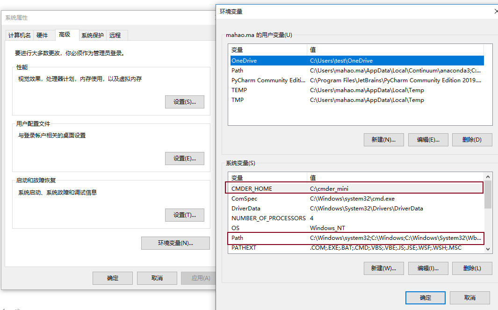

# Windows10安装Ubuntu子系统

## 一、开启开发模式

“设置 - 更新和安全 - 针对开发人员”设置页面，选中“开发人员模式”。



<!--more-->

## 二、启用或关闭Windows功能



## 三、安装 Linux 子系统

打开 Windows 应用市场，输入 linux 搜索，选择你自己想要的系统版本



## 四、一个好看的cmd

[zsh](https://link.zhihu.com/?target=http%3A//www.zsh.org/)（Z Shell）是一个功能强大的交互式shell脚本命令解释器。它不仅支持bash，还提供一些强大和高效的功能，例如更好的**自动补全**和**纠错**。貌似很好用

```shell
sudo apt-get install zsh     #安装oh-my-zsh首先需要安装zsh
zsh --version                #查看版本号

sh -c "$(curl -fsSL https://raw.githubusercontent.com/robbyrussell/oh-my-zsh/master/tools/install.sh)"        #使用curl安装oh-my-zsh
sh -c "$(wget https://raw.githubusercontent.com/robbyrussell/oh-my-zsh/master/tools/install.sh -O -)"   #使用wget安装oh-my-zsh
```

在`vim ~/.bash_profile`中启用zsh，编辑文件，在末尾添加：

```shell
exec zsh
source .zshrc
```

## 五、安装配置Cmder命令行终端

访问[cmder.net](https://cmder.net/)，下载mini版本即可

1. 修改启动参数

   修改启动参数填入`bash -cur_console:p`，这样我们直接打开cmder后就可以进入到linux系统了

   

2. 将cmder添加进win10的右键菜单

   1. 右键点击我的电脑--属性--高级系统设置--环境变量--系统变量，**点击新建，变量名设置为：**CMDER_HOME，变量值直接粘贴刚才拷贝的地址，

   2. 然后点击系统变量中的path，点击新建，输入%CMDER_HOME%
      
   3. 使用管理员权限打开cmder终端运行`Cmder.exe /REGISTER ALL`

# 文件夹互相访问

## win10访问ubuntu

```shell
C:\Users\xxx\AppData\Local\Packages\CanonicalGroupLimited.UbuntuonWindows_79rhkp1fndgsc\LocalState\rootfs\home\xxx
```


## ubuntu访问win10

```shell
/mnt/c/Users    # 进入win10的c盘的Users
```

### 可以建立一个win10的快捷方式

```shell
ln -s /mnt/c/Users/xxx ~/win10    建立链接
```


