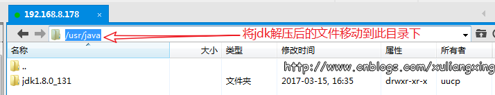
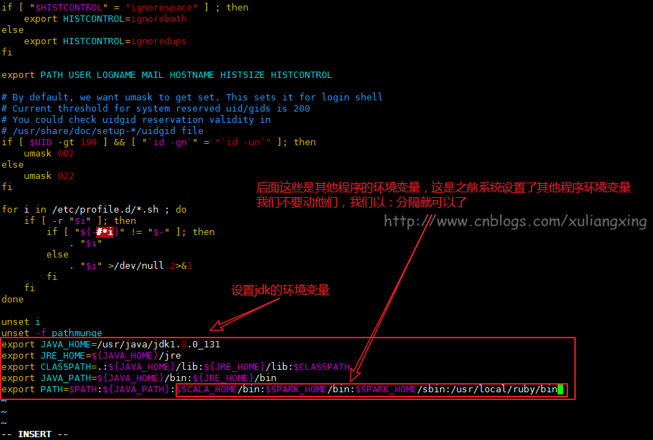
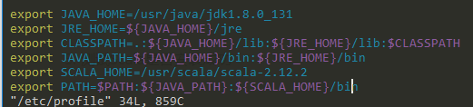
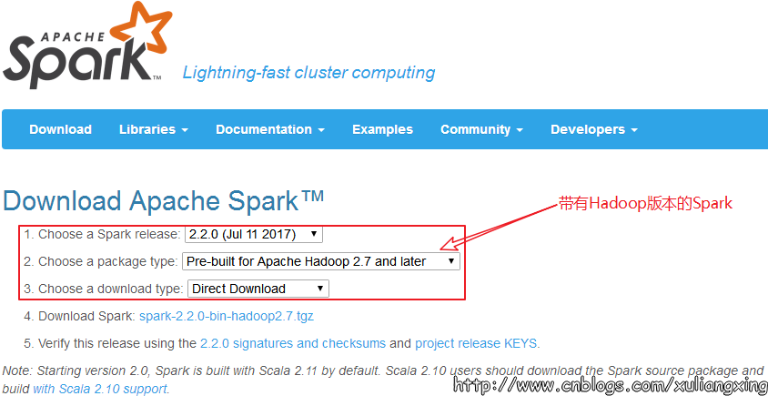
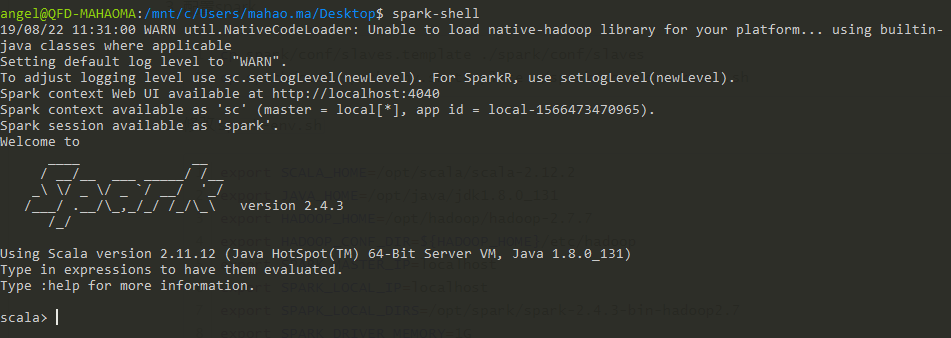

```
JDK:1.8  
Spark-2.2.0
Hadoop Release:2.7.4
```

一般将文件安装在`/opt`目录下，`/opt`目录用来存放第三方的应用程序与文件。

<!--more-->

# 安装java

1. 下载`Linux`环境下的`jdk1.8`，请去（[官网](http://www.oracle.com/technetwork/java/javase/downloads/jdk8-downloads-2133151.html)）中下载`jdk`的安装文件；

2. 解压安装包

   ```shell
   tar  -zxvf  jdk-8u131-linux-x64.tar.gz  
   ```

3. 将`jdk`安装在`usr/java`当中

   ```shell
   mkdir /opt/java   #创建/usr/java文件夹
   mv /home/cmfchina/jdk1.8.0_131 /opt/java  #将jdk1.8.0_131移动到/opt/java文件夹
   ```

   

4. 修改环境变量，使用`vim /etc/profile`并在末尾添加如下内容，并使用`source /etc/profile`让命令`profile`

   ```shell
   export JAVA_HOME=/opt/java/jdk1.8.0_131
   export JRE_HOME=${JAVA_HOME}/jre
   export CLASSPATH=.:${JAVA_HOME}/lib:${JRE_HOME}/lib:$CLASSPATH
   export JAVA_PATH=${JAVA_HOME}/bin:${JRE_HOME}/bin
   export PATH=$PATH:${JAVA_PATH}
   ```

   

5. 测试是否安装成功

   - 使用`javac`命令，不会出现`command not found`错误
   - 使用`java -version`，出现版本为`java version "1.8.0_131"`
   - `echo $PATH`，看看自己刚刚设置的的环境变量配置是否都正确

# 安装scala

1. 从官网：http://www.scala-lang.org/ 下载Scala

2. 解压压缩包

   ```shell
   tar  -zxvf  scala-2.12.2.tgz
   ```

3. 将`scala`安装在opt/scala`当中

   ```shell
   mkdir /opt/scala 
   mv scala-2.12.2 /usr/scala
   ```

4. 配置Scala环境变量
   ```shell
   export SCALA_HOME=/opt/scala/scala-2.12.2
   export PATH=$PATH:${SCALA_HOME}/bin
   ```
   在该文件的PATH变量中增加下面的内容`{SCALA_HOME}/bin`
   

   
5. 运行环境变量

   ```
   source  /etc/profile 
   ```

6. 测试Scala是否安装成功

   ```
   scala -version
   ```

# ssh免密登陆

1. 安装ssh，win10的ubuntu子系统使默认安装好的

   ```shell
   sudo apt-get install openssh-client
   sudo apt-get install openssh-server
   ```

2. 启动、重启ssh服务

   ```shell
   sudo service ssh start
   sudo service ssh restart
   ```

   - 可能报错

     ```shell
     Could not load host key: /etc/ssh/ssh_host_rsa_key
     Could not load host key: /etc/ssh/ssh_host_ecdsa_key
     Could not load host key: /etc/ssh/ssh_host_ed25519_key
     ```

     - 解决方法

       ```shell
       ssh-keygen -t rsa -f /etc/ssh/ssh_host_rsa_key
       ssh-keygen -t ecdsa -f /etc/ssh/ssh_host_ecdsa_key
       ssh-keygen -t ed25519 -f /etc/ssh/ssh_host_ed25519_key
       ```

3. 配置ssh端口。ssh端口默认是22号端口,修改`/etc/ssh/sshd_config`

   ```shell
   Port 22         #如果和win10的端口号冲突，可以改为其他的
   UsePrivilegeSeparation no
   PermitRootLogin no         #如果你确实要用root方式登录的话设为yes
   PasswordAuthentication yes
   ```

4. 配置免密登陆

   ```shell
   ssh-keygen -t rsa -P '' -f ~/.ssh/id_rsa  生成密钥
   ssh-copy-id -i ~/.ssh/id_rsa.pub <username>@localhost  将公钥发送至Ubuntu ,其中<username> 为你的用户名
   ssh localhost  查看是否不需要密码登录
   ```

# 安装hadoop

1. 下载`hadoop`。[官网](https://www.apache.org/dyn/closer.cgi/hadoop/common)。[清华](http://mirror.bit.edu.cn/apache/hadoop/common/)

2. 解压配置环境变量

   ```shell
   sudo tar -zvxf hadoop-2.7.7.tar.gz    #解压缩
   sudo mv hadoop-2.7.7 /opt/hadoop      #复制文件
   sudo vim /etc/profile                 #配置全局变量
   sudo source /etc/profile              #生效
   ```

   

3. 设置`JAVA_HOME`路径。修改`etc/hadoop/hadoop-env.sh`文件中的JAVA_HOME变量，添加`export JAVA_HOME=/mnt/d/usr/local/jdk`

4. 修改`etc/hadoop/core-site.xml`文件。(注意文件夹的权限)

   ```xml
   <configuration>
       <!--指定NamNode通信地址-->
       <property>
           <name>fs.defaultFS</name>
           <value>hdfs://localhost:9000</value>
       </property>
      <!--指定Hadoop运行时产生文件的存储路径-->
       <property>
           <name>hadoop.tmp.dir</name>
           <value>file:/opt/hadoop/tmp</value>
       </property>
   </configuration>
   ```

5. 修改`etc/hadoop/hdfs-site.xml`文件

   ```xml
   <configuration>
       <property>
           <name>dfs.name.dir</name>
           <value>file:/opt/hadoop/hdfs/name</value>
           <description>namenode上存储hdfs名字空间元数据 </description>
       </property>
   
       <property>
           <name>dfs.data.dir</name>
           <value>file:/opt/hadoop/hdfs/data</value>
           <description>datanode上数据块的物理存储位置</description>
       </property>
   
       <!-- 设置hdfs副本数量 -->
       <property>
           <name>dfs.replication</name>
           <value>1</value>
       </property>
   </configuration>
   ```

6. 编辑`mapred-site.xml`配置文件，配置`mapreducer`框架运行在`yarn`上：

   键入如下命令复制`mapred-site.xml`配置文件：`cp mapred-site.xml.template mapred-site.xml`

   `mapred-site.xml`配置文件内容如下:

   ```xml
   <configuration>
   <!-- 通知框架MR使用YARN -->
       <property>
           <name>mapreduce.framework.name</name>
           <value>yarn</value>
       </property>
   </configuration>
   ```

7. 编辑`yarn`配置`yarn-site.xml`，添加如下内容：

   ```xml
   <configuration>
   <!--reducer取数据的方式是mapreduce_shuffle-->
       <property>
           <name>yarn.nodemanager.aux-services</name>
           <value>mapreduce_shuffle</value>
       </property>
   </configuration>
   ```

8. 建立文件夹

   ```mermaid
   graph LR
   A[hadoop]-->B[tmp]
   A-->C[hdfs]
   C-->D[data]
   C-->E[name]
   ```

9. 格式化`hdfs`；启动`hdfs`和`yarn`

   ```shell
   hdfs namenode -format
   start-all.sh
   ```

10. 检测是否成功

    ```shell
    jps
    
    5074 SecondaryNameNode
    2003 NodeManager
    8008 Jps
    6505 NameNode
    6700 DataNode
    1663 ResourceManager
    ```

# 安装Spark

1. 我们到Spark官网进行下载：http://spark.apache.org/ ，我们选择带有Hadoop版本的Spark，如图所示：
    

2. 解压Spark，将spark安装进`/opt/spark`.同上

3. 配置spark

   ```shell
   cp spark/conf/slaves.template ./spark/conf/slaves
   cp spark/conf/spark-env.sh.template ./spark/conf/spark-env.sh
   ```

4. 修改`spark-env.sh`

   ```shell
   export SCALA_HOME=/opt/scala/scala-2.12.2
   export JAVA_HOME=/opt/java/jdk1.8.0_131
   export HADOOP_HOME=/opt/hadoop/hadoop-2.7.7
   export HADOOP_CONF_DIR=${HADOOP_HOME}/etc/hadoop
   export SPARK_MASTER_IP=localhost
   export SPARK_LOCAL_IP=localhost
   export SPAPK_LOCAL_DIRS=/opt/spark/spark-2.4.3-bin-hadoop2.7
   export SPARK_DRIVER_MEMORY=1G
   ```

5. 启动`spark-shell`   


