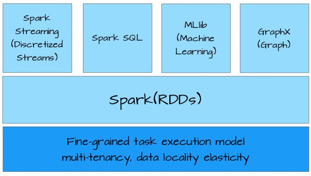
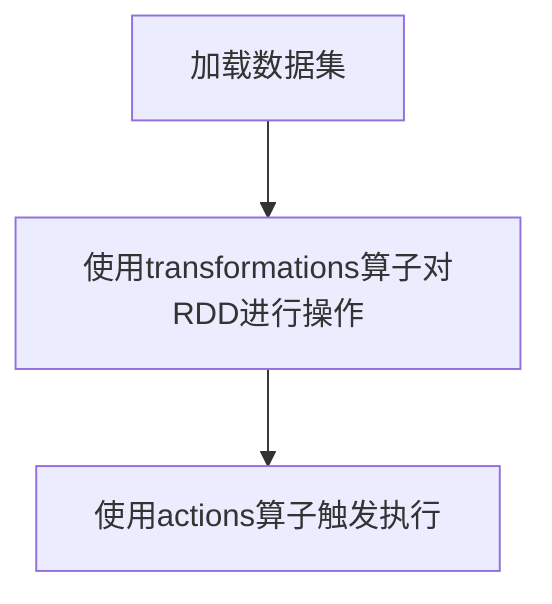
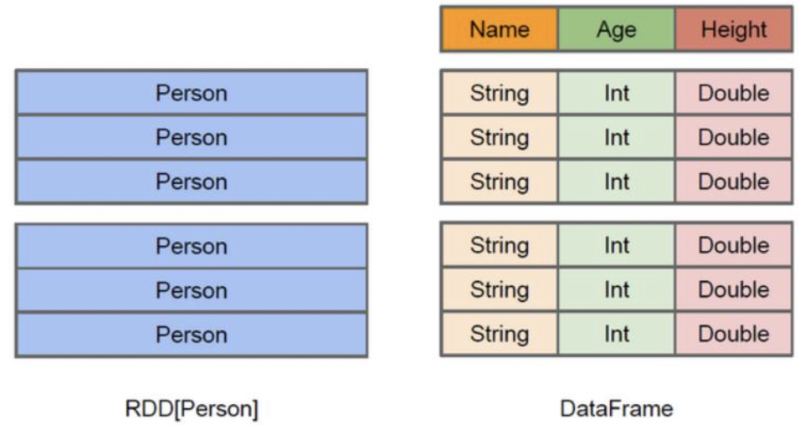

---

title: spark
date: 2019-08-09 17:08:07
tags: [人工智能,分布式系统]
categories: spark
---

# [spark简介](https://spark-reference-doc-cn.readthedocs.io/zh_CN/latest/programming-guide/sql-guide.html#rdd)

Spark是开发通用的大数据处理框架。Spark应用程序可以使用R语言、Java、Scala和Python进行编写，极少使用R语言编写Spark程序，Java和Scala语言编写的Spark程序的执行效率是相同的，但Java语言写的代码量多，Scala简洁优雅，但可读性不如Java，Python语言编写的Spark程序的执行效率不如Java和Scala。

<!--more-->

## 运行模式

Spark有4中运行模式：

| 名称       | 说明                                          |
| ---------- | --------------------------------------------- |
| local      | 适用于测试                                    |
| standalone | 并非是单节点，而是使用spark自带的资源调度框架 |
| yarn       | 最流行的方式，使用yarn集群调度资源            |
| mesos      | 国外使用的多                                  |

# [RDD](./RDD-Spark.md)

`Spark`主要特点是提供了一个集群的分布式内存抽象，以支持需要工作集的应用。这个抽象就是`RDD`

`RDD`是**弹性分布式数据集**，**是`Spark`中最基本的数据抽象，任何数据在`Spark`中都被表示为`RDD`**。从编程的角度来看，`RDD`可以简单看成是一个数组。和普通数组的区别是，`RDD`中的数据是分区存储的，这样不同分区的数据就可以分布在不同的机器上，同时可以被并行处理。因此，Spark应用程序所做的无非是把需要处理的数据转换为`RDD`，然后对`RDD`进行一系列的变换和操作从而得到结果。

## Transformation

| 命令                                | 说明                                                         |
| ----------------------------------- | ------------------------------------------------------------ |
| filter(func)                        | 返回一个新的数据集，由经过func函数后返回值为true的原元素组成 |
| map(func)                           | 返回一个新的分布式数据集，由每个原元素经过func函数转换后组成 |
| flatMap(func)                       | 类似于map，但是每一个输入元素，会被映射为0到多个输出元素（因此，func函数的返回值是一个Seq，而不是单一元素） |
| ample(withReplacement, frac, seed)  | 根据给定的随机种子seed，随机抽样出数量为frac的数据           |
| union(otherDataset)                 | 返回一个新的数据集，由原数据集和参数联合而成                 |
| groupByKey([numTasks])              | 在一个由（K,V）对组成的数据集上调用，返回一个（K，Seq[V])对的数据集。注意：默认情况下，使用8个并行任务进行分组，你可以传入numTask可选参数，根据数据量设置不同数目的Task |
| reduceByKey(func, [numTasks])       | 在一个（K，V)对的数据集上使用，返回一个（K，V）对的数据集，key相同的值，都被使用指定的reduce函数聚合到一起。和groupbykey类似，任务的个数是可以通过第二个可选参数来配置的。 |
| join(otherDataset, [numTasks])      | 在类型为（K,V)和（K,W)类型的数据集上调用，返回一个（K,(V,W))对，每个key中的所有元素都在一起的数据集 |
| groupWith(otherDataset, [numTasks]) | 在类型为（K,V)和(K,W)类型的数据集上调用，返回一个数据集，组成元素为（K, Seq[V], Seq[W]) Tuples。这个操作在其它框架，称为CoGroup |
| cartesian(otherDataset)             | 笛卡尔积。但在数据集T和U上调用时，返回一个(T，U）对的数据集，所有元素交互进行笛卡尔积。 |
|                                     |                                                              |
|                                     |                                                              |
|                                     |                                                              |
| map(func)                           | 返回一个新的分布式数据集，由每个原元素经过func函数转换后组成 |

## Actions

| 命令                       | 说明                                                         |
| -------------------------- | ------------------------------------------------------------ |
| `reduce(func)`             | 通过函数`func`聚集数据集中的所有元素。`func`函数接受2个参数，返回一个值。这个函数必须是关联性的，确保可以被正确的并发执行 |
| `collect()`                | 在`Driver`的程序中，以数组的形式，返回数据集的所有元素。这通常会在使用`filter`或者其它操作后，返回一个足够小的数据子集再使用，直接将整个`RDD`集Collect返回，很可能会让`Driver`程序OOM |
| `count()`                  | 统计`RDD`中元素的个数                                        |
| `take(n)`                  | 取`RDD`中的前`n`个元素。注意，这个操作目前并非在多个节点上，并行执行，而是`Driver`程序所在机器，单机计算所有的元素(Gateway的内存压力会增大，需要谨慎使用） |
| `first()`                  | 返回数据集的第一个元素（类似于`take(1)`  ）                  |
| `reduce(func)`             | 按照指定规则聚合`RDD`中的元素                                |
| `countByValue()`           | 统计出`RDD`中每个元素的个数                                  |
| `countByKey()`             | 统计出`KV`格式的`RDD`中相同的K的个数                         |
| `foreach(func)`            | 以元素为单位，遍历`RDD`，运行`func`函数。                    |
| `foreachPartition(func)`   | 以分区为单位，遍历`RDD`，运行`func`函数。                    |
| `saveAsTextFile(path)`     | 将数据集的元素，以t`extfile`的形式，保存到本地文件系统，`hdfs`或者任何其它`hadoop`支持的文件系统。Spark将会调用每个元素的`toString`方法，并将它转换为文件中的一行文本 |
| `saveAsSequenceFile(path)` | 将数据集的元素，以`sequencefile`的格式，保存到指定的目录下，本地系统，`hdfs`或者任何其它`hadoop`支持的文件系统。`RDD`的元素必须由`key-value`对组成，并都实现了`Hadoop`的`Writable`接口，或隐式可以转换为`Writable`（Spark包括了基本类型的转换，例如`Int`，`Double`，`String`等等） |

# [MLlib](https://spark.apache.org/docs/latest/ml-classification-regression.html)与ML

- `spark.mllib`包含基于RDD的原始算法API。Spark MLlib 历史比较长，在1.0 以前的版本即已经包含了，提供的算法实现都是基于原始的 RDD。

- `spark.ml`则提供了基于[DataFrames](http://spark.apache.org/docs/latest/sql-programming-guide.html#dataframes) 高层次的API，可以用来构建机器学习工作流（PipeLine）。ML Pipeline 弥补了原始 MLlib 库的不足，向用户提供了一个基于 DataFrame 的机器学习工作流式 API 套件。

使用 `ML Pipeline API`可以很方便的把数据处理，特征转换，正则化，以及多个机器学习算法联合起来，构建一个单一完整的机器学习流水线。这种方式给我们提供了更灵活的方法，更符合机器学习过程的特点，也更容易从其他语言迁移。**Spark官方推荐使用`spark.ml`**。如果新的算法能够适用于机器学习管道的概念，就应该将其放到`spark.ml`包中，如：特征提取器和转换器。开发者需要注意的是，从`Spark2.0`开始，基于`RDD`的`API`进入维护模式（即不增加任何新的特性），**并预期于3.0版本的时候被移除出`MLlib**`。

# SQL、DataFrame和DataSet

# 附录

## RDD与DataFrame、DataSet

`DataFrame = SchemaRDD = RDD<ROW>`

从图虫颜色来区分，DataFrame是列式存储。当要取Age这一列时，RDD必须先取出person再取Age，而DataFrame可以直接取Age这一列

