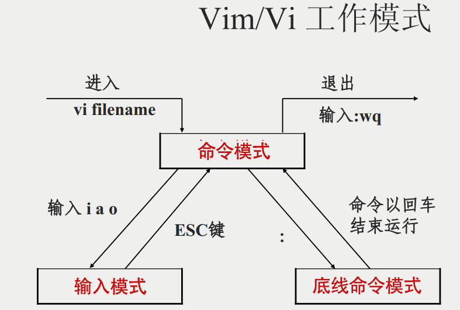

<!--more-->

# 命令模式

| 功能      | 描述                                                         |
| --------- | ------------------------------------------------------------ |
| 常用命令  | i、a、o	                  切换到输入模式，以输入字符 x	                             删除当前光标所在处的字符。 :	                              切换到底线命令模式，以在最底一行输入命令。 HOME(0)   END($)	移动光标到行首/行尾 |
| 搜索/替换 |                                                              |
| 删除      | nx	          n 为数字，连续向后删除 n 个字符。举例来说，我要连续删除 10 个字符， 『10x』。 dd	          删除游标所在的那一整行(常用) ndd	        n 为数字。删除光标所在的向下 n 行，例如 20dd 则是删除 20 行 (常用) d1G	        删除光标所在到第一行的所有数据 dG	          删除光标所在到最后一行的所有数据 d$	           删除游标所在处，到该行的最后一个字符 d0	           那个是数字的 0 ，删除游标所在处，到该行的最前面一个字符 |
| 复制      | yy	                   复制游标所在的那一行(常用) nyy	n              为数字。复制光标所在的向下 n 行，例如 20yy 则是复制 20 行(常用) y1G	                复制游标所在行到第一行的所有数据 yG	                  复制游标所在行到最后一行的所有数据 y0	                   复制光标所在的那个字符到该行行首的所有数据 |
| 粘贴      | p, P	                 p 为将已复制的数据在光标下一行贴上， J	                       将光标所在行与下一行的数据结合成同一行 c	                      重复删除多个数据，例如向下删除 10 行，[ 10cj ] c	                      重复删除多个数据，例如向下删除 10 行，[ 10cj ] u	                      复原前一个动作。(常用) |

## 搜索与替换

| 命令                 | 说明                                                         |
| -------------------- | ------------------------------------------------------------ |
| /word                | 向光标之下寻找一个名称为 word 的字符串。例如要在档案内搜寻 vbird 这个字符串，就输入 /vbird 即可！ (常用) |
| ?word                | 向光标之上寻找一个字符串名称为 word 的字符串。               |
| n                    | 这个 n 是英文按键。代表重复前一个搜寻的动作。举例来说， 如果刚刚我们执行 /vbird 去向下搜寻 vbird 这个字符串，则按下 n 后，会向下继续搜寻下一个名称为 vbird 的字符串。如果是执行 ?vbird 的话，那么按下 n 则会向上继续搜寻名称为 vbird 的字符串！ |
| N                    | 这个 N 是英文按键。与 n 刚好相反，为『反向』进行前一个搜寻动作。 例如 /vbird 后，按下 N 则表示『向上』搜寻 vbird 。 |
| n1,n2s/word1/word2/g | n1 与 n2 为数字。在第 n1 与 n2 行之间寻找 word1 这个字符串，并将该字符串取代为 word2 ！举例来说，在 100 到 200 行之间搜寻 vbird 并取代为 VBIRD 则： `『:100,200s/vbird/VBIRD/g』。` |

# 输入模式

| 命令                  | 说明                                           |
| --------------------- | ---------------------------------------------- |
| 字符按键以及Shift组合 | 输入字符                                       |
| ENTER                 | 回车键，换行                                   |
| BACK SPACE            | 退格键，删除光标前一个字符                     |
| DEL                   | 删除键，删除光标后一个字符                     |
| 方向键                | 在文本中移动光标                               |
| HOME/END              | 移动光标到行首/行尾                            |
| Page Up/Page Down     | 上/下翻页                                      |
| Insert                | 切换光标为输入/替换模式，光标将变成竖线/下划线 |
| ESC                   | 退出输入模式，切换到命令模式                   |

# 底线命令模式

| 命令                | 说明                                                         |
| ------------------- | ------------------------------------------------------------ |
| q                   | 退出程序                                                     |
| w                   | 保存文件                                                     |
| :q!                 | 若曾修改过档案，又不想储存，使用 ! 为强制离开不储存档案。    |
| :w [filename]       | 将编辑的数据储存成另一个档案（类似另存新档）                 |
| :r [filename]       | 在编辑的数据中，读入另一个档案的数据。亦即将 『filename』 这个档案内容加到游标所在行后面 |
| :n1,n2 w [filename] | 将 n1 到 n2 的内容储存成 filename 这个档案。                 |
| :! command          | 暂时离开 vi 到指令行模式下执行 command 的显示结果！例如 `『:! ls /home』`即可在 vi 当中察看 /home 底下以 ls 输出的档案信息！ |
| 行号                | :set nu           显示行号 :set nonu      不显示行号      |

