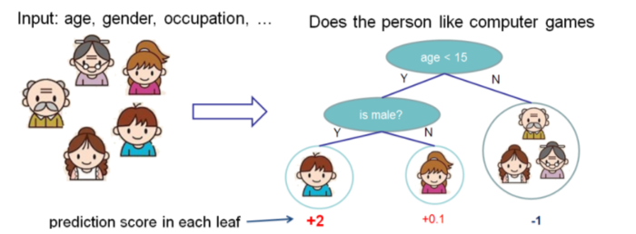
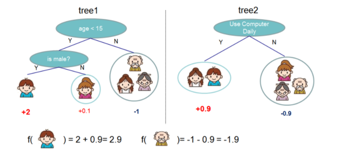
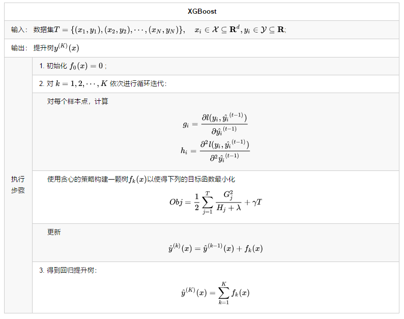
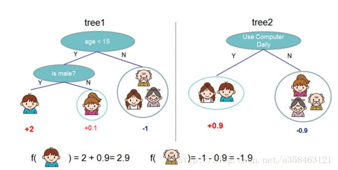
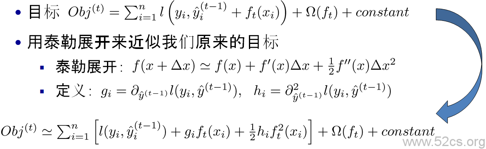
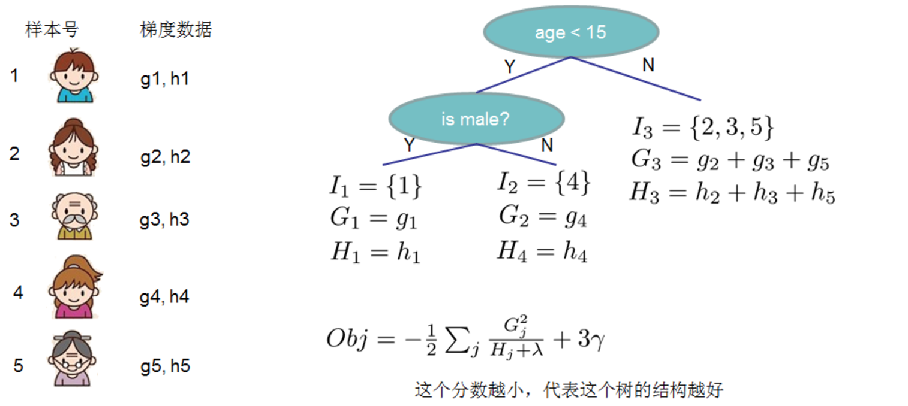
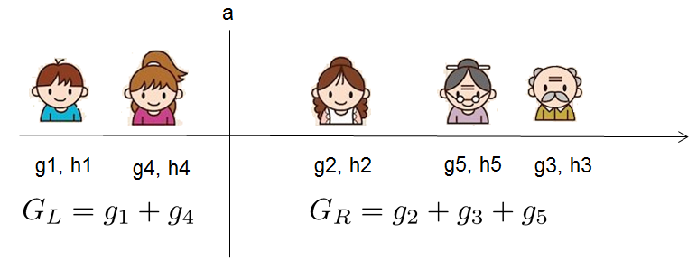
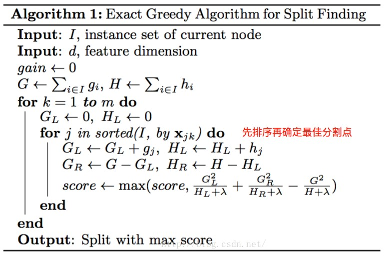
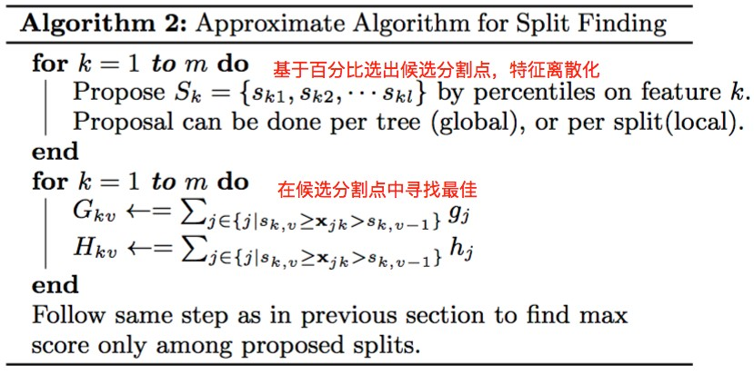
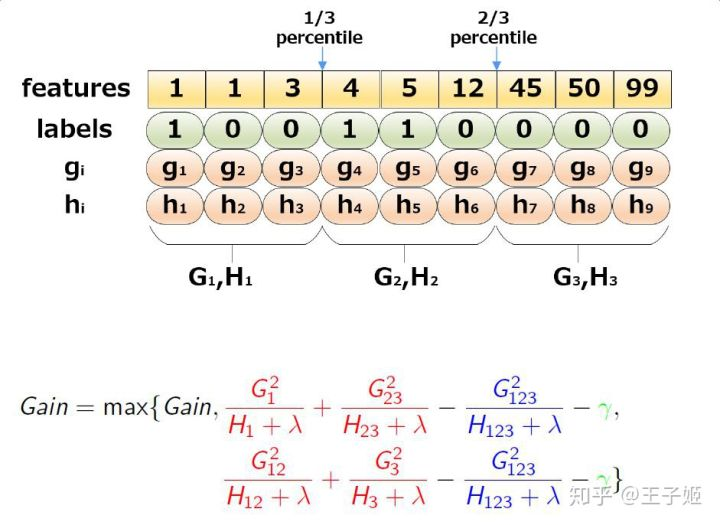

# [简介](https://yxzf.github.io/2017/03/xgboost-v1/)
下图就是CART树和一堆CART树的示例，用来判断一个人是否会喜欢计算机游戏

<!-- more -->

## 算法

# 模型
我们希望训练出 $K$ 颗树，将它们集成起来从而预测我们的$y$。我们可以用以下公式表示：
$$\hat{y}=\sum_{k=1}^Kf_k(x_i)\\
f(x)=w_{q(x)}$$
在这里，我们用一个函数 $f_k(x)$ 来表示一颗决策树，那个函数 $f$ 可以理解为将样本x映射到树的某个叶子结点中，树中的每个叶子结点都会对应着一个权重$w$。

如图，这就是提升树的一个例子，这里一共有两颗树，意味着我们有两个函数 $f_1,f_2，K=2$ ，然后将样本分别放到我们的两颗树中，就可以计算出两个值，把它加起来就是我们要预测的y

# 目标函数

$K$ 表示有 $K$ 棵树，$f_k$ 相当于第 $k$ 棵。因此我们的目标函数可以写成
$$Obj=\sum_il(\hat{y_i},y)+\sum_k\Omega(f_k)\\
where\ \Omega(f)=\gamma T+\frac{1}{2}\lambda||w||^2$$
其中 $l$ 是可导且凸的**损失函数**，用来衡量 $\hat{y}$ 与 $y$ 的相近程度，第二项 $Ω$ 则是**正则项**，它包含了两个部分，第一个是 $γT$，这里的 $T$ 表示**叶子结点的数量**，$γ$ 是超参，也就是说如果 $γ$ 越大，那么我们的叶子结点数量就会越小。另外一部分则是L2正则项，通过对叶子结点的权重进行惩罚，使得不会存在权重过大的叶子结点防止过拟合。$w$ 就表示叶子结点的权重。

# 梯度提升
假设第 $t$ 轮的预测值为$y^{(t)}$ ，第 $t$ 颗回归树为 $f_t(x)$。则模型迭代如下:
$$\begin{align}\hat y_i^{(0)} &= 0 \\  y_i^{(0)} & = f_1(x_i)= \hat y_i^{(0)}+f_1(x_i) \\  y_i^{(2)}&=f_1(x_i)+f_2(x_i)= \hat y_i^{(1)}+f_2(x_i) \\ &\cdots \\ y_i^{(t)}&=\sum_{k=1}^tf_k(x_i)= \hat y_i^{(t-1)}+f_t(x_i) \end{align}$$

但是对于上面这么一个目标函数，我们是很难进行优化的，于是我们将它变换一下，我们通过每一步增加一个基分类器 $f_t(x)$ ，贪婪地去优化这个目标函数，使得每次增加 $f_t(x)$，都使得loss变小。如此一来，我们就得到了一个可以用于评价当前分类器 $f_t(x)$ 性能的一个评价函数：
$$\begin{align*}
Obj^{(t)}&=\sum_{i=1}^nl(y_i,\hat{y_i}^{(t)})+ \sum_{i=1}^t\Omega(f_t) \\
&=\sum_{i=1}^nl(y_i,\hat{y_i}^{(t-1)}+f_t(x_i))+\Omega(f_t) + constant
\end{align*}$$
选取一个 $f_t(x)$来使得我们的目标函数尽量最大地降低。$constant$就是前 $t-1$ 棵树的复杂度

**泰勒展开**

因为 $l(y_i,\hat y_i^{(t-1)})$ 是常数字所以最优化可以化简为下式子

$$ \begin{align*}
Obj^{(t)} &=\sum_{i=1}^n [ g_if_t(x_i)+\frac 1 2 h_if_t^2(x_i)] + \Omega (f_t) \\
&=\sum_{i=1}^n [ g_iw_q(x_i)+\frac 1 2 h_iw_q^2(x_i)] + \gamma T + \lambda \frac{1}{2}\sum _{j=1}^Tw_j^2\\
&= \sum_{j=1}^T [( \sum_{i \in I_j} g_i)w_j+\frac 1 2(\sum_{i \in I_j} h_i + \lambda)w_j^2] + \gamma T \\
&= \sum_{j=1}^T [G_j w_j + \frac 1 2 (H_j + \lambda) w_j^2] + \gamma T
\end{align*} $$

$j$为叶子结点的序号，$T$ 为叶子结点的总数 ；$i$ 为样本的序号，$n$ 为样本的总数；$w_q(x_i)$是求取$x_i$权值的对应函数；$\sum_{i \in I_j} g_i$ 为同一叶子结点的 $g_i$ 的和；$\sum_{i \in I_j} g_i w_j$ 为同一结点的 $g_i w_j$ ;$\sum_{j=1}^T \sum_{i \in I_j} = \sum_{i=1}^n$。其中

$$g_i=\frac{\partial l(y_i,\hat{y_i}^{(t-1)})}{\partial \hat{y_i}^{(t-1)}} \quad  h_i=\frac{\partial ^2l(y_i,\hat{y_i}^{(t-1)})}{\partial ^2\hat{y_i}^{(t-1)}} \\
G_j = \sum_{i \in I_j} g_i \quad H_j = \sum_{i \in I_j} h_i$$

# 求取基模型$f_t(x)$-叶子结点权值$w$
** $f_t(x_i)$ 是什么？它其实就是 $f_t$ 的某个叶子结点的值 $w$ 。之前我们提到过，叶子结点的值是可以作为模型的参数**
$$Obj^{(t)}  = \sum_{j=1}^T [G_j w_j + \frac 1 2 (H_j + \lambda) w_j^2] + \gamma T$$

令$\frac{\partial Obj^{(t)}}{\partial w}=0$ 得到
$$w_j^* = - \frac {G_j} {H_j + \lambda}$$
带入上式得到
$$Obj^{(t)} = - \frac 1 2 \sum_{j=1}^T \frac {G_j^2} {H_j + \lambda} + \gamma T$$

# 划分点
$$\begin{align}
    Obj_{split} &= - \frac 1 2 [\frac {G_L^2}{H_L + \lambda} + \frac {G_R^2}{H_R + \lambda}] + \gamma T_{split} \\
    Obj_{noSplit} &=  - \frac 1 2 \frac {(G_L + G_R)^2}{H_L + H_R + \lambda} + \gamma T_{noSplit} \\
    Gain &= Obj_{noSplit} - Obj_{split} \\
         &= \frac 1 2 [\frac {G_L^2}{H_L + \lambda} + \frac {G_R^2}{H_R + \lambda} - \frac {(G_L + G_R)^2}{H_L + H_R + \lambda}] - \gamma(T_{split} - T_{nosplit}) \\
         &=\frac 1 2 [\frac {G_L^2}{H_L + \lambda} + \frac {G_R^2}{H_R + \lambda} - \frac {(G_L + G_R)^2}{H_L + H_R + \lambda}] - \gamma
\end{align}$$
因为是二分类，二叉树所以$T_{split} - T_{nosplit} = 1$，**$Gain$越大越好**

# 总结
## 目标函数与叶子结点权值
$$w_j^* = - \frac {G_j} {H_j + \lambda}$$

$$Obj= - \frac 1 2 \sum_{j=1}^T \frac {G_j^2} {H_j + \lambda} + \gamma T$$

其中
$$g_i=\frac{\partial l(y_i,\hat{y_i}^{(t-1)})}{\partial \hat{y_i}^{(t-1)}} \quad h_i=\frac{\partial ^2l(y_i,\hat{y_i}^{(t-1)})}{\partial ^2\hat{y_i}^{(t-1)}} \\ G_j = \sum_{i \in I_j} g_i \quad H_j = \sum_{i \in I_j} h_i$$

## 打分函数示例
Obj代表了当我们指定一个树的结构的时候，我们在目标上面最多减少多少。我们可以把它叫做结构分数(structure score)

## 分裂结点
论文中给出了两种分裂结点的方法，贪心算法遍历所有分割点进行划分挑选增益最大的切分点。近似算法:对于数据量大的情况下进行近似算法
### 贪心法：
直观的方法是枚举所有的树结构，并根据上面数structure score来打分，找出最优的那棵树加入模型中，再不断重复。但暴力枚举根本不可行，所以类似于一般决策树的构建，XGBoost也是采用贪心算法，**每一次尝试去对已有的叶子加入一个分割。对于一个具体的分割方案，增益计算如下**：

$$Gain=\frac 1 2 [\frac {G_L^2}{H_L + \lambda} + \frac {G_R^2}{H_R + \lambda} - \frac {(G_L + G_R)^2}{H_L + H_R + \lambda}] - \gamma$$

对于每次扩展，我们还是要枚举所有可能的分割方案，如何高效地枚举所有的分割呢？我假设我们要枚举所有 $x < a$ 这样的条件，对于某个特定的分割 $a$ 我们要计算 $a$ 左边和右边的导数和。对于所有的 $a$，首先根据需要划分的那列特征值排序，然后从左到右的扫描就可以枚举出所有分割的梯度和$G_L$和$G_R$，再用上面的公式计算每个分割方案的分数就可以了。

观察这个目标函数，大家会发现第二个值得注意的事情就是引入分割不一定会使得情况变好，因为我们有一个引入新叶子的惩罚项。优化这个目标对应了树的剪枝， 当引入的分割带来的增益小于一个阀值的时候，我们可以剪掉这个分割。大家可以发现，当我们正式地推导目标的时候，像计算分数和剪枝这样的策略都会自然地出现，而不再是一种因为heuristic（启发式）而进行的操作了。

#### 算法说明
上面是针对一个特征，如果有m个特征，需要对所有参数都采取一样的操作，然后找到最好的那个特征所对应的划分。

### [近似算法](https://zhuanlan.zhihu.com/p/38297689)
XGBoost使用exact greedy算法来寻找分割点建树，但是当数据量非常大难以被全部加载进内存时或者分布式环境下时，exact greedy算法将不再合适。因此作者提出近似算法来寻找分割点。近似算法的大致流程见下面的算法。
该算法会首先根据**特征分布的百分位数** (percentiles of feature distribution)，提出候选划分点 (candidate splitting points)。接着，该算法将连续型特征映射到由这些候选点划分的分桶(buckets) 中，聚合统计信息，基于该聚合统计找到在 proposal 间的最优解。
- Global：学习每棵树前，提出候选切分点；
- Local：每次分裂前，重新提出候选切分点；

 - 第一个for循环做的工作：对特征 $K$ 根据该特征分布的分位数找到切割点的候选集合 $S_k = \{s_{k1}, s_{k2}, ... ,s_{kl} \}$；这样做的目的是提取出部分的切分点不用遍历所有的切分点。其中获取某个特征K的候选切割点的方式叫proposal。主要有两种proposal方式：global proposal和local proposal。
 - 第二个for循环的工作：将每个特征的取值映射到由这些该特征对应的候选点集划分的分桶(buckets)区间 $\{s_{k,v}≥x_{jk}>s_{k,v−1}\}$ 中，对每个桶（区间）内的样本统计值 $G,H$ 进行累加统计，最后在这些累计的统计量上寻找最佳分裂点。这样做的主要目的是获取每个特征的候选分割点的 $G,H$ 量。

#### 近似算法举例

# xgboost与GBDT的区别
1. Xgboost是GB算法的高效实现，xgboost中的基学习器除了可以是CART（gbtree）也可以是线性分类器（gblinear）。
1. 传统GBDT以CART作为基分类器，xgboost还支持线性分类器，这个时候xgboost相当于带L1和L2正则化项的逻辑斯蒂回归（分类问题）或者线性回归（回归问题）。
1. 传统GBDT在优化时只用到一阶导数信息，xgboost则对代价函数进行了二阶泰勒展开，同时用到了一阶和二阶导数。顺便提一下，xgboost工具支持自定义代价函数，只要函数可一阶和二阶求导。
1. xgboost在代价函数里加入了正则项，用于控制模型的复杂度。正则项里包含了树的叶子结点个数、每个叶子结点上输出的score的L2模的平方和
1. 列抽样（column subsampling）。xgboost借鉴了随机森林的做法，支持列抽样，不仅能降低过拟合，还能减少计算，这也是xgboost异于传统gbdt的一个特性。
1. 支持并行化处理。xgboost的并行是在特征粒度上的，在训练之前，预先对特征进行了排序，然后保存为block结构，后面的迭代中重复地使用这个结构，大大减小计算量。在进行结点的分裂时，需要计算每个特征的增益，最终选增益最大的那个特征去做分裂，那么各个特征的增益计算就可以开多线程进行，即在不同的特征属性上采用多线程并行方式寻找最佳分割点。
1. 可以处理稀疏、缺失数据(结点分裂算法能自动利用特征的稀疏性),可以学习出它的分裂方向，加快稀疏计算速度。
