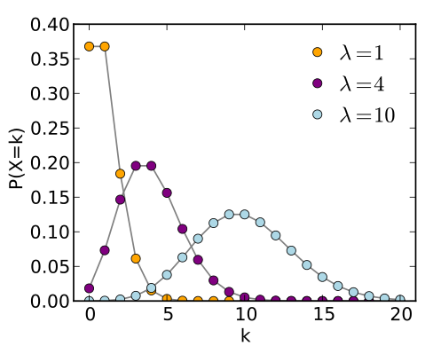
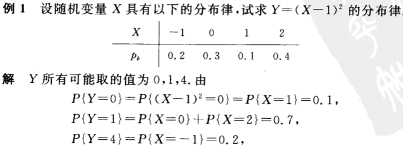
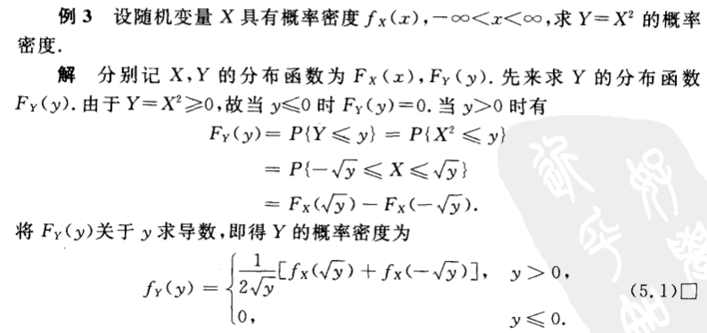
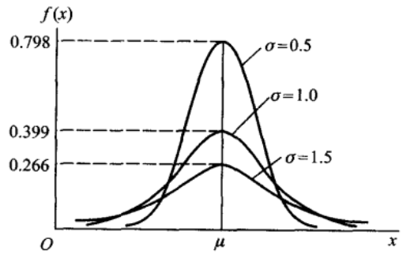

本文主要讲述三种离散型随机变量的分布(伯努利分布,二项分布,泊松分布)和三种连续型随机变量的分布(均匀分布,指数分布,正态分布)。
<!--more-->

# 离散型随机变量的分布
## 伯努利分布
伯努利分布又名**两点分布**或者**0-1分布**，只能取两种结果，一般记为0或1。设取1的概率为$p$，其分布规律为
$$P(X=k) = p^k(1-p)^{1-k}, k = 0,1 (1<p<1)$$
如果试验E只有两种结果，则称试验E为**伯努利试验**。如果独立的进行 n 次试验E，则称为**n重伯努利试验**。

## 二项分布
以 $X$ 表示 n 重伯努利试验中事件 $A$ 出现的次数，则 $X$ 为一个随机变量，令 $p$ 为事件 A 出现的概率，则事件 $X$ 服从以下分布：

$$P(X=k) = C_n^k p^k q^{n-k}, k = 0,1,2,…,n$$
其中 $q=1−p$,则我们称 $X$ 服从参数为 $n,p$ 的二项分布，记为 $X~b(n,p)$。

## 泊松分布
随机变量 $X$ 的所有可能取值为 0,1,2,3….,且各个取值的概率为

$$P(X=k) = \frac {\lambda^ke^{-\lambda}}{k!}, k=0,1,2….$$
则我们称 $X$ 服从参数为 $λ$ 的泊松分布，记为 $X~π(λ)$ 其中 $λ$ 为 $X$ 的期望，即 $E(X)$
其分布规律通过图像直观表示为

泊松分布适合于描述**单位时间内随机事件发生的次数的概率分布**。如某一服务设施在一定时间内受到的服务请求的次数，电话交换机接到呼叫的次数、汽车站台的候客人数、机器出现的故障数、自然灾害发生的次数、DNA序列的变异数、放射性原子核的衰变数等等。从上面的图像也可以看出，对于给定泊松分布的强度 λ ,其在单位时间内发生的次数的概率有一个峰值，也就是说发生的次数很多或很少的可能性都不大，且当强度越大，其最大可能发生的次数的值也越大。

下面介绍用**泊松分布来逼近二项分布的定理，也就是泊松定理**。

泊松定理：设 $λ>0$ 是一个常数，$n$ 是任意正整数，设 $np=λ$ ,则对于任一非负整数 $k$，有
$$\lim_{n \to \infty} C_n^kp^k(1-p)^{n-k} = \frac{\lambda^ke^{-\lambda}}{k!}$$
即当 $n$ 很大且 $p$ 很小的时候，我们可以使用上面公式等号右边部分来逼近左边部分，从而简化计算。

# 连续型随机变量的分布
## 分布函数和概率密度函数
首先需要清楚，**分布函数是针对随机变量的，离散或连续都可以；而概率密度函数是针对连续随机变量的。**下面是这两者的定义以及联系

**分布函数的定义**如下：

$X$ 是一个随机变量，$x$ 是任意实数，则 $X$ 的分布函数定义为

$$F(x)=P(X≤x),(−∞<x<∞)$$

则对于任意实数 $x_1,x_2(x_1 < x_2)$,有

$$P(x_1 < X \le x_2) = p(X \le x_2) - p(X \le x_1) = F(x_2) - F(x_1)$$
即如果我们知道了 $X$ 的分布函数，则可以知道 $X$ 落在任一区间上的概率，也就是说通过分布函数可以完整描述随机变量的统计规律特性。

概率密度函数定义如下：

对于分布函数 $F(X)$，假如存在 $f(x)$ 使得以下公式成立：

$$F(x) = \int_{-\infty}^x f(t) dt$$
则 X 为连续型随机变量，f(x)为随机变量的概率密度函数。$f(x)$ 具有以下性质

1. $f(x)≥0$
1. $\int_{-\infty}^{\infty} f(x) dx = 1$
3. 对于任意实数 $x_1,x_2(x_1 < x_2)$，有
$$P(x_1< X \le x_2) = F(x_2) - F(x_1) = \int_{x_1}^{x_2} f(x) dx$$
且当 $f(x)￥ 在点 $x$ 连续的时候，有
$$F′(x)=f(x)$$
通过上面这个性质可以推导出下面的约等式
$$P(x<X≤x+Δx)≈f(x)Δx$$
也就是说概率密度函数在某点的值的大小一定程度上反映了随机变量落在该点附近的概率的大小。

上面讲了随机变量的分布函数，下面讲一下随机变量的函数的分布函数，例如 $X$ 为一个随机变量，则 $Y=(X−1)^2$ 是随机变量 $X$ 的函数，且 $Y$ 也是一个随机变量， 因此 $Y$ 也有自己的分布律。下面是两个例子，其中一个是离散型随机变量，一个是连续型随机变量。

离散型随机变量的函数的分布律容易求，对于连续型随机变量的函数的分布律的求法一般是先按定义写出 $Y$ 的分布函数 $F(Y<=y)$, 然后替换成 $F(g(X)<=Y)$, 再转换成 $X$ 的分布函数和概率密度函数。

## 均匀分布
若随机变量 $X$ 的概率密度函数为
$$f(x) = \begin{cases}  \frac{1}{b-a} &{a<x<b} \\ 0&{其他}\end{cases}$$
则称X在区间 (a,b) 上服从均匀分布，记为 $X~U(a,b)$
## 指数分布
若随机变量 $X$ 的概率密度函数为

$$f(x) = \begin{cases}  \frac{1}{\theta}e^{-x / \theta} &{x>0} \\ 0&{其他}\end{cases}$$
则称 $X$ 服从参数为 $θ$ 的指数分布。

其图像如下所示:

其分布函数为
$$F(x) = \begin{cases}  1-e^{-x / \theta} &{x>0} \\ 0&{其他}\end{cases}$$
如果说上面的泊松分布是描述某个时间段内事件发生次数的概率分布，那么指数分布描述的就是事件发生的时间间隔的概率分布。指数分布是连续的分布，反映在其实际意义上就是时间是连续的。更详细的描述可查看这里

关于指数分布的一个有趣的性质为：

$$P(X>s+t | X>s) = P(X>t)$$
该性质也称为无记忆性，假设 $X$ 是某一原件的寿命，上面的式子表示的就是该元件在使用了 s 个小时后，至少还能使用 t 个小时的条件概率。而这一条件概率又等于该元件从刚开始使用的算起至少能使用 t 个小时的概率。也就是说原件对使用过的s个小时无记忆性，这个特性与随机过程中的平稳过程非常相似，而这个特性也是指数分布有广泛应用的重要原因。

## 正态分布
正态分布也叫高斯分布，其概率密度函数为

$$f(x) = \frac{1}{\sqrt{2\pi}\sigma}e^{-\frac{(x-\mu)^2}{2\sigma^2}}$$
则称 $X$ 服从参数为 $μ,σ$ 的正态分布，记为$N(\mu,\sigma^2)$，而且 $μ,σ$ 分别是正态分布的期望和标准差。其图像如下所示

从图像可知，当$X=μ$时，取值最大，也就是说随机变量落在这个值附近的概率最大，而这个值也就是正态分布的期望
