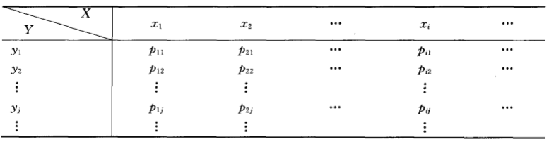

# 联合分布函数
假设 $X$ 和 $Y$ 都是随机变量，那么我们定义其分布函数如下：

$$F(x,y) = P ((X \le x)\cap(Y \le y)) =  P (X \le x, Y \le y )$$
上面的 $F(x,y)$ 称作随机变量$(X,Y)$的分布函数，也叫作联合分布函数。
<!--more-->
## 离散型随机变量联合分布
如果上面的 $X$ 和 $Y$ 都是离散随机变量，那么对于 $(X,Y)$ 的所有取值可记为

$$P(X=x_i, Y=y_i) = p_{ij},i,j=1,2,….$$
上面的所有P的取值为二维离散随机变量的分布律，也叫联合分布律。直观用表格表示如下所示

连续型随机变量联合分布
类似地，如果上面的X和Y都是连续随机变量，那么分布函数可定义为

$$F(x,y) = \int_{-\infty}^y\int_{-\infty}^xf(u,v)dudv$$
其中 $f(x,y)$ 被称为概率密度函数，也叫联合概率密度函数。

其性质与一维随机变量的概率密度函数非常相似
1. $f(x,y)≥0$
1. $\int_{-\infty}^{\infty}\int_{-\infty}^{\infty}f(x,y)dxdy = F(\infty,\infty)$
3. 设 $G$ 是 $xOy$ 平面上的区域，点 $(X,Y)$ 落在$G$内的概率为
$$\int_{-\infty}^{\infty}\int_{-\infty}^{\infty}f(x,y)dxdy = F(\infty,\infty)$$
4. 若 $f(x,y)$ 在点 $(x,y)$ 连续，则
$$\frac{\partial^2F(X,Y)}{\partial x \partial y} = f(x, y)$$

# 边缘分布函数
二维随机变量 $(X,Y)$ 作为一个整体的时候，其分布函数为联合分布函数，但是 $X$ 和 $Y$ 是随机变量，各自也有分布函数，将其分别记为 $F_X(x),F_Y(y)$，称为随机变量 $(X,Y)$ 关于 $X$ 和关于 $Y$ 的**边缘分布函数**。

边缘分布函数可通过联合分布函数确定，关系如下

$$F_X(x) = P(X \le x) = P(X \le x,Y \lt \infty) = F(x, \infty)$$

$$F_X(x)=F(x,∞)\\
F_Y(y)=F(∞,y)$$

## 离散型随机变量边缘分布
假如 $X$ 和 $Y$ 是离散型随机变量，那么随机变量 $(X,Y)$ 关于 $X$ 和关于 $Y$ 的边缘分布定义下
$$
p_{i.} = \sum_{j=1}^{\infty} p_{ij} = P(X = x_i), i=1,2,3…..n \\
p_{.j} = \sum_{i=1}^{\infty} p_{ij} = P(Y = y_j), j=1,2,3…..n
$$
上面的式子分别称为随机变量 $(X,Y)$ 关于 $X$ 和关于 $Y$ 的边缘分布率。

## 连续型随机变量边缘分布
假如 $X$ 和 $Y$ 分别是连续性随机变量，那么随机变量 $(X,Y)$ 关于 $X$ 的边缘分布函数定义为

$$F_X(x) = F(x,\infty) = \int_{-\infty}^{x}(\int_{-\infty}^{\infty}f(x,y)dy)dx=\int_{-\infty}^{\infty}f(x,y)dy$$
则被称为随机变量 $(X,Y)$ 关于 $Y$ 的 边缘概率密度函数

# 条件分布
由条件概率可以比较容易推导出条件分布的含义，其定义如下：

## 离散型随机变量的条件分布
对于离散型随机变量，条件分布的定义如下：

设 $(X,Y)$ 是二维离散型随机变量，对于固定的 $j$，若 $P(Y=y_j)>0$, 则称
$$P(X = x_i|Y= y_j) = \frac{P(X = x_i, Y=y_j)}{P(Y=y_j)} = \frac{p_{ij}}{p_{.j}}, i = 1,2,3$$

为在 $Y=y_j$ 条件下随机变量X的条件分布律。同理，交换 $X$ 和 $Y$ 的位置得到的是在 $X=x_i$ 条件下随机变量 $Y$ 的条件分布律。

## 连续型随机变量的条件分布
对于连续型的随机变量，条件分布的定义如下：

设二维随机变量 $(X,Y)$ 的概率密度函数为 $f(x,y),(X,Y)$ 关于 $Y$ 的边缘概率密度为 $f_Y(y)$ .若对于固定的 $y，f_Y(y)>0$ ，则称 $\frac{f(x,y)}{f_Y(y)}$ 为在 $Y=y$ 的条件下 $X$ 的条件概率密度。记为
$$f_{X|Y}(x|y) = \frac{f(x,y)}{f_Y(y)}$$
有了条件概率密度(就是条件概率密度函数)，我们也可以定义出条件分布函数如下

$$\int_{-\infty}^x f_{X|Y}(x|y)dx = \int_{-\infty}^x \frac{f(x,y)}{f_Y(y)}dx$$
上面的函数为在 $Y=y$ 的条件下 $X$ 的条件分布函数，记为

$$F_{X|Y}(x|y) = P(X \le x| Y=y)$$
# 相互独立的随机变量
两个随机变量 $X,Y$ 相互独立的充要条件如下：

$$F(x,y) = F_X(x)F_Y(y)$$
上面的 $F(x,y),F_X(x),F_Y(y)$ 分别是二维随机变量的联合分布函数及关于 $X$ 和 $Y$ 的边缘分布函数。

除了通过分布函数，对于具体的连续型随机变量或离散型随机变量，还可通过概率密度函数和分布律来定义相互独立的条件。

对于连续型随机变量，上面的式子等价于

$$f(x,y) = f_X(x)f_Y(y)$$
式子中的 $f(x,y),f_X(x),f_Y(y)$ 分别为 随机变量 $(X,Y)$ 的条件概率密度函数和边缘概率密度函数。

对于离散型随机变量则有：

$$P(X = x_i, Y = y_j) = P(X=x_i)P(Y=y_j)$$
# 二维随机变量的函数的分布
在讨论一维随机变量的分布函数的时候，也讨论了一维随机变量的函数的分布函数，同样对于二维随机变量，我们也可以讨论其函数的分布函数。下面主要讨论 $Z=X+Y，Z=XY，Z=Y/X，M=max(X,Y)，N=min(X,Y)$ 这几个函数的分布函数（X，Y 为相互独立的随机变量），这里主要给出具体的公式，证明省略。

## $Z=X+Y$ 的分布
设 $(X,Y)$ 是二维连续型随机变量，其概率密度函数为 $f(x,y)， Z=X+Y$ 仍然为连续性随机变量，其概率密度函数为

$$f_{X+Y}(z) = \int_{-\infty}^{\infty} f(z-y,y)dy$$

或
$$f_{X+Y}(z) = \int_{-\infty}^{\infty} f(x,z-x)dx$$

当 $X,Y$ 相互独立时，其边缘概率密度函数具有以下性质

$$f(x,y) = f_X(x)f_Y(y)$$
因此上面的式子也可以化成下面的形式

$$f_{X+Y}(z) = \int_{-\infty}^{\infty} f_X(z-y)f_Y(y)dy\\
f_{X+Y}(z) = \int_{-\infty}^{\infty} f_X(x)f_Y(z-x)dx$$

## $Z=XY$ 和 $Z=Y/X$ 的分布
设 $(X,Y)$ 是二维连续型随机变量，其概率密度函数为 $f(x,y)$， $Z = \frac{Y}{X},Z = XY$仍然为连续性随机变量，其概率密度函数为

$$f_{Y/X}(z) = \int_{-\infty}^{\infty} |x|f(x,xz)dx\\
f_{XY}(z) = \int_{-\infty}^{\infty} \frac{1}{|x|}f(x,z/x)dx$$
当 $X,Y$ 相互独立时，同样有下面的性质

$$f_{Y/X}(z) = \int_{-\infty}^{\infty} |x|f_X(x)f_Y(xz)dx\\
f_{XY}(z) = \int_{-\infty}^{\infty} \frac{1}{|x|}f_X(x)f_Y(z/x)dx$$
## $M=max(X,Y)$ 和 $N=min(X,Y)$ 的分布
讨论 $max(X,Y)$ 和 $min(X,Y)$ 的分布的时候， 一般假设 $X,Y$ 相互独立，因为这样才有下面的性质。

对于 $M=max(X,Y)$ 的分布有

$$F_{max}(z) = P(M \le z) = P(X \le z, Y \le z) = P(X \le z)P(Y \le z)$$
由于 $X$ 和 $Y$ 相互独立，因此有

$$F_{max}(z) = F_X(z)F_Y(z)$$
同样对 $N=min(X,Y)$ 有

$$F_{min}(z) = P(N \le z) = 1 - P(N \gt z) = 1 - P(X > z)P(Y>z)$$
即

$$F_{min}(z) = 1 - (1 - F_X(z))(1 - F_Y(z))$$
推广到 n 个相互独立的随机变量有下面的性质

$M = max \lbrace X_1,X_2…,X_n \rbrace$ 及 $N = min\lbrace X_1,X_2…,X_n \rbrace$ 的分布函数分别为
$$F_{max}(z) = F_{X_1}(z)F_{X_2}(z)…F_{X_n}(z) \\
F_{min}(z) = 1 - (1 - F_{X_1}(z))(1 - F_{X_2}(z))…(1 - F_{X_n}(z))$$
而当 $X_1,X_2…,X_n$ 独立同分布的时候，上式变为如下所示

$$F_{max}(z) = [F(z)]^n\\
F_{min}(z) = 1 - (1 - F(z))^n$$
