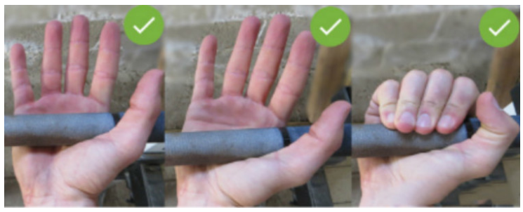
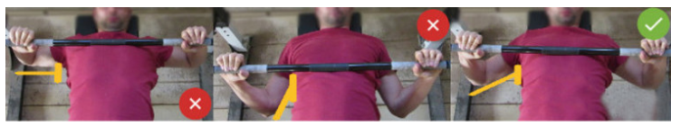
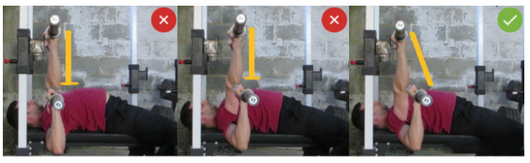
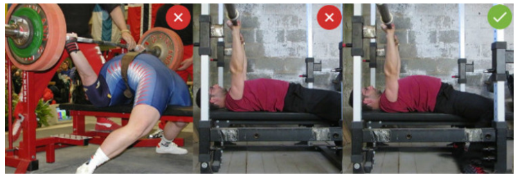
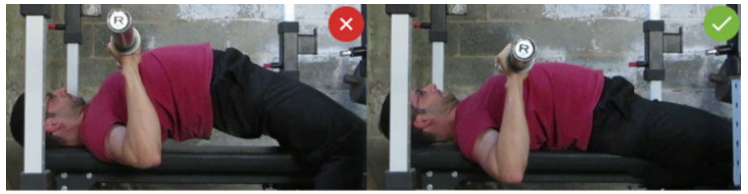

| 部位 | 动作                                                   |
| ---- | ------------------------------------------------------ |
| 胸部 | 上胸肌：上斜卧推 中胸肌：平板卧推 下胸肌：臂前屈 |
|      |                                                        |
|      |                                                        |
|      |                                                        |
|      |                                                        |
|      |                                                        |

<!--more-->

<iframe src="//player.bilibili.com/player.html?aid=24287094&cid=40734416&page=1" scrolling="yes" border="0" frameborder="no" framespacing="1" allowfullscreen="true"></iframe>

# 卧推

## [卧推细节](https://mp.weixin.qq.com/s?__biz=MzA3MDE5NDQxMQ==&mid=2649921198&idx=1&sn=59eea138954556dcbca1e62c6116edb9&chksm=86c6b32ab1b13a3c85904df933279afaf0afe1c89463021249f1611cdaa4f8fcf3d3d718de45&scene=21#wechat_redirect)

1. 上合适的杠铃片并用杠铃夹固定住。但当一个人训练时，可以不使用杠铃夹，这样杠铃倾斜的时候，杠铃片会掉落，从而保证不受伤。
2. 杠铃与板凳位于正中间从而确保在卧推的过程中，杠铃两边的力量平衡
3. 杠铃位于眼睛这个上方
4. 握距（大臂与躯干程75°）：确保杠铃在最低点，胳膊与躯干的角度在75°左右。注意千万不能在90°，因为此时肩关节达到最大活动限度，当杠铃到达最低点的时候，很容易造成肩关节损伤。。
5. 握法：不要空握，以免杠铃滑落。手腕不要弯，保证手腕垂直，用你的大小鱼际顶住杠铃，从而使手臂承受杠铃的重量，避免手腕受伤。正确的姿势，大拇指缠绕的方法。
6. 两脚：用力踩地面，臀部用力，感觉力量从脚向上传递，。（腿部驱动技术）
7. 手臂外旋：保证手臂与躯干的夹角，夹角太大会损伤肩膀，配合大拇指缠绕的方式
8. 下降点：胸部，刺激胸肌并保证小臂与地面垂直
9. 最高点：锁骨，刺激胸肌并保证小臂与地面垂直
10. 最重要的是**肩胛骨后缩下压**

<iframe width="100%" height="550" src="//player.bilibili.com/player.html?aid=13073525&cid=21459892&page=1" scrolling="no" border="0" frameborder="no" framespacing="0" allowfullscreen="true"> </iframe>
## 卧推致命错误

1. **卧推时双脚离地**

2. **尝试大重量卧推的时候没有人保护或不借用四方架**

3. **卧推下架和归架的移动速度过快**

4. 手腕疼：正确的办法是全握，手腕立直，中立位的方式推杠铃，用你的大小鱼际顶住杠铃。同时使用大拇指缠绕的方式

   

5. 过度的外展手臂

   

6. 杠铃运动轨迹

   

7. 卧推时没有挺胸

   

8. 臀部脱离卧推椅

## 疼痛

| 部位       | 原因                                                         |
| ---------- | ------------------------------------------------------------ |
| **肩膀痛** | 保持肩胛骨后缩下压 注意控制大臂外展幅度                   |
| **手肘疼** | 伸肘肌群和屈肘肌群的力量失衡。 保证从侧面看时前臂始终垂直于地面 热身不足 |
| **手腕疼** | 保持手腕中立，用你的大小鱼际顶住杠铃                         |

# 上斜卧推

| 与平板卧推不同 | 1. 卧推凳30°,这个角度最适合上胸肌发力 2.下落点锁骨上方--》直上直下 |
| -------------- | ------------------------------------------------------------ |
| 与平板卧推相同 | 1. 脚像平卧一样提供动力，脚要加紧平板。为上身提供功力 2. 臀部坐实不能离开凳子，（与平板卧推一样是力量举的规格） 3. **挺胸收紧肩胛骨，以免肩损伤** 4. **手臂与躯干的夹角不能太大，以免肩损伤**  -----》握距 5. **手臂与地面垂直，以免肘关节损伤** 6. **手臂外旋，以免肘关节损伤** 7. **手腕保持中立,使用大小鱼际承受重量** |

是否起桥，感受胸肌的发力

<iframe width=100% height=550 src="//player.bilibili.com/player.html?aid=25531524&cid=43475731&page=1" scrolling="no" border="0" frameborder="no" framespacing="0" allowfullscreen="true"> </iframe>
# 臂屈伸

重点保护肩部

### 肩部疼痛的原因

肩关节是一种球窝关节，这种关节十分灵活而且活动幅度大，但是缺乏稳定性。虽有关节囊及韧带保护，但关节囊薄而松弛，而韧带少而弱。因此肩关节脱位和劳损是比较普遍的现象。

为了避免肩关节损伤，应该**保持肩关节受力平衡**，如果受力不平衡，肱骨（大臂）就不能保持在关节窝的良好位置，它就会滑动，从而造成软组织受到磨损以及挤压，让你感到肩膀疼。因此在做这个动作时，应该注意以下几点：

1. 充分的热身，增加关节滑液，保护关节软骨免受机械性损伤。
2. 动作要循序渐进，不要逞强。注意动作的标准性
3. 肩部不要下沉太低，和肩关节相同高度或者稍微低一点就好。肩膀越低受伤的可能性越大
4. 避免圆肩含胸，保持肩胛骨后收下压，否则会造成肩夹挤的现象（手举过头部会疼痛痛）。同时含胸会导致肩胛骨无法自由移动，如果肩胛骨没有正常活动，肩关节会承受巨大压力
5. 练习时，手腕要锁住不要弯曲，和小臂保持在一条直线上，这样可以避免手腕、肘部受伤
6. 双杠的间距不宜太宽，这样会增加肩部剪切力的力矩，同时还会肱骨头陷进关节窝的部分更少，让肩关节受力不稳定。一般建议双杠间距与肩同宽，手肘贴着身体两侧保持稳定