---

title: 关系运算-SQL
date: 2019-07-31 11:05:24
tags: [数据库,编程语言]
categories: SQL
---

# 集合运算

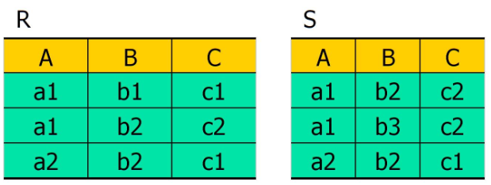

<!--more-->

## 并

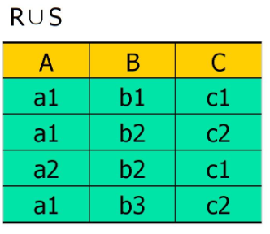

```sql
Select * from R Union Select * from S;
```

## 差

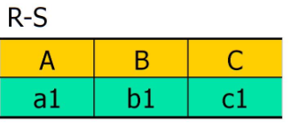

```sql
Select * from R Except Select * from S;
```

## 交

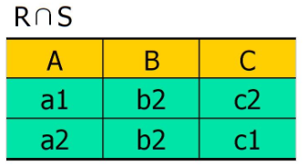

```sql
Select * from R Intersect Select * from S
```


## 笛卡尔积

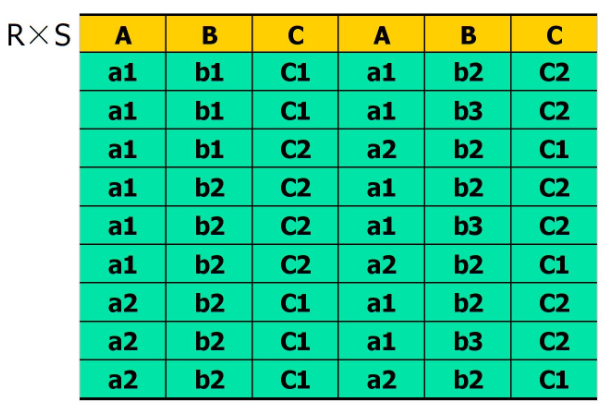

```sql
Select * from R,S
```


# 关系运算

## 选择

```sql
SELECT R.学号，R.课程名,R.分数 from R WHERE 分数>85
```

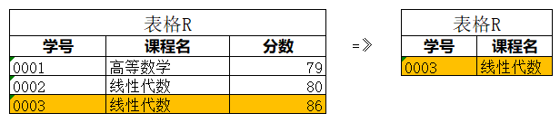

## 投影

```sql
SELECT 课程名 FROM R;
```

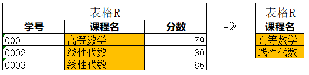

## 连接

从关系R和关系S的广义笛卡儿积中选取满足给定条件的元组组成新的关系称为R和S的连接

```sql
SELECT * from R 
join
SELECT * from S
on R.C<S.E
```

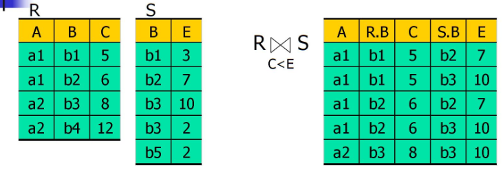

## 除

给定关系R (X， Y) 和S (Y， Z)， 其中X， Y， Z为属性组。R中的Y与S中的Y出自相同的域集。R与S的除运算得到一个新的关系P(X)。其中P(X)与S(Y)组成的元组都在R(X,Y)中。
$$
P(X)=R(X,Y) \div S(Y,Z)
$$

```sql
SELECT DISTINCT R.X FROM R  R1
WHERE NOT EXISTS 
(	
    SELECT S.Y FROM S 
    WHERE NOT EXISTS 
    (
        SELECT * FROM R R2 
        where R1.X=R2.X and R2.Y=S.Y
    )
) 
```


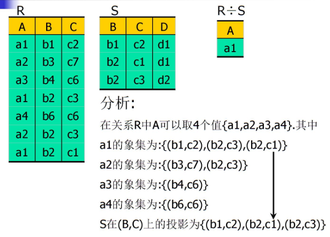

### 习题

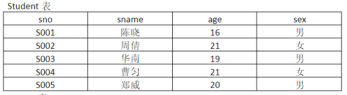

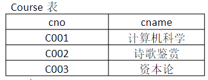

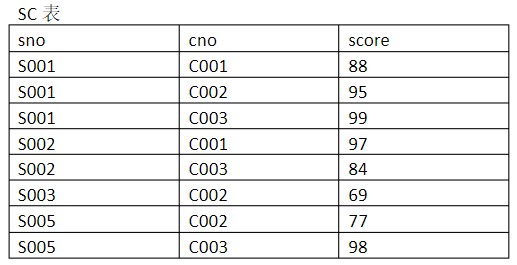

- 求至少选择了C001和C003两门课程的学生学号

  ```sql
  select distinct sno from sc A
  where not exists
  (
  	select * from course B where cno in ('C002','C003') and not exists
      (
      	select * from sc C where A.sno=C.sno and B.cno=C.cno
      )
  )
  ```

  