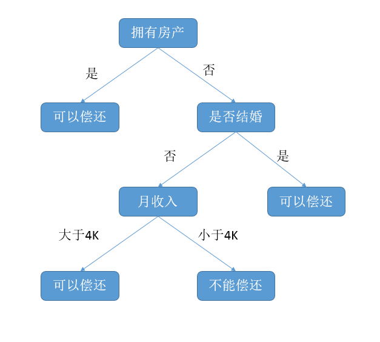
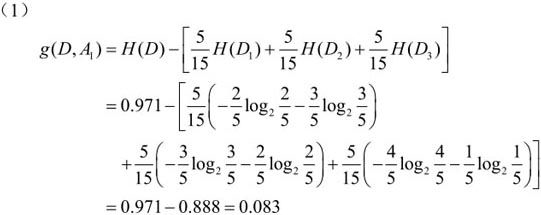
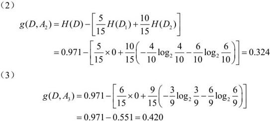
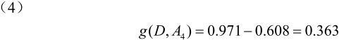
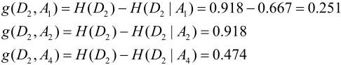
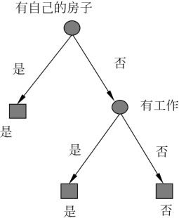
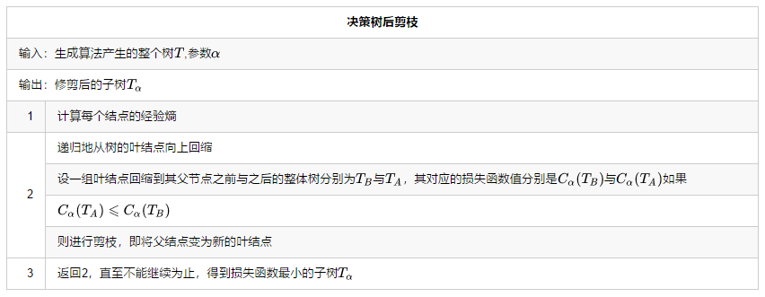

# 简介
分类决策树模型是一种描述对实例进行分类的树形结构。决策树由结点（node）和有向边（directed edge）组成。结点有两种类型：内部结点（internal node）和叶结点（leaf node）。内部结点表示一个特征或属性，叶结点表示一个类。决策树案例图如下图所示。

算法|特征选择|目标
-|-|-
ID3|信息增益 $g(D,A)=H(D)-H(D\mid A)$|信息增益最大的
C4.5|信息增益比 $g_{R}(D,A)=\frac{g(D,A)}{H_A(D)}$|信息增益比大的
CART|分类：基尼指数 $Gini( p )=\sum_{k=1}^{K}p_k(1-p_k)=1-\sum_{k=1}^{K}p_k^2$ 回归：平方差|

<!--more-->

# 特征选择

## 信息增益（用于ID3算法）
信息熵表示的是不确定度。均匀分布时，不确定度最大，此时熵就最大。当选择某个特征对数据集进行分类时，分类后的数据集信息熵会比分类前的小，其差值表示为信息增益。信息增益可以衡量某个特征对分类结果的影响大小。**信息增益=信息熵-条件熵；换句话说，信息增益代表了在一个条件下，信息复杂度（不确定性）减少的程度**
- 定义
特征 $A$ 对训练数据集 $D$ 的信息增益 $g(D,A)$，定义为集合 $D$ 的信息熵 $H(D)$ 与特征 $A$ 给定条件下 $D$ 的条件熵 $H(D|A)$ 之差，即
$$g(D,A)=H(D)-H(D|A)$$
- 算法
设训练数据集为 $D$，$|D|$ 表示其样本容量，即样本个数。设有 $K$ 个类 $C_k，k＝1,2,…,K$ ，$|C_k|$ 为属于类 $C_k$ 的样本个数。设特征 $A$ 有 $n$ 个不同的取值 ${a_1，a_2,…,a_n}$ ，根据特征 $A$ 的取值将 $D$ 划分为$n$个子集 $D_1,D_2,…,D_n$，$|D_i|$ 为 $D_i$ 的样本个数，$\sum_{i=1}^{n}|D_i|=|D|$。记子集 $D_i$ 中属于类 $C_k$ 的样本的集合为 $D_{ik}$，即 $D_{ik}＝D_i⋂C_k$，$|D_{ik}|$ 为 $D_{ik}$ 的样本个数。于是信息增益的算法如下：
输入：训练数据集$D$和特征$A$；
输出：特征$A$对训练数据集$D$的信息增益$g(D,A)$。
 1. 计算数据集$D$的信息熵$H(D)$
  $$H(D)=-\sum_{k=1}^{K}\frac{|C_k|}{|D|}log_2\frac{|C_k|}{|D|}$$
 1. 计算特征$A$对数据集$D$的经验条件熵$H(D|A)$
  $$H(D|A)=-\sum_{i=1}^{n}\frac{|D_i|}{|D|}H(D_i)=-\sum_{i=1}^{n}\frac{|D_i|}{|D|}\sum_{k=1}^{K}\frac{|D_{ik}|}{|D_i|}log_2\frac{|D_{ik}|}{|D_i|}$$

## 信息增益比

当特征的取值较多时，根据此特征划分更容易得到纯度更高的子集，因此划分之后的熵更低，由于划分前的熵是一定的，因此信息增益更大，因此**信息增益比较偏向取值较多的特征**。例如面对连续增益(体重、身高、年龄等)，(极端情况下所有数据都独一无二)，在这种情况下，我们采用信息增益比。
$$\begin{align*}
g_{R}(D,A)&=\frac{g(D,A)}{H_A(D)}\\
H_A(D)&=-\sum_{i=1}^{n}\frac{|D_i|}{|D|}log_2\frac{|D_{i}|}{|D|}
\end{align*}
$$

### 为什么使用信息增益比
Day | Temperatrue | Outlook | Humidity | Windy | PlayGolf?
-|-|-|-|-|-
07-05 | hot | sunny | high | false | no
07-06 | hot | sunny | high | true | no
07-07 | hot | overcast | high | false | yes
07-09 | cool | rain | normal | false | yes
07-10 | cool | overcast | normal | true | yes
07-12 | mild | sunny | high | false | no
07-14 | cool | sunny | normal | false | yes
07-15 | mild | rain | normal | false | yes
07-20 | mild | sunny | normal | true | yes
07-21 | mild | overcast | high | true | yes
07-22 | hot | overcast | normal | false | yes
07-23 | mild | sunny | high | true | no
07-26 | cool | sunny | normal | true | no
07-30 | mild | sunny | high | false | yes

还是以此表为例，假如我们想用Day来做为特征(当然实际上一般人也不会傻到用Day用做特征)，显然，每一天都可以将样本分开，也就是形成了一颗叶子数量为14，深度只有两层的树。

#### 信息增益
$$\begin{align*}
H(D) &= -\sum_{k=1}^{K}\frac{|C_k|}{|D|}log_2\frac{|C_k|}{|D|}\\
&=-{5\over14}log {5\over14} - {9\over14}log {9\over14} =0.9403\\
H(D|A) &=-\sum_{i=1}^{n}\frac{|D_i|}{|D|}H(D_i)=-\sum_{i=1}^{n}\frac{|D_i|}{|D|}\sum_{k=1}^{K}\frac{|D_{ik}|}{|D_i|}log_2\frac{|D_{ik}|}{|D_i|}\\
&=\sum_{i=1}^{14}1\times H(D_i)=\sum_{i=1}^{14}1\times\sum_{k=1}^{2}1\times log_2 \frac{1}{1}=0\\
g(D,A)&=H(D)-H(D|A)=0.9403
\end{align*}$$
**信息增益比较偏向取值较多的特征**。

#### 信息增益比
$$\begin{align*}
H_A(D) &=-\sum_{i=1}^{n}\frac{|D_i|}{|D|}log_2\frac{|D_i|}{|D|}\\
&=-\sum_{i=1}^{14}\frac{1}{14}log_2\frac{1}{14}=3.807\\
g_{R}(D,A)&=\frac{g(D,A)}{H_A(D)} \\
&=\frac{0.9403}{3.807}=0.247
\end{align*}$$

## 基尼指数
分类问题中，假设有 $K$ 个类，样本点属于第k类的概率为$p_k$，则概率分布的基尼指数定义为
$$\begin{align*}
Gini(p)&=\sum_{k=1}^{K}p_k(1-p_k)=1-\sum_{k=1}^{K}p_k^2\\
Gini(D)&=1-\sum_{k=1}^{K}\left ( \frac{|c_k|}{D} \right )^2
\end{align*}$$
如果样本集合 $D$ 根据特征 $A$ 是否取某一可能值 $a$ 被分割成 $D_1$ 和 $D_2$ 两部分，则在特征 $A$ 的条件下，集合 $D$ 的基尼指数定义为
$$Gini(D,A)=\frac{|D_1|}{D}Gini(D_1)+\frac{|D_2|}{D}Gini(D_2)$$
基尼指数 $Gini(D,A)$ 表示集合 $D$ 的不确定性，基尼指数 $Gini(D,A)$ 表示经 $A=a$ 分割后集合 $D$ 的不确定性。基尼指数值越大，样本集合的不确定性也就越强

# 决策树生成
迭代终止条件：
1. 所有的特征都用了，没有特征可以继续来进行特征选择
2. 当前特征集中的最大的信息增益小于我们设定的阈值
3. 树的结点深度达到预定值

## ID3
ID3算法使用了信息增益。信息增益的缺点是：对取值数目比较多的属性有偏好。一个特征的信息增益越大，表明属性对样本熵减少的能力越强，不确定性变成确定性的能力越强。用信息增益训练出来的决策树深度很浅的树。
### 不足
- **ID3没有考虑连续特征**，比如长度，密度都是连续值，无法在ID3运用。这大大限制了ID3的用途。
- **ID3偏好选择取值多的特征做分支**，ID3采用信息增益大的特征优先建立决策树的结点。很快就被人发现，在相同条件下，取值比较多的特征比取值少的特征信息增益大。直白解释：取值比较多的特征，就可以分叉出更多的分支，分支更多，每个分支的纯度必然更高！
- **ID3算法对于缺失值的情况没有做考虑**
- **没有考虑过拟合的问题，即没有剪枝处理**

### 计算实例
$A_1$：年龄    $A_2$：有工作    $A_3$：有自己的房子    $A_4$：信贷情况
1. 根结点
$H(D)=-\frac{9}{15}log_2\frac{9}{15}-\frac{6}{15}log_2\frac{6}{15}=0.971$

由此可知$g(D,A_3)$最大，所以选择$A_3$（有自己的房子）作为根结点做为划分
1. 树结点
它将训练数据集 $D$ 划分为两个子集 $D_1$（$A_3$取值为“是”）和 $D_2$（$A_3$取值为“否”）。当 $A_3$ 取值为“是”的时候，$D_1$ 全部为是；当 $A_3$ 取值为“否”的时候，对 $D_2$ 进行划分
$H(D_2)=-\frac{3}{9}log_2\frac{3}{9}-\frac{6}{9}log_2\frac{6}{9}=0.918$
由此可知 $g(D,A_2)$ 最大，所以选择 $A_2$（有工作）作为树结点做为划分
1. 结果

## C4.5
采用信息增益比作为特征选择标准，与算法与ID3类似
- 对与 **ID3没有考虑连续特征**(以两个相邻连续值的平均数进行划分)
详情请参考如下连续值处理问题
- 对与 **ID3偏好选择取值多的特征做分支**
改用信息增益比作为分支指标，因为特征数越多的特征对应的特征熵越大，它作为分母，可以校正信息增益容易偏向于取值较多的特征的问题。
- 对与 **ID3算法对于缺失值的情况没有做考虑**
- 对与**没有考虑过拟合的问题**
C4.5引入了正则化系数进行初步的剪枝。

## [CART](/2017/07/21/回归树/)

# 决策树剪枝(ID3与C4.5)
决策树生成算法递归地产生决策树，直到不能继续下去为止。这样产生的树往往对训练数据的分类很准确，但对未知的测试数据的分类却没有那么准确，即出现**过拟合现象**。过拟合的原因在于学习时过多地考虑如何提高对训练数据的正确分类，从而构建出过于复杂的决策树。解决这个问题的办法是考虑决策树的复杂度，对已生成的**决策树进行简化**。
## 预减枝
通过设定阈值，提前停止树的构建而对树剪枝，一旦停止，结点就是树叶。停止决策树生长最简单的方法有：
1. 定义一个高度，当决策树达到该高度时就停止决策树的生长
2. 达到某个结点的实例具有相同的特征向量，及时这些实例不属于同一类，也可以停止决策树的生长。这个方法对于处理数据的数据冲突问题比较有效。
3. 定义一个阈值，当达到某个结点的实例个数小于阈值时就可以停止决策树的生长
4. 定义一个阈值，通过计算每次扩张对系统性能的增益，并比较增益值与该阈值大小来决定是否停止决策树的生长。

## 后剪枝
### 定义新的损失函数

$$C_α(T)=C(T)+α|T|$$
其中，$C(T)$即是该 Node 和不确定性相关的损失、$|T|$则是该 Node 下属叶结点的个数。不妨设第 $t$ 个叶结点含有 $N_t$个样本且这 $N_t$ 个样本的不确定性为 $H_t(T)$，那么新损失一般可以直接定义为加权不确定性：
$$C\left( T \right) = \sum_{t = 1}^{\left| T \right|}{N_{t}H_{t}(T)}$$

#### 经验熵的损失函数
当不确定性为经验熵$H_t(T)=-\sum_{k}\frac{N_{tk}}{N_t}log\: \frac{N_{tk}}{N_t}$时，其损失函数为
$$C(T)=\sum_{t=1}^{\left | T \right |}N_tH_t(T)=-\sum_{t=1}^{\left | T \right |} \sum_{k=1}^KN_{tk}log\: \frac{N_{tk}}{N_t}$$
其中树的叶子结点个数为$\left | T \right |$,$t$是树$T$的叶结点，该叶结点有$N_t$个样本点，其中$k$类的样本点有$N_{tk}$个，$k=1,2,...,K$,$H(t)$为叶结点$t$上的经验熵，$\alpha \geqslant 0$为参数

### 算法

# 连续值的处理
比如$m$个样本的连续特征$A$有$m$个，从小到大排列为$a_1,a_2,…,a_m$,则取相邻两样本值的中位数，一共取得$m−1$个划分点，其中第$i$个划分点$T_i$表示为：

$$T_i = \frac{a_i+a_{i+1}}{2}$$

对于这$m−1$个点，分别计算以该点作为二元分类点时的信息增益。选择信息增益最大的点作为该连续特征的二元离散分类点。比如取到的增益最大的点$a_t$,则小于$a_t$的值为类别1，大于$a_t$的值为类别2，这样我们就做到了连续特征的离散化。要注意的是，与离散属性不同的是，**如果当前结点为连续属性，则该属性后面还可以参与子结点的产生选择过程。**

# 缺失值的处理
可以简单的抛弃不完整样本，但是如果不完整样本太多，就不能简单的抛弃。面对不完整样本我们有两个问题需要解决：
- 如何在属性值缺失的情况下进行划分属性选择
- 给定划分属性，若样本在该属性上的值缺失，如何对样本进行划分

给定训练集$D$和属性$A$，令$\tilde{D}$表示$D$中属性$A$上没有缺失值的样本子集。**对问题(1)，显然我们仅可根据$\tilde{D}$来判断属性$A$的优劣**。假设属性$A$有$V$个可取的值${a^1,...,a^V}$，令$\tilde{D}_v$表示$\tilde{D}$中在属性$A$上取值为$a^V$的样本子集，$\tilde{D}_k$表示$\tilde{D}$中属于第$k$类$k=1,...,K$的样本子集，则显然有$\tilde{D}=\bigcup _{k=1}^K\tilde{D}_k$、$\tilde{D}=\bigcup _{v=1}^V\tilde{D}_v$。假定我们为每个样本$x$赋予一个权重$w_x$并定义
$\rho =\frac{\sum _{x \in \tilde{D}}w_x}{\sum _{x \in D}w_x}$    $\rho $表示无缺失样本所占的比例
$\tilde{p}_k =\frac{\sum _{x \in \tilde{D}_k}w_x}{\sum _{x \in \tilde{D}}w_x}\: \: (1\leqslant k\leqslant K)$         $\tilde{p}_k$表示无缺失值样本中第$k$类所占的比例
$\tilde{r}_v =\frac{\sum _{x \in \tilde{D}_v}w_x}{\sum _{x \in \tilde{D}}w_x}\: \: (1\leqslant k\leqslant V)$  $\tilde{r}_v$表示无缺失值样本中在属性$A$上取值$a^v$所占的样本比例
$$\begin{align*}
Gain(D|A)&=\rho \times Gain(\tilde{D} ,A) \\
 &= \rho \times \left ( Ent(\tilde{D})-\sum_{v=1}^{V} \tilde{r}_v Ent(\tilde{D_v})\right )\\
Ent(\tilde{D}) &= -\sum_{k=1}^{\left | \gamma  \right |}\tilde{p_k}log_2\; \tilde{p_k}
\end{align*}$$
对问题(2)，若样本$x$在属性$A$上的取值已知，则将$x$划入取值相对应的子结点，且样本权重保持为$w_x$。若样本$x$在属性$A$上的取值未知，则将$x$同时划入所有的子结点，且样本权值在属性值$a^v$对应的子结点中调整为$\tilde{r}_v \cdot w_x$
## 缺失值处理
在某些情况下，可供使用的数据可能缺少某些属性的值。假如$〈x，c(x)〉$是样本集$S$中的一个训练实例，但是其属性$A$的值$A(x)$未知。处理缺少属性值的一种策略是赋给它结点$n$所对应的训练实例中该属性的最常见值；另外一种更复杂的策略是为$A$的每个可能值赋予一个概率。例如，给定一个布尔属性$A$，如果结点$n$包含6个已知$A=1$和4个$A=0$的实例，那么$A(x)=1$的概率是0.6，而$A(x)=0$的概率是0.4。于是，实例$x$的60%被分配到$A=1$的分支，40%被分配到另一个分支。这些片断样例的目的是计算信息增益，另外，如果有第二个缺少值的属性必须被测试，这些样例可以在后继的树分支中被进一步细分。C4.5就是使用这种方法处理缺少的属性值。
 1. 计算属性$A$的增益或者增益率时，如果有些样本没有属性$A$，可以有这么几种处理方式： 
  (1). 忽略这些缺失属性$A$的样本。 
  (2). 给缺失属性$A$的样本赋予属性$A$一个均值或者最常用的的值。
  (3). 计算增益或者增益率时根据缺失属性样本个数所占的比率对增益/增益率进行相应的“打折”。 （请看周志华的机器学习）
  (4). 根据其他未知的属性想办法把这些样本缺失的属性补全。
 2. 当属性$A$已经被选择，该对样本进行分支的时候，如果有些样本缺失了属性$A$,那么： 
   (1).忽略这些样本。 
   (2).把这些样本的属性$A$赋予一个均值或者最常出现的值，然后再对他们进行处理。
   (3).把属性缺失样本分配给所有的子集，也就是说每个子集都有这些属性缺失样本。 
   (4).单独为属性缺失的样本划分一个分支子集。
   (5).对于缺失属性$A$的样本，尝试着根据其他属性给他分配一个属性$A$的值，然后继续处理将其划分到相应的子集。
 3. 对于一个确实属性$A$的待分类样本，有这么几种解释
   (1).如果有单独的确实分支，依据此分支
   (2).把待分类的样本的属性$A$值分配一个最常见出现的$A$的属性值，然后进行分支预测
   (3).估计其他属性为该待分类样本填充一个属性$A$值，然后进行分支处理
   (4).在决策树中属性$A$结点的分支上，遍历属性$A$结点的所有分支，探索可能所有的分类结果，然后把这些分类结果结合起来一起考虑，按照概率决定一个分类。
   (5).待分类样本在到达属性$A$结点时就终止分类，然后根据此时$A$结点所覆盖的叶子节结点类别状况其分配一个发生概率最高的类
