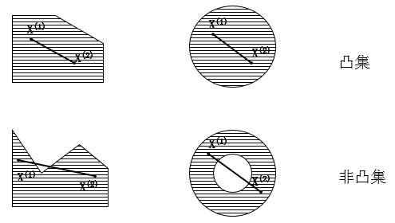
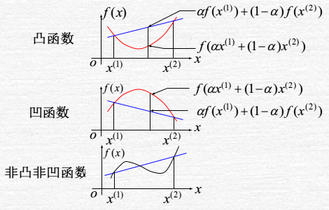
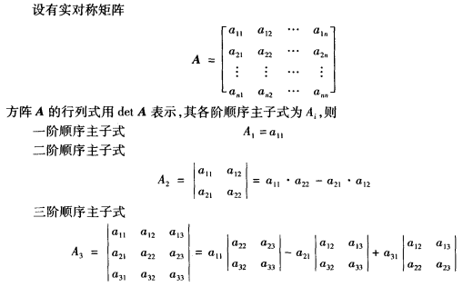
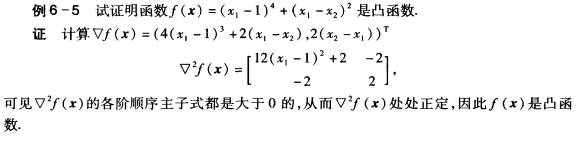

**凸优化也可以解释为目标函数 $f(x)$ 为凸函数而起约束围成的可行域为一个凸集。**

# 凸集

对于集合 $K$ ，$\forall x_1,x_2 \in K$,若 $\alpha x_1 + (1-\alpha)x_2 \in K$,其中$α∈[0,1])$,则 $K$ 为凸集，即集合中任意两点的连线均在凸集中，如在下图所示

<!--more-->
有时候需要对某个凸集进行放缩转换等操作，对凸集进行以下操作后，得到的集合依然是凸集

1. 凸集的重叠（intersection）部分任然为凸集
1. 若 $C$ 为凸集，则
$$aC+b = \lbrace ax+b , x \in C, \forall a, b\rbrace$$
也为凸集
1. 对于函数 $f(x)=Ax+b$, 若 $C$ 为凸集，则下面得到的转换也为凸集，注意这里的 $A$ 是矩阵
$$f(C) = \lbrace f(x):x\in C\rbrace$$
而当 $D$ 是一个凸集的时候，下面得到的转换也是凸集
$$f^{-1}(D) = \lbrace x: f(x)\in D\rbrace$$
这两个转换互为逆反关系

常见的凸集有下面这些(下式中 $a,x,b$ 均为向量, $A$ 为矩阵)

- 点（point）、线（line）、面（plane）
- norm ball: $\{x:||x||≤r\}$
- hyperplane: $\{x:a^Tx=b\}$
- halfspace: $\{x:a^Tx≤b\}$
- affine space: $\{x:Ax=b\}$
- polyhedron: $\{x:Ax<b\}$

 \ge f(x) + \nabla f(x)(y - x)$$
1. 二阶特性（Second-order characterization）：
函数的$∇^2f(x)$是半正定的。
1. Jensen不等式（Jensen’s inequality）：
$$f(E(x))≤E(f(x))$$
这里的 $E$ 表示的是期望，这是从凸函数拓展到概率论的一个推论，这里不详细展开。
1. sublevel sets，即集合 $\{x:f(x)≤t\}$ 是一个凸集/凸集，凸函数和凸优化-a587ad27.png)

# 凸函数
凸函数的定义如下

设 $f(x)$ 为定义在 $n$ 维欧氏空间中某个凸集 $S$ 上的函数，若对于任何实数 $α(0<α<1)$ 以及 $S$ 中的任意不同两点 $x$ 和 $y$，均有
$$f(\alpha x^{(1)}+ (1-\alpha)x^{(2)}) \le \alpha f(x^{(1)}) + (1-\alpha)f(x^{(2)})$$
则称 $f(x)$ 为定义在凸集 $S$ 上的凸函数。假如上面不等式中的 $≤$ 改为 $<$， 则称其为严格凸函数。

## 判断凸函数
根据凸函数的定义来判断一个函数是否为凸函数往往比较困难，**这里分别通过一阶条件和二阶条件判断凸函数。**
### 一阶条件
设 $f(x)$ 在凸集 $S$上有一阶连续偏导数，则 $f(x)$ 为 $S$ 上的凸函数的充要条件为：对于 任意不同两点 $x^{(1)}$和 $x^{(2)}$，均有
$$f(x^{(2)}) \ge f(x^{(1)}) + \nabla f(x^{(1)})^T(x^{(2)} - x^{(1)})$$

### 二阶条件

设 $f(x)$ 在凸集 $S$上有二阶连续偏导数，则 $f(x)$ 为 $S$上的凸函数的充要条件为：$f(x)$ 的海塞矩阵 $∇^2f(x)$在 $S$ 上处处半正定(为凹函数的充要条件为处处半负定)。
注意：假如海塞矩阵 $∇^2f(x)$在 $S$ 上处处正定，则 $f(x)$ 为严格凸函数，但是反过来不成立。

#### 顺序主子式的定义

##### 海塞矩阵判断凸函数例子

## 凸函数的性质

凸函数有几个非常重要的性质，对于一个凸函数 $f$, 其重要性质

1. 一阶特性（First-order characterization）：
$$ f(y) \ge f(x) + \nabla f(x)(y - x) $$
1. 二阶特性（Second-order characterization）：
$$\nabla^2f(x) \succeq 0$$
这里的 $⪰0$ 表示 Hessian 矩阵是半正定的。
1. Jensen不等式（Jensen’s inequality）：
$$f(E(x))≤E(f(x))$$
这里的 $E$ 表示的是期望，这是从凸函数拓展到概率论的一个推论，这里不详细展开。
1. sublevel sets，即集合 $\{x:f(x)≤t\}$ 是一个凸集

## 常见的凸函数有下面这些

1. 仿射函数( Affine function ): $a^Tx+b$
1. 二次函数( quadratic function),注意这里的 $Q$ 必须为半正定矩阵: $\frac{1}{2}x^TQx + b^Tx+c(Q \succeq 0)$
1. 最小平方误差( Least squares loss ): $||y-Ax||_2^2$ (总是凸的，因为 $A^TA$ 总是半正定的)
1. 示性函数（Indicator function）：
$$I_C(X) = \begin{cases} 0&x \in C\\ \infty & x \notin C\end{cases}$$
1. max function: $f(x) = max \lbrace x_1,…x_n \rbrace$
1. 范数（Norm）：范数分为向量范数和矩阵范数，任意范数均为凸的，各种范数的定义如下
 - 向量范数
0范数：$||x||_0$ 向量中非零元素的个数
1范数： $||x||_1 = \sum_{i=1}^n |x_i|$
$p$ 范数：$||x||_p = (\sum_{i=1}^nx_i^p)^{1/p}~~(p > 1)$
无穷范数: $||x||_{\infty} = max_{i=1,…n} |x_i|$

 - 矩阵范数
核(nuclear)范数: $||X||_{tr} = \sum_{i=1}^{r}\sigma_i(X)$ , ($\sigma_i(X)$是矩阵分解后的奇异值,核范数即为矩阵所有奇异值之和)
谱（spectral）范数：$||X||_{op} = max_{i=1,…r}\sigma_i(X)$, 即为最大的奇异值

# 凸优化
对于下面的优化问题
$$\begin{align*} &\min_x\quad f(x)\\ &\begin{array}\\ s.t.&g_i(x) \le 0,~i=1,\ldots,m\\ &h_j(x)=0,~j=1,\ldots,r \end{array} \end{align*}$$
当 $f(x),gi(x$ 均为凸函数， 而 $h_j(x)$ 为仿射函数（affine function）时，该优化称为凸优化,注意上面的 min 以及约束条件的符号均要符合规定。
**凸优化也可以解释为目标函数 $f(x)$ 为凸函数而起约束围成的可行域为一个凸集。**

## 常见的一些凸优化问题
常见的一些凸优化问题有：线性规划（linear programs），二次规划（quadratic programs），半正定规划（semidefinite programs），且 $LP∈QP∈SDP$, 即后者是包含前者的关系。

- 线性规划问题一般原型如下($c$为向量，$D,A$为矩阵)

$$\begin{align*} &\min_x\quad c^Tx\\ &\begin{array}\\ s.t.&Dx \le d\\ &Ax=b \end{array} \end{align*}$$

- 二次规划问题一般原型如下（要求矩阵 $Q$ 半正定）

$$\begin{align*} &\min_x\quad \frac{1}{2}x^TQx+c^Tx\\ &\begin{array}\\ s.t.&Dx \le d\\ &Ax=b \end{array} \end{align*}$$

- 而半正定规划问题一般原型如下(X 在这里表示矩阵)

$$\begin{align*} &\min_X\quad CX\\ &\begin{array}\\ s.t.&A_iX \le b_i, i=1,…m\\ &X \succeq 0 \end{array} \end{align*}$$
