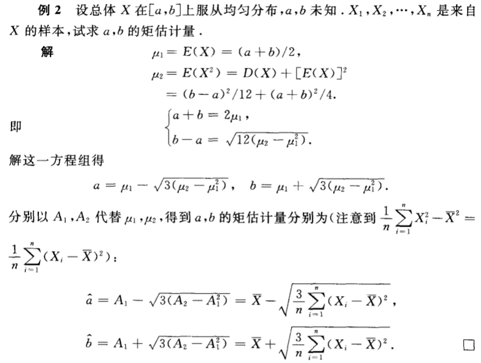
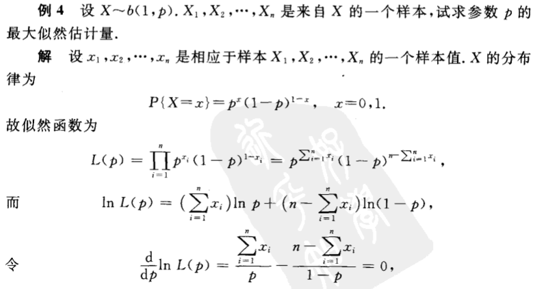
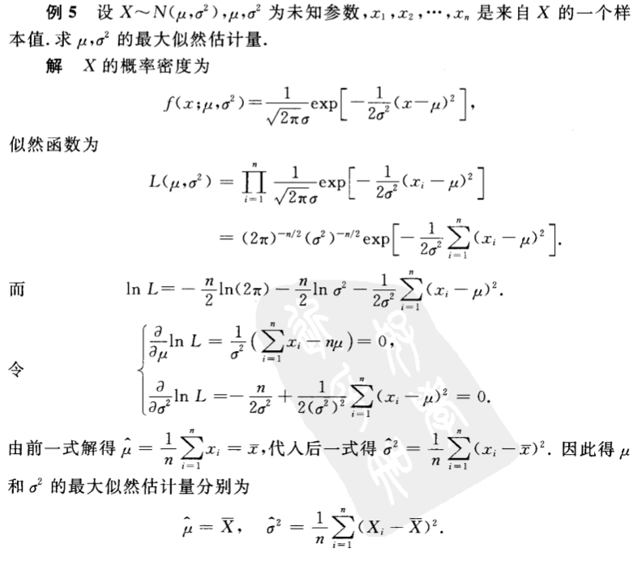
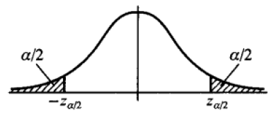
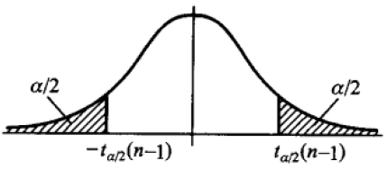
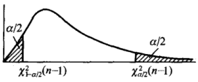

在数理统计中，常常需要通过样本来估计总体的参数，估计可划分为两大类：点估计和区间估计。点估计就是估计总体中某个参数的值，而区间估计是估计总体的某个参数落在某个区间的概率大小。本文主要讲述点估计中的矩估计法和最大似然估计法，以及针对服从正态分布的期望和方差进行区间估计。

# 参数估计定义
- 已知一个随机变量的分布函数 $Xf_θ(x)$, 其中 $θ = (θ_1,··· ,θ_k)$ 为未知参数.
- 样本 $X_1,··· ,X_n$
- 利用样本对参数 $θ$ 做出估计，或者估计 $θ$ 的某个函数 $g(θ)$
 - 点估计: 用样本的一个函数 $T(X_1,··· ,X_n)$ 去估计 $g(θ)$
 - 区间估计: 用一个区间去估计 $g(θ)$
<!--more-->

# 点估计
点估计一般解决的问题是总体 $X$ 的分布函数 $F(X,θ)$ 形式为已知，但是 $θ$ 参数未知。点估计的目的就是通过样本 $X_1,X_2,…X_n$ 构造一个适当的统计量 $θ′(X_1,X_2,…X_n)$，用于作为未知参数 $θ$ 的近似值。由于 $θ′$ 是样本的函数，因此对于不同的样本，$θ′$ 的值一般不同。

点估计中一般用到的方法包括**矩估计法和最大似然估计法**。

## 矩估计法
**矩估计法的核心思想是样本矩总是收敛于相应的总体矩，因此可通过样本矩作为相应的总体矩的估计量，进而根据总体矩与待估参数的关系求出待估参数。**

矩估计法的一般描述如下：
设 $X$ 为连续型随机变量，其概率密度函数为 $f(x;\theta_1, \theta_2,..\theta_n)$ ；离散型随机变量，其分布律为 $P(X=x) = p(x; \theta_1, \theta_2,..\theta_n)$ ；则总体的 $n$ 阶矩分别为
$$\begin{align*}
E(X^n) &= \int_{-\infty}^{\infty} x^nf(x;\theta_1, \theta_2…\theta_n) dx \\
E(X^n) &= \sum_{x \in R_x} x^np(x;\theta_1, \theta_2….\theta_n)
\end{align*}$$

而样本 $X_1, X_2…X_k$ 的 $n$ 阶矩的定义为

$$A_n = \frac{1}{k} \sum_{i=1}^{k}X_i^n$$
由于总体的 $n$ 阶矩往往是未知参数 $θ$ 的函数，因此常常先用总体的 $n$ 阶矩 $E(X^n)$ 将参数 $θ$ 表示出来，然后用样本矩 $A_n$ 代替总体的 $n$ 阶矩 $E(X^n)$ ,进而得出估计的 $θ$ 的值。下面是一个简单的例子

## 最大似然估计法
**最大似然估计的思想是既然当前取得了这组样本，那么有理由相信已取得的样本出现的概率是很大的。因此通过极大化这组样本的联合概率来估计未知参数的值。**

### 离散型总体
单总体为离散型的时候，设当前样本为 $X_1,X_2,…X_n$， 则其联合概率为 $\prod_{i=1}^{n} p(x_i;\theta)$, 其中 $x_i$ 是 $X_i$ 相应的观测值，则上面的联合概率实际上是参数 $θ$ 的函数，记为
$$L(\theta) = \prod_{i=1}^{n} p(x_i;\theta)$$

上面的 $L(θ)$ 被称为样本的似然函数。

选择 $θ$ 的值使得 $L(θ)$ 最大便是最大似然估计做的事情。一般通过对 似然函数求导便可求得其最大值对应的 $θ$。如下是一个简单的例子

上面最后求解的结果是 $p’ = \overline x$ 。同时也注意到求解似然函数最大化时会先对似然函数取 $log$ , 目的是将连乘变为连加，方便运算，同时这种方法也被称为对数极大似然估计。

### 连续型总体
若总体是连续型，设其概率密度函数为 $f(x,θ)$ ，则当前样本 $X_1,X_2,…X_n$ 的联合概率密度函数为

$$\prod_{i=1}^{n}f(x_i;\theta)$$

其中 $x_1,x_2,…x_n$ 是相应于样本的一个样本值，则随机点落在 （$x_1,x_2,…x_n$）的领域（边长为 $dx_1, dx_2,…dx_n$ 的n维立方体）内的概率近似为

$$\prod_{i=1}^{n}f(x_i;\theta)dx_i$$

同样我们要让上式取到最大，但是因子 $\prod_{i=1}^{n}dx_i$ 不随 $θ$ 改变，因此只需考虑函数 $L(\theta) = \prod_{i=1}^{n}f(x_i;\theta)$ 最大即可，这里 $L(θ)$ 被称为似然函数，极大化也是通过求导来解决。

下面是一个连续型总体进行极大似然估计的例子

## 评选标准
对于同一参数，不同的估计方法求出的估计量可能不一样，那么如何判断不同的估计量之间的优劣，**无偏性，有效性和相合性**是常用的三个指标。

- 相合性 (consistency): 当样本数量趋于无穷时，估计量收敛 于参数真实值.
- 无偏性 (bias): 对于有限的样本，估计量所符合的分布之期 望等于参数真实值.
- 有效性 (efficiency): 估计值所满足的分布方差越小越好.

### 相合性
当样本数目 $n→∞$ 时，估计量 $\theta’(X_1，X_2…X_n)$ 收敛于真正的 $θ$ ,则称 $θ′$ 为 $θ$ 的相合估计量。即有以下式子成立
$$\lim_{n \rightarrow \infty}P(|\theta’ - \theta| < \epsilon) = 1$$
相合性是一个估计量的基本要求，如果估计量没有相合性，那么无论样本数量 n 取多大，这些估计量都无法准确估计正确参数，都是不可取的。

### 无偏性
无偏性指的是从样本中得到的估计量 $θ′$ 的期望与总体的参数 $θ$ 相等，也就是
$$E(θ′)=θ$$

此时称 $θ′$ 是 $θ$ 的无偏估计量。无偏估计量的意义是对于某些样本值，这一估计量得到的估计值比真实值要打，而对于另外一些样本则偏小，反复将这一估计量使用多次，就平均来说其偏差为零。

### 有效性
当两个估计量 $\theta_1’, \theta_2’$ 均是无偏估计量时，就要通过比较他们的有效性来决定选取哪个估计量。有效性指的是在样本容量 $n$ 相同的情况下，假如 $θ_1'$ 的观察值较 $θ_2'$ 的值更密集在真值 $θ$ 附近，那么认为 $θ_1'$ 比 $θ_2'$ 更为理想。

实际上，上面比较的就是两个估计量的方差大小，方差越小，则越有效，因此当两个总体的样本数相同的时候，若 $D(θ_1')<D(θ_2')$ 时， 就称 $θ_1'$ 比 $θ_2'$ 更有效。

# 区间估计
**对于总体中的未知参数，我们的估计总是存在着一定的误差的，如何去衡量这个误差是一个需要考虑的事情。同时，除了上面的点估计，在实际中我们往往还希望估计出参数的一个范围，同时参数落在这个范围的概率，或者是说可信程度。**

估计参数落在某个范围以及落在这个范围的可信程度就是区间估计干的事情。

其严格定义如下

设总体的分布中存在一个未知参数 $θ$, 对于给定的值 $α(0<α<1)$, 若通过样本 $X_1,X_2,X_3…X_n$ 估计的两个统计量 $θ_1′$ 和 $θ_2′$ 满足下面不等式时
$$P(\theta’_1 < \theta < \theta’_2) \ge 1 - \alpha$$
则称区间 $(\theta’_1, \theta’_2)$ 是参数 $θ$ 置信水平为 $1−α$ 的置信区间, $\theta’_1, \theta’_2$ 分别称为置信下限和置信上限。

上面式子的含义是若反复抽样多次（每次得到的样本的容量相等），每个样本值确定一个区间$(\theta’_1, \theta’_2)$，这个区间要么包含 $θ$ 的真值，要么不包含 $θ$ 的真值,在这么多的区间中，包含 $θ$ 真值的概率约为 $1−α$.

## 正态分布均值与方差的区间估计
由于正态分布的普遍性，下面主要讲述对正态分布的期望和方差进行区间估计的方法，而这里会用到我们前面讲到的统计量的三大分布： $χ^2$ 分布， $t$ 分布， $F$ 分布，以及对其拓展的一些定理，具体的定理及其证明可参考抽样与统计.md。

下面会讲述单个正态分布的期望和方差的估计，以及两个正态分布的期望差和方差比的估计。

### 单个正态分布
下面的关于单个正态分布的讨论都是基于以下假设：给定置信水平为 $1−α$ , 设 $X_1,X_2,X_3…X_n$ 为总体 $N(μ,σ^2)$ 的样本，$\overline X，S^2$ 分别是样本的期望和方差。

#### 估计期望 $μ$ 的置信区间
通过样本 $X_1,X_2,X_3…X_n$ 估计总体 $N(μ,σ^2)$ 的期望 $μ$ 时可以分为两种情况：

1. 总体的方差 $σ^2$ 已知
1. 总体的方差 $σ^2$ 未知
##### 总体的方差 $σ^2$ 已知->定理一
若已知总体的方差，则因为 $\overline X \sim N(\mu , \sigma^2/n)$ , 即 $\frac{\overline X - \mu}{\sqrt{\sigma^2/n}} \sim N(0,1)$ , 下面都会这样不加证明给出这些统计量服从的分布，具体的证明参考[这篇文章](样本以及抽样分布.md)。

按照标准正态分布的上 $α$ 分位点的定义有
$$P(|\frac{\overline X - \mu}{\sqrt{\sigma^2/n}} | < z_{\alpha/2}) = 1 - \alpha$$

从概率密度函数上直观看为：

进一步化简有
$$P(\overline X - \frac{\sigma}{\sqrt{n}}z_{\alpha/2} < \mu < \overline X + \frac{\sigma}{\sqrt{n}}z_{\alpha/2}) = 1 - \alpha$$
给定 $\alpha, z_{\alpha/2}$ 的值可以通过查表获得。这样便得到了期望 $μ$ 的一个估计区间为 $(\overline X - \frac{\sigma}{\sqrt{n}}z_{\alpha/2}, \overline X + \frac{\sigma}{\sqrt{n}}z_{\alpha/2})$, 其置信度为 $1−α$。注意置信水平为 $1−α$ 的置信区间并不是唯一的，假如说给定 $α=0.05$, 则上面的式子可写为
$$P(\overline X - \frac{\sigma}{\sqrt{n}}z_{0.025} < \mu < \overline X + \frac{\sigma}{\sqrt{n}}z_{0.025}) = 1 - \alpha$$
同时也可写为
$$P(\overline X - \frac{\sigma}{\sqrt{n}}z_{0.04} < \mu < \overline X + \frac{\sigma}{\sqrt{n}}z_{0.01}) = 1 - \alpha$$
但是写成不对称的形式计算出来的区间长度要更长，显然，置信度相同的情况下，置信区间肯定是越小越好，所以对于正态分布的分位点往往选择对称形式。

下面的求解方法与这方法类似，只是构造的统计量不同，因而服从的分布也不同。

##### 总体的方差 $σ^2$ 未知->定理三
当总体方差未知时，就无法利用上面标准正态分布。但是回忆 $t$ 分布的作用及其定理，可知
$$\frac{\overline X - \mu}{S/\sqrt{n}} \sim t(n-1)$$

同样按照 $t$ 分布的上 $α$ 分位点的定义有
$$P(|\frac{\overline X - \mu}{S/\sqrt{n}}| < t_{\alpha/2}(n-1)) = 1 - \alpha$$
其对应的概率密度函数如下所示

进一步化简可得
$$P(\overline X - \frac{S}{\sqrt{n}}t_{\alpha/2}(n - 1) < \mu < \overline X + \frac{S}{\sqrt{n}}t_{\alpha/2}(n - 1)) = 1 - \alpha$$
则期望 $μ$ 的一个置信水平为 $1−α$ 的置信区间为
$$(\overline X - \frac{S}{\sqrt{n}}t_{\alpha/2}(n - 1), \overline X + \frac{S}{\sqrt{n}}t_{\alpha/2}(n - 1))$$

#### 估计方差 $σ^2$ 的置信区间
估计方差 $σ^2$ 的置信区间也可分为两种情况

1. 总体的期望 $μ$ 已知
1. 总体的期望 $μ$ 未知
##### 总体的期望 $μ$ 已知->定理一

当期望 $μ$ 已知时，求解方差 $σ^2$ 的置信区间的方法跟上面已知方差 $σ^2$ 求解期望 $μ$ 的一样，都是利用 $\frac{\overline X - \mu}{\sqrt{\sigma^2/n}} \sim N(0,1)$，然后写出对应未知量的区间，这里就不详细讲述已知 $μ$ 求解方差 $σ^2$ 的详细过程了。

##### 总体的期望 μ 未知->定理二

当期望 $μ$ 未知时，求解方差 $σ^2$ 的区间估计就再也不能利用上面的 $\frac{\overline X - \mu}{\sqrt{\sigma^2/n}} \sim N(0,1)$。结合 $χ^2$ 分布的特性及其推导的定理可知

$$\frac{(n-1)S^2}{\sigma^2} \sim \chi^2(n-1)$$

同样按照 $χ^2$ 分布的 $α$ 分位点的定义有

$$P( \chi^2_{1 - \alpha/2}(n-1) < \frac{(n-1)S^2}{\sigma^2} < \chi^2_{\alpha/2}(n-1)) = 1 - \alpha$$

注意这里不能用绝对值了，原因是 $χ^2$ 分布的概率密度函数不像标准正态分布或 $t$ 分布那样是对称的。其对应的概率密度函数如下所示

进一步化简可得
$$P(\frac{(n-1)S^2}{\chi^2_{\alpha/2}(n-1)} < \sigma^2 < \frac{(n-1)S^2}{\chi^2_{1 - \alpha/2}(n-1)}) = 1 - \alpha$$
即给定样本，总体期望 $μ$ 未知的时候，总体方差 $σ^2$ 的一个置信水平为 $1−α$ 的置信区间为
$$(\frac{(n-1)S^2}{\chi^2_{\alpha/2}(n-1)}, \frac{(n-1)S^2}{\chi^2_{1 - \alpha/2}(n-1)})$$
实际上， $χ^2$ 分布的一个作用就是在正态总体分布中期望未知时估计其方差的置信区间。

### 两个正态分布->定理四
下面讲述两个正态分布的期望差值的区间估计以及方差比的估计。考虑以下问题：已知产品的某一质量指标服从正态分布，但由于原料、操作人员不同，或工艺过程的改变等因素，引起总体均值、方差有所变化。我们需要知道这些变化有多大，就需要考虑两个正态分布**均值差或方差比**的估计问题。

下面的讨论都是假设给定了置信水平为 $1−α$, 并设 $X_1, X_2,….X_n$ 是来自第一个总体 $N_1(\mu_1, \sigma_1^2)$ 的样本，$Y_1, Y_2,….Y_n$ 是来自第二个总体 $N_2(\mu_2, \sigma_2^2)$ 的样本，并假设 $\overline X, \overline Y$ 是第一、第二个样本的均值， $S_1^2, S_2^2$ 是第一、第二个样本的方差。

#### 估计 $μ_1−μ_2$ 的置信区间
估计 $μ_1−μ_2$ 的置信区间时也可以分为两种情况

1. 总体的方差 $\sigma_1^2, \sigma_2^2$ 已知
1. 总体的方差 $\sigma_1^2, \sigma_2^2$ 未知，但是知道 $\sigma_1^2 = \sigma_2^2 = \sigma^2$（$σ$未知）
##### 总体的方差 $\sigma_1^2, \sigma_2^2$ 已知->定理一
由 $\overline X \sim N(\mu_1, \sigma_1^2/n_1), \overline Y \sim N(\mu_2, \sigma_2^2/n_2)$ 可知
$$\overline X - \overline Y \sim N(\mu_1 - \mu_2, \sigma_1^2/n_1 + \sigma_2^2/n_2) \\
 \frac{(\overline X - \overline Y) - (\mu_1 - \mu_2)}{\sqrt{\sigma_1^2/n_1 + \sigma_2^2/n_2}} \sim N(0, 1)$$
与上面相同，按照标准正态分布的上 $α$ 分位点的定义有
$$P(|\frac{(\overline X - \overline Y) - (\mu_1 - \mu_2)}{\sqrt{\sigma_1^2/n_1 + \sigma_2^2/n_2}} | < z_{\alpha/2}) = 1 - \alpha$$
同样可解得 $μ_1−μ_2$ 置信度为 $1−α$ 的区间。

##### 总体的方差 $\sigma_1^2, \sigma_2^2$ 未知，但 $\sigma_1^2 = \sigma_2^2 = \sigma^2$（$σ$未知）->定理四

根据 $t$ 分布的作用及其推导的定理可知

$$\frac{(\overline X - \overline Y) - (\mu_1 - \mu_2)}{S_w\sqrt{1/n_1+1/n_2}} \sim t(n_1+n_2-2)$$
其中 $S_w = \sqrt{\frac{(n_1 -1)S_1^2+(n_2 -1)S_2^2}{n_1+n_2-2}}$
同样根据 $t$ 分布的上 $α$ 分位点的定义有
$$P(|\frac{(\overline X - \overline Y) - (\mu_1 - \mu_2)}{S_w\sqrt{1/n_1+1/n_2}}| < t_{\alpha/2}(n_1+n_2-2)) = 1 - \alpha$$
通过查表同样可以求出 $μ_1−μ_2$ 置信度为 $1−α$ 的区间，结合上面 $t$ 分布在单个正态总体分布参数估计的问题可知， $t$ 分布专门用于解决正态分布中方差未知时估计其期望的问题。

#### 计 $\sigma_1^2 / \sigma_2^2$ 的置信区间
估计 $\sigma_1^2 / \sigma_2^2$ 的置信区间同样可以分为两种情况

1. 总体期望 $μ_1,μ_2$ 已知
1. 总体期望 $μ_1,μ_2$ 未知

##### 总体期望 $μ_1,μ_2$ 已知->定理一

总体期望 $μ_1,μ_2$ 已知时可以先通过标准正态分布求出 $\sigma_1^2, \sigma_2^2$ 各自的范围, 然后求解 $\sigma_1^2 / \sigma_2^2$ 的范围。

##### 总体期望 $μ_1,μ_2$ 未知时，如何估计 $\sigma_1^2 / \sigma_2^2$ 的范围->定理四

由 $F$ 分布的定义以及推导的定理可知
$$\frac{S_1^2/S_2^2}{\sigma_1^2/ \sigma_2^2} \sim F(n_1 - 1, n_2 - 1)$$
根据 $F$ 分布的 $α$ 分位点的定义有
$$P( F_{1 - \alpha/2}(n_1 - 1, n_2 - 1) < \frac{S_1^2/S_2^2}{\sigma_1^2/ \sigma_2^2} < F_{\alpha/2}(n_1 - 1, n_2 - 1)) = 1 - \alpha$$
化简可得
$$P( \frac{S_1^2}{S_2^2}\frac{1}{F_{\alpha/2}(n_1 - 1, n_2 - 1)} < \frac{\sigma_1^2}{ \sigma_2^2} < \frac{S_1^2}{S_2^2}\frac{1}{F_{1 - \alpha/2}(n_1 - 1, n_2 - 1)}) = 1 - \alpha$$
即 $\sigma_1^2 / \sigma_2^2$ 一个置信度为 $1−α$ 的置信区间为
$$(\frac{S_1^2}{S_2^2}\frac{1}{F_{\alpha/2}(n_1 - 1, n_2 - 1)} < \frac{\sigma_1^2}{ \sigma_2^2}, \frac{S_1^2}{S_2^2}\frac{1}{F_{1 - \alpha/2}(n_1 - 1, n_2 - 1)})$$

### 小结
在上面对正态分布总体进行参数估计中，用到了数理统计中的三大分布： $χ^2$ 分布， $t$ 分布和 $F$ 分布， 其中 $χ^2$ 分布主要解决总体期望未知时估计其方差的问题， $t$ 分布主要解决总体方差未知时估计其期望的问题，$F$ 主要解决期望未知时两个正态分布的方差比值问题。

## 单侧置信区间
上面均是讨论未知参数 $θ$ 的双侧置信区间，但是在实际问题中，往往考虑的只是一个上限或下限，比如说设备、原件的寿命我们关心的是平均寿命 $θ$ 的下限。这就引出了单侧置信区间的概念。单侧置信区间跟双侧置信区间的概念非常类似。

总体的参数 $θ$ 未知, 对于给定的 $α$ ,若由样本 $X_1, X_2..X_n$ 确定的统计量 $θ′$满足
$$P(\theta > \theta’) = 1 - \alpha$$
则称 $(θ′,∞)$ 是参数 $θ$ 的置信水平为 $1−α$ 的单侧置信区间，而 $θ′$ 是单侧置信下限，将 $θ>θ′$ 变为 $θ<θ′$ 后，相应地变为单侧置信上限。

单侧置信区间的计算方法与上面提到的双侧置信区间的计算方法已知，都是根据给定的 $α$ 值和统计量服从的分布去查表，找到相应的分位点后带入不等式求解目标估计量的范围即可。
