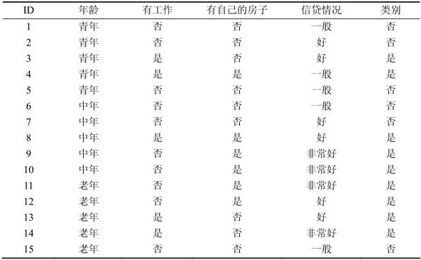
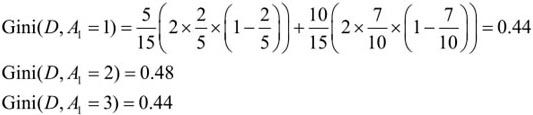
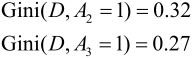
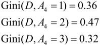
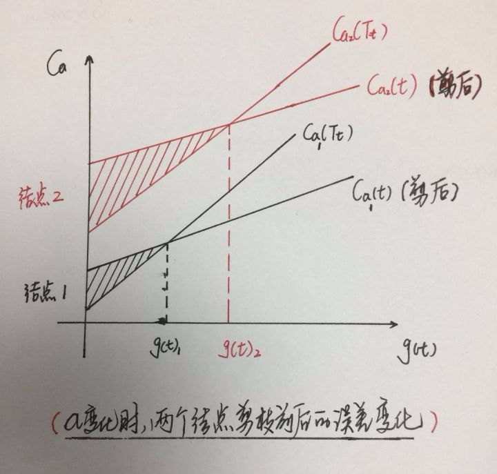
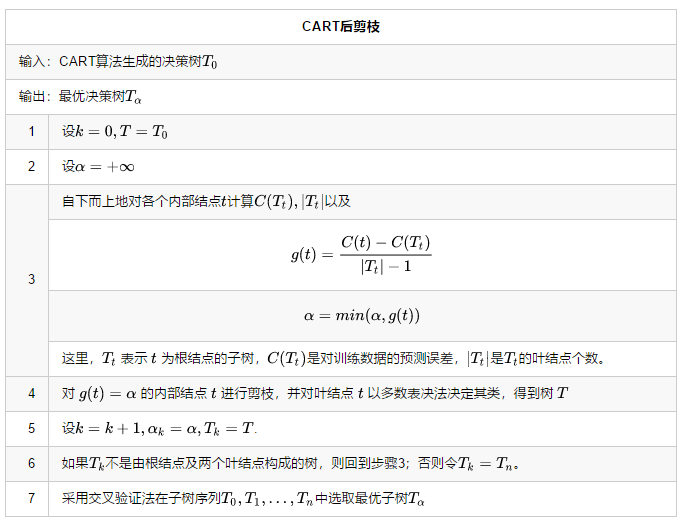

# 简介
决策树的生成就是递归地构建二叉决策树的过程。对回归树用**平方误差最小化准则**，对分类树用**基尼指数（Gini index）**最小化准则，进行特征选择，生成二叉树。CART算法有两步：**决策树生成和剪枝。**
<!--more-->

# 回归树的生成
一个回归树对应着输入空间（即特征空间）的一个划分以及在划分的单元上的输出值。假设已将输入空间划分为$M$个单元$R_1,R_2,…,R_M$，并且在每个单元$R_m$上有一个固定的输出值$c$,$f(x)=\sum _{i=1}^M c_mI(x \in R_m)$
- 输入：训练数据集$D{(x_1,y_1),...,(x_N,y_N)}$；
- 输出：回归树$f(x)=\sum _{i=1}^M c_mI(x \in R_m)$
在训练数据集所在的输入空间中，递归地将每个区域划分为两个子区域并决定每个子区域上的输出值，构建二叉决策树
 1. 当输入空间的划分确定时，可以用平方误差$\sum _{x_i\in R_m}(y_i-f(x_i))^2$来表示回归树对于训练数据的预测误差，选择最优切分变量$j$与切分点$s$，使得预测误差最小，求解
 $$\min_{j,s}[\min_{c_1} \sum_{x_i\in R_1(j,s)}(y_i-c_1)^2 + \min_{c_2} \sum_{x_i\in R_2(j,s)}(y_i-c_2)^2]$$
 1. 用选定的对$（j,s）$划分区域并决定相应的输出值：
 $$R_1(j,s)=\{x|x^{(j)}\leqslant s\},R_1(j,s)=\{x|x^{(j)}> s\}\\
\hat{c}_m=\frac{1}{N_m}\sum_{x_i \in R_m(j,s)}y_i ,\; \; x\in R_m ,\, \, m=1,2$$
 1. 继续对两个子区域调用以上两个步骤，直至满足停止条件。
 1. 将输入空间划分为$M$个区域$R_1,R_2,…R_m$，生成决策树
 $$f(x)=\sum _{m=1}^M\hat{c}_mI(x \in R_m)$$

## 计算实例
训练数据见下表，x的取值范围为区间[0.5,10.5],y的取值范围为区间[5.0,10.0],学习这个回归问题的最小二叉回归树

$x_i$ | 1 | 2 | 3 | 4 | 5 | 6 | 7 | 8 | 9 | 10
-|-|-|-|-|-|-|-|-|-|-
$y_i$ | 5.56 | 5.70 | 5.91 | 6.40 | 6.80 | 7.05 | 8.90 |8.70 | 9.00 | 9.05

### 根结点$T_1(x)$
求训练数据的切分点，根据所给数据，求取使得预测误差最小的切分点：

$x_i$ | 1 | 2 | 3 | 4 | 5 | 6 | 7 | 8 | 9 | 10
-|-|-|-|-|-|-|-|-|-|-
$y_i$ | 5.56 | 5.70 | 5.91 | 6.40 | 6.80 | 7.05 | 8.90 |8.70 | 9.00 | 9.05
切分点|1.5 | 2.5 | 3.5 | 4.5 | 5.5 |  6.5 |  7.5 |  8.5 |  9.5

- 例如当 $s=1.5$ 时，$R_1 = \lbrace 1\rbrace$ , $R_2 = \lbrace 2, 3 , \ldots , 10\rbrace$ , $c_1=5.56$ , $c_2=7.50$ ,
$$m(s)=\min_{j,s}[\min_{c_1} \sum_{x_i\in R_1(j,s)}(y_i-c_1)^2 + \min_{c_2} \sum_{x_i\in R_2(j,s)}(y_i-c_2)^2] = 0+15.72 = 15.72$$
由上表可知，当$x=6.5$的时候达到最小值，此时$R_1 = \lbrace 1 ,2 , \ldots , 6\rbrace$ , $R_2 = \lbrace 7 ,8 ,9 ,10 ,\rbrace$ , $c_1=6.24$ , $c_2=8.9$ , 所以回归树$T_1(x)$为：
$$T_1(x) =
\begin{cases}
6.24, & x\lt 6.5 \\
8.91, & x \ge 6.5 \\
\end{cases}$$
$$f_1(x) = T_1(x)$$

- 用$f_1(x)$拟合训练数据的平方误差：
$$L(y,f_1(x)) = \sum_{i=1}^{10}(y_i-f_1(x_i))^2 = 1.93$$

### 次结点$T_2(x)$
用$f_1(x)$拟合训练数据的残差见下表，表中$r_{2i} = y_i - f_1(x_i),i=1,2,\ldots , 10$

$x_i$ | 1 | 2 | 3 | 4 | 5 | 6 | 7 | 8 | 9 | 10
-|-|-|-|-|-|-|-|-|-|-
$y_i$ | 5.56 | 5.70 | 5.91 | 6.40 | 6.80 | 7.05 | 8.90 |8.70 | 9.00 | 9.05
$r_{2i}$ | -0.68 | -0.54 | -0.33 | 0.16 | 0.56 | 0.81 | -0.01 | -0.21 | 0.09 | 0.14

求$T_2(x)$.方法与求$T_1(x)$一样，只是拟合的数据是上表的残差，可以得到
$$T_2(x) =
\begin{cases}
-0.52, & x\lt 3.5 \\
0.22, & x \ge 3.5 \\
\end{cases}$$
$$f_2(x) = f_1(x) + T_2(x)=
\begin{cases}
5.72, & x\lt 3.5 \\
6.46, & 3.5\le x \lt 6.5 \\
9.13, & x\ge 6.5 \\
\end{cases}$$

- 用$f_2(x)$拟合训练数据的平方误差是：
$$L(y,f_2(x)) = \sum_{i=1}^{10}(y_i-f_2(x_i))^2 = 0.79$$

### 结果
继续求得
$$T_3(x) =
\begin{cases}
0.15, & x\lt 6.5 \\
-0.22, & x \ge 6.5 \\
\end{cases}
\quad L(y,f_3(x)) = 0.47 ,$$
$$T_4(x) =
\begin{cases}
-0.16, & x\lt 4.5 \\
0.11, & x \ge 4.5 \\
\end{cases}
\quad L(y,f_3(x)) = 0.30 ,$$
$$T_5(x) =
\begin{cases}
0.07, & x\lt 6.5 \\
-0.11, & x \ge 6.5 \\
\end{cases}
\quad L(y,f_3(x)) = 0.23 ,$$
$$T_6(x) =
\begin{cases}
-0.15, & x\lt 2.5 \\
0.04, & x \ge 2.5 \\
\end{cases}$$
$$f_6(x) = f_5(x)+T_6(x) =T_1(x)+ \ldots + T_5(x) + T_6(x)=
\begin{cases}
5.63, & x\lt 2.5 \\
5.82, & 2.5 \le x\lt 3.5 \\
6.56, & 3.5 \le x\lt 4.5 \\
6.83, & 4.5 \le x\lt 6.5 \\
8.95, & x\ge 6.5 \\
\end{cases}$$
- 用$f_6(x)$拟合训练数据的平方损失误差是
$$L(y,f_6(x)) = \sum_{i=1}^{10}(y_i-f_6(x_i))^2 = 0.71$$
假设此时已经满足误差要求，那么$f(x)=f_6(x)$即为所求的回归树。

** 综可知平方差函数越来越小**

# 分类树的生成
- 输入：训练数据集$D$，停止计算的条件；
- 输出：CART决策树。根据训练数据集，从根结点开始，递归地对每个结点进行以下操作，构建二叉决策树：
 1. 设结点的训练数据集为$D$，计算现有特征对该数据集的基尼指数。此时，对每一个特征$A$，对其可能取的每个值$a$，根据样本点对$A＝a$的测试为“是”或“否”将$D$分割成$D1$和$D2$两部分，利用式$Gini(D)=1-\sum_{k=1}^{K}\left ( \frac{|c_k|}{D} \right )^2$计算$A＝a$时的基尼指数。
 2. 在所有可能的特征$A$以及它们所有可能的切分点$a$中，选择基尼指数最小的特征及其对应的切分点作为最优特征与最优切分点。依最优特征与最优切分点，从现结点生成两个子结点，将训练数据集依特征分配到两个子结点中去。
 3. 对两个子结点递归地调用以上两个步骤，直至满足停止条件。
 4. 生成CART决策树。

 ## 基尼指数
 分类问题中，假设有 $K$ 个类，样本点属于第k类的概率为$p_k$，则概率分布的基尼指数定义为
 $$\begin{align*}
 Gini(p)&=\sum_{k=1}^{K}p_k(1-p_k)=1-\sum_{k=1}^{K}p_k^2\\
 Gini(D)&=1-\sum_{k=1}^{K}\left ( \frac{|c_k|}{D} \right )^2
 \end{align*}$$
 如果样本集合 $D$ 根据特征 $A$ 是否取某一可能值 $a$ 被分割成 $D_1$ 和 $D_2$ 两部分，则在特征 $A$ 的条件下，集合 $D$ 的基尼指数定义为
 $$Gini(D,A)=\frac{|D_1|}{D}Gini(D_1)+\frac{|D_2|}{D}Gini(D_2)$$
 基尼指数 $Gini(D,A)$ 表示集合 $D$ 的不确定性，基尼指数 $Gini(D,A)$ 表示经 $A=a$ 分割后集合 $D$ 的不确定性。基尼指数值越大，样本集合的不确定性也就越强

## 计算实例

分别以$A_1，A_2，A_3，A_4$表示年龄、有工作、有自己的房子和信贷情况4个特征，并以$1，2，3$表示年龄的值为青年、中年和老年，以$1，2$表示有工作和有自己的房子的值为是和否，以$1，2，3$表示信贷情况的值为非常好、好和一般。
$$Gini( D,A_1=1 )=\frac{5}{15}\left ( \frac{2}{5}(1-\frac{2}{5})+\frac{3}{5}(1-\frac{3}{5}) \right )+\frac{10}{15}\left ( \frac{7}{10}(1-\frac{7}{10})+\frac{3}{10}(1-\frac{3}{10}) \right )$$

在$A_1，A_2，A_3，A_4$几个特征中，$Gini(D，A_3＝1)＝0.27$最小，所以选择特征 $A_3$ 为最优特征，$A_3＝1$为其最优切分点。于是根结点生成两个子结点，一个是叶结点。对另一个结点继续使用以上方法在$A_1，A_2，A_4$中选择最优特征及其最优切分点，结果是 $A_2＝1$。依此计算得知，所得结点都是叶结点。

# CART剪枝
### CART决策树剪枝
CART剪枝算法从“完全生长”的决策树的底端剪去一些子树，使决策树变小（模型变简单），从而能够对未知数据有更准确的预测。CART剪枝算法由两步组成：
- 首先从生成算法产生的决策树 $T_0$ 底端开始不断剪枝，直到T0的根结点，形成一个子树序列$\{T_0，T_1,…,T_n\}$；
- 然后通过交叉验证法在独立的验证数据集上对子树序列进行测试，从中选择最优子树。

那么问题来了，参数$α$给定的？谁来给？领域专家给？这是一种行之有效的办法，但却需要领域知识。理想化的模型都希望参数由data决定，也就是$α$也由数据决定。那么我们能想到的就是拿测试数据去测试在给定$α$下生成的子树。
**ID3与C4.5使用的$α$由人为决定，CART的$α$有算法决定**下面主要介绍如何确定$α$

#### $α$的算法
剪枝过程中计算子树的损失函数
$$C_{\alpha}(T) = C(T)+\alpha \left | T \right |$$

其中，$T$为任意子树，$ C(T)$为对训练数据的预测误差（如基尼指数），$\left | T \right |$为子树的叶结点个数，$\alpha \geqslant 0$为参数，$C_\alpha (T)$为参数是$\alpha $时的子树$T$的整体损失，参数$\alpha $权衡训练数据的拟合程度与模型的复杂度

具体地，从整体树$T_0$开始剪枝，对$T_0$的任意内部结点$t$，以$t$为单结点树的损失函数是

$$C_{\alpha}(t) = C(t)+\alpha $$

以$t$为为根结点的子树$T_t$为单结点树的损失函数是

$$C_{\alpha }(T_t) = C(T_t)+\alpha \left | T_t \right |$$

- 当$\alpha =0$及$\alpha $充分小时，有不等式

$$C_\alpha(T_t)<C_\alpha(t)$$

- 当$\alpha $增大时，有某一$\alpha $有

$$C_\alpha(T_t)=C_\alpha(t)$$

- 当$\alpha $继续增大时

$$C_\alpha(T_t)>C_\alpha(t)$$

所以我们只要取$\alpha_1 = \frac{C(t)-C(T_t)}{\vert T_t\vert-1}$时，当且仅当$α≥α_1$时，剪枝必然发生。$α$必须满足上述条件，否则前提假设将失去意义。所以说，我们通过假设剪枝必然发生就能找到对应的$α$

这个 $α$ 的值有什么意义，刚才我们高能预警的地方，$0=\alpha_0<\alpha_1<...<\alpha_n<+\infty$ ，在每个区间 $[α_i,α_{i+1})$ 中，子树 $T_i$ 是这个区间里最优的。为什么呢？原因就在刚才的推导，对于当前这个结点，只要 $α$ 大于这个值时，一定有$C_{\alpha}(t)<C_{\alpha}(T_t)$ ，也就是剪掉这个结点后都比不剪要更优。所以每个最优子树对应的是一个区间，在这个区间内都是最优的。

##### $g(t)$为什么是最小的
$$g(t) = \frac{C(t)-C(T_t)}{\vert T_t\vert-1}$$

当$α$较小时，结点不修剪的误差要小于修剪之后的误差，此时不剪为好，但当$α$增大时，修剪前后的误差先减小后增大，对应每个结点都有一个临界值 $g(t)$ 。
为什么要选择最小的$ g(t)$ 呢？以图中两个点为例，结点1和结点2，$g(t)_2$ 大于$g(t)_1$, 假设在所有结点中$g(t)_1$最小，$g(t)_2$最大，两种选择方法：当选择最大值$g(t)_2$，即结点2进行剪枝，但此时结点1的不修剪的误差大于修剪之后的误差，即如果不修剪的话，误差变大，依次类推，对其它所有的结点的$g(t)$都是如此，从而造成整体的累计误差更大。反之，如果选择最小值$g(t)_1$，即结点1进行剪枝，则其余结点不剪的误差要小于剪后的误差，不修剪为好，且整体的误差最小。从而以最小$g(t)$剪枝获得的子树是该$α$值下的最优子树！

### 剪枝流程

