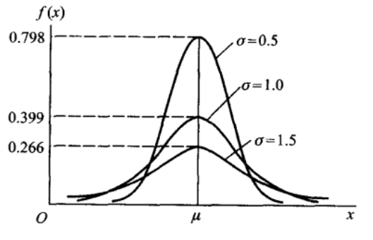

本文主要讲述三种离散型随机变量的分布(伯努利分布,二项分布,泊松分布)和三种连续型随机变量的分布(均匀分布,指数分布,正态分布)。三大抽样分布
<!--more-->

# 离散型随机变量的分布
## 伯努利分布
伯努利分布又名**两点分布**或者**0-1分布**，只能取两种结果，一般记为0或1。设取1的概率为$p$，其分布规律为
$$P(X=k) = p^k(1-p)^{1-k}, k = 0,1 (1<p<1)$$
如果试验E只有两种结果，则称试验E为**伯努利试验**。如果独立的进行 n 次试验E，则称为**n重伯努利试验**。

## 二项分布
以 $X$ 表示 n 重伯努利试验中事件 $A$ 出现的次数，则 $X$ 为一个随机变量，令 $p$ 为事件 A 出现的概率，则事件 $X$ 服从以下分布：

$$P(X=k) = C_n^k p^k q^{n-k}, k = 0,1,2,…,n$$
其中 $q=1−p$,则我们称 $X$ 服从参数为 $n,p$ 的二项分布，记为 $X~b(n,p)$。

## 泊松分布
随机变量 $X$ 的所有可能取值为 0,1,2,3….,且各个取值的概率为

$$P(X=k) = \frac {\lambda^ke^{-\lambda}}{k!}, k=0,1,2….$$
则我们称 $X$ 服从参数为 $λ$ 的泊松分布，记为 $X~π(λ)$ 其中 $λ$ 为 $X$ 的期望，即 $E(X)$
其分布规律通过图像直观表示为

泊松分布适合于描述**单位时间内随机事件发生的次数的概率分布**。如某一服务设施在一定时间内受到的服务请求的次数，电话交换机接到呼叫的次数、汽车站台的候客人数、机器出现的故障数、自然灾害发生的次数、DNA序列的变异数、放射性原子核的衰变数等等。从上面的图像也可以看出，对于给定泊松分布的强度 λ ,其在单位时间内发生的次数的概率有一个峰值，也就是说发生的次数很多或很少的可能性都不大，且当强度越大，其最大可能发生的次数的值也越大。

下面介绍用**泊松分布来逼近二项分布的定理，也就是泊松定理**。

泊松定理：设 $λ>0$ 是一个常数，$n$ 是任意正整数，设 $np=λ$ ,则对于任一非负整数 $k$，有
$$\lim_{n \to \infty} C_n^kp^k(1-p)^{n-k} = \frac{\lambda^ke^{-\lambda}}{k!}$$
即当 $n$ 很大且 $p$ 很小的时候，我们可以使用上面公式等号右边部分来逼近左边部分，从而简化计算。

# 连续型随机变量的分布

## 均匀分布
若随机变量 $X$ 的概率密度函数为
$$f(x) = \begin{cases}  \frac{1}{b-a} &{a<x<b} \\ 0&{其他}\end{cases}$$
则称X在区间 (a,b) 上服从均匀分布，记为 $X~U(a,b)$
## 指数分布
若随机变量 $X$ 的概率密度函数为

$$f(x) = \begin{cases}  \frac{1}{\theta}e^{-x / \theta} &{x>0} \\ 0&{其他}\end{cases}$$
则称 $X$ 服从参数为 $θ$ 的指数分布。

其图像如下所示:

其分布函数为
$$F(x) = \begin{cases}  1-e^{-x / \theta} &{x>0} \\ 0&{其他}\end{cases}$$
如果说上面的泊松分布是描述某个时间段内事件发生次数的概率分布，那么指数分布描述的就是事件发生的时间间隔的概率分布。指数分布是连续的分布，反映在其实际意义上就是时间是连续的。更详细的描述可查看这里

关于指数分布的一个有趣的性质为：

$$P(X>s+t | X>s) = P(X>t)$$
该性质也称为无记忆性，假设 $X$ 是某一原件的寿命，上面的式子表示的就是该元件在使用了 s 个小时后，至少还能使用 t 个小时的条件概率。而这一条件概率又等于该元件从刚开始使用的算起至少能使用 t 个小时的概率。也就是说原件对使用过的s个小时无记忆性，这个特性与随机过程中的平稳过程非常相似，而这个特性也是指数分布有广泛应用的重要原因。

## 正态分布
正态分布也叫高斯分布，其概率密度函数为

$$f(x) = \frac{1}{\sqrt{2\pi}\sigma}e^{-\frac{(x-\mu)^2}{2\sigma^2}}$$
则称 $X$ 服从参数为 $μ,σ$ 的正态分布，记为$N(\mu,\sigma^2)$，而且 $μ,σ$ 分别是正态分布的期望和标准差。其图像如下所示

从图像可知，当$X=μ$时，取值最大，也就是说随机变量落在这个值附近的概率最大，而这个值也就是正态分布的期望

# 抽样分布
## 统计量
样本是进行统计推断的依据，但是在应用中，往往不是直接使用样本本身，而是**针对不同问题构造适当的样本的函数，利用这些样本的函数进行统计推断。**

当这些样本的函数中不含未知变量时，我们称其为统计量，如下面就是几个常用的统计量，其中 $X_1,X_2,….,X_n$ 为总体的一个样本。

样本平均值：
$$\overline X = \frac{1}{n} \sum_{i=1}^{n} X_i$$
样本方差：
$$S^2 = \frac{1}{n-1} \sum_{i=1}^{n} (X_i - \overline X)^2$$
样本标准差：
$$S = \sqrt {S^2}$$
样本 k 阶原点矩：
$$A_k = \frac{1}{n} \sum_{i=1}^{n} X_i^k (k=1,2,…)$$
样本 k 阶中心矩:
$$B_k = \frac{1}{n} \sum_{i=1}^{n}(X_i - \overline X)^k (k=2,3,4…..)$$
这些统计量的定义与概率论中的基本相似，唯一比较奇怪的是为什么样本方差的分母是 $n−1$ 而不是 $n$，原因是通过数学证明可以得到只有当分母取n-1时，用样本来估计总体才是无偏的(无偏指的是估计量的期望与总体的参数一致)，下面是分母取n时得到的有偏估计的证明过程（$S^2_1$为样本方差）

## 统计量的分布
使用统计量进行统计推断时，常常需要知道其分布，**统计量的分布也称为抽样分布**，下面介绍三种来自正态分布的抽样分布： $χ^2$ 分布，$t$ 分布和 $F$ 分布。

### $χ^2$ 分布
$χ^2$ 分布的定义如下

设 $X_1, X_2,…X_n$ 是来自总体 $N(0,1)$ 的样本，则称统计量
$$\chi^2 = X_1^2 + X_2^2 +….X_n^2$$
为服从自由度为 $n$ 的 $χ^2$ 分布

上面的自由度指的是右端独立变量的个数。

$χ^2(n)$ 的概率密度函数为

$$f(y) = \begin{cases}  \frac{1}{2^{\frac{n}{2}}\Gamma(n/2)}y^{n/2-1}e^{-y/2} &{y>0} \\ 0&{其他}\end{cases}$$

上式的 $Γ$ 函数定义为

$$\Gamma = \int_{0}^{\infty} \frac{t^z - 1}{e^t} dt$$

$f(y)$ 的图像如下所示

关于 $χ^2(n)$ 有以下几个有用的结论：

- 可加性
设 $\chi_1^2$~$\chi^2(n_1), \chi_2^2$ ~ $\chi_2^2$ , 并且 $\chi_1^2, \chi_2^2$ 相互独立，则有
$$\chi_1^2 + \chi_2^2 \sim \chi^2(n_1 + n_2)$$
- 期望和方差
若$\chi^2(n)$，则χ2的期望和方差如下所示
$$E(\chi^2) = n, D(\chi^2)=2n$$
- 分位点
分位点的定义如下，给定正数 $a,0<a<1$, 称满足下面条件

$$P(\chi^2 \gt \chi_a^2(n)) = \int_{\chi_a^2(n)}^{\infty}f(y)dy= a$$

的 $\chi_a^2(n)$ 为 $\chi^2(n)$ 上的 $a$ 分位点，其图像如下所示

由定义可知，分位点由 $a,n$ 共同决定，因此对于不同的 $a，n$ 可以查阅表格得到其 $a$ 分位点。

### $t$ 分布
t分布的定义如下：

设 $X \sim N(0,1), Y \sim \chi^2(n)$, 且 X,Y 相互独立，则称随机变量
$$t = \frac{X}{\sqrt{Y/n}}$$
服从自由度为 $n$ 的 $t$ 分布, 记为 $t∼t(n)$
其概率密度函数和对应的图像如下所示：

其分位点的定义与上面讲述的一样，

$$P(t \gt t_a(n)) = \int_{t_a(n)}^{\infty}h(t)dt= a$$

且由于其概率密度函数的对称性可知,总是存在这样对称的两个分位点 ： $t_{1-a}(n) = -t_a(n)$
### $F$ 分布
$F$ 分布的定义如下

设 $U∼χ^2(n_1),V∼χ^2(n_2$， 且 $U,V$ 相互独立，则称随机变量
$$F = \frac{U/n_1}{V/n_2}$$
服从自由度为 $(n_1,n_2)$ 的 $F$ 分布，记为$F∼F(n_1,n_2)$
其概率密度函数为：

$$\psi(y) = \begin{cases}  \frac{\Gamma((n_1+n_2)/2)(n_1/n_2)^{n_1/2}y^{n_1/2-1}}{\Gamma(n_1/2)\Gamma(n_2/2)[1+(n_1y/n_2)]^{(n_1+n_2/)2}} &{y>0} \\ 0&{其他}\end{cases}$$

概率密度函数的图像如下所示

其分位点定义同上
$$P(F \gt F_a(n_1,n_2)) = \int_{F_a(n_1,n_2)}^{\infty}\psi(y)dy= a$$

且具有以下性质

$$F_{1-a}(n_1,n_2) = \frac{1}{F_a(n_2,n_1)}$$

上面只是简单地介绍了三大抽样分布，并未介绍其作用，**实际上三大抽样分布主要用于参数的区间估计中，而这主要基于从正态分布中抽取的样本所构造的统计量服从这三大分布这一事实，从下面要介绍的定理中可以看到了这三大抽样分布的作用**。更详细的作用会在区间估计中进一步体现。
