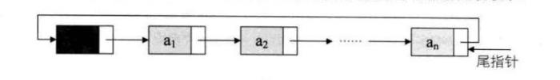

# [定义](https://www.jianshu.com/p/8f536664fa38)
将单链表中终端结点的指针端有空指针改为指向头结点，就使整个单链表形成一个环，这种头尾相接的单链表成为单循环链表，简称单链表(circle linked list)

但是循环链表进过改造，不用头指针，而是用指向终端结点的尾指针来表示循环链表，这样查找开始结点和终端结点都很方便。


<!--more-->
# 代码
```c

#include <stdio.h>
#include <stdlib.h>

/*链式存储结构的定义*/
typedef struct CLinkList{

    int data;
    struct CLinkList * next;

}node;

/**
* 1.初始化循环链表
*/
void ds_init(node **pNode){

    int item;
    node * temp;
    node * target;

    printf("输入结点的值，输入0完成初始化\n");

    while (1) {

        scanf("%d", &item);

        fflush(stdin);  // 清空输入缓存区

        if (item == 0) return;

        if ((*pNode) == NULL) {

            // 链表中只有一个结点
            *pNode = (node *)malloc(sizeof(struct CLinkList));

            if (!(*pNode)) exit(0);

            (*pNode)->data = item;
            (*pNode)->next = *pNode;

        }else{

            //找到next指向第一个结点的结点
            for (target = (*pNode); target->next != (*pNode); target = target->next);

            // 生成一个新的结点
            temp = (node *)malloc(sizeof(struct CLinkList));

            if (!temp) exit(0);

            temp->data = item;
            temp->next = *pNode;
            target->next = temp;
        }

    }
}

/**
* 2.插入结点
* @param  pNode 链表的第一个结点
* @param  i 插入的位置
*/
void ds_insert(node **pNode, int i){

    node * temp;
    node * target;
    node * p;
    int item;
    int j = 1;

    printf("输入要插入加点的值:");
    scanf("%d", &item);

    if (i == 1) { // 插入到第一个位置

        // 新插入的结点作为第一个结点
        temp = (node *)malloc(sizeof(struct CLinkList));

        if (!temp) exit(0);

        temp->data = item;

        //找到最后一个结点
        for (target = (*pNode); target->next != (*pNode); target = target->next);

        temp->next = (*pNode);
        target->next = temp;
        *pNode = temp;

    }else{  // 插入到其他位置

        target = *pNode;

        for (; j<(i-1); j++) {
            target = target->next;
        }

        temp = (node *)malloc(sizeof(struct CLinkList));

        if (!temp) exit(0);

        temp->data = item;
        p = target->next;
        target->next = temp;
        temp->next = p;
    }
}

/**
* 3.删除结点
* @param  pNode 链表的第一个结点
* @param  i 删除的位置
*/
void ds_delete(node **pNode, int i){

    node * target;
    node * temp;
    int j = 1;

    if (i ==1) { // 删除的是第一个结点

        // 找到最后一个结点
        for (target = *pNode; target->next != *pNode; target = target->next);

        temp = *pNode;
        *pNode = (*pNode)->next;
        target->next = *pNode;
        free(temp);
    }else{  // 删除其他结点

        target = *pNode;

        for (; j<i-1 ; j++) {
            target = target->next;
        }

        temp = target->next;
        target->next = temp->next;
        free(temp);
    }
}

/**
* 4.返回结点所在位置
* @param  pNode 链表的第一个结点
* @param  elem 结点所在位置
*/
int ds_search(node *pNode, int elem){

    node * target;
    int i = 1;

    for (target = pNode; target->data != elem && target->next != pNode; i++) {
        target = target->next;
    }

    if (target->next == pNode) return 0; // 表中不存在该元素

    else
        return i;
}

/**
* 5.遍历
*/
void ds_traverse(node *pNode){

    node * temp;
    temp = pNode;

    printf("*************链表中的元素**********\n");

    do {
        printf("%4d ", temp->data);
    } while ((temp = temp->next) != pNode);

    printf("\n");
}

/**
* 5.合并链表
*/
LinkList Connect(LinkList A, LinkList B){

    LinkList p = A->next;  // 保存A表的头结点

    A->next = B->next->next; // 将B表的开始结点链接到A表尾部

    free(B);  // 释放B表的头结点

    B->next = p;

    return B;  // 返回新循环链表的尾指针
}
```
