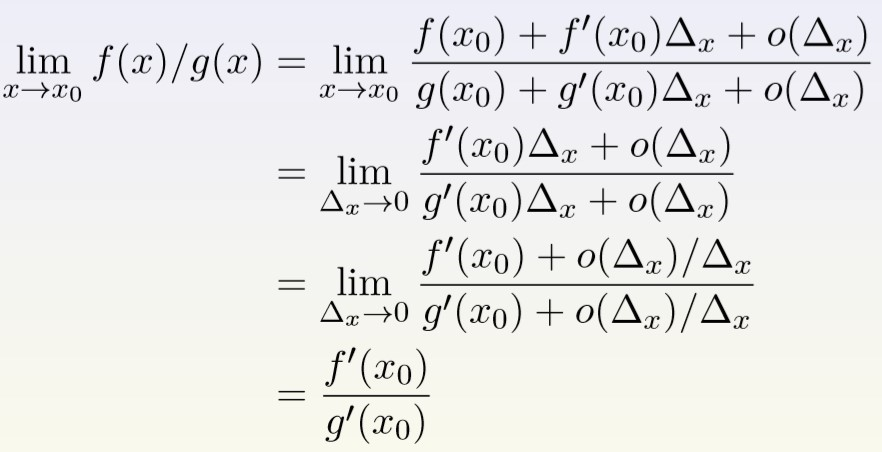

# 极限
## 定义
函数 $f$ 在 $x_0$ 处的极限为 $L$

$$\lim_{x\rightarrow 0} f(x) = L$$

<!--more-->

## 如何比较无穷小
无穷也分大小，如何描述与比较无穷大和无穷小 。**通过相除比较无穷小**。例如：

$$\lim_{x\rightarrow 0} \frac{sin (x)}{tan (x)} = \lim_{x\rightarrow x_0} cos(x) = cos(0) = 1$$

所以当 $x\rightarrow x_0$ 的时候，$sin(x)$ 与 $tan(x)$ 是同样级别的无穷小.

### 无穷小阶数
- 定义
当 $x\rightarrow 0$ 时，
 - 如果 $\lim_{x\rightarrow 0} f(x) = 0$ 而且 $\lim_{x\rightarrow 0} \frac{f (x)}{x^n} = 0$那么此时 $f(x)$ 为
$n$ 阶以上无穷小，记为
$$f(x) = o(x^n),x → 0$$
 - 如果 $\lim_{x\rightarrow 0} f(x) = 0$ 而且 $\lim_{x\rightarrow 0} \frac{f (x)}{x^n} $ 存在且不等于零，那么 此时 $f(x)$ 为 $n$ 阶无穷小，记为
$$f(x) = O(x^n),x → 0 $$

为了方便，在不至于引起误解的时候我们回省略掉 $x → 0.$

### Proposition (三明治/两边夹/夹逼原理)
如果三个函数满足 $f(x) ≤ g(x) ≤ h(x)$, 而且他们都在 $x_0$ 处有极 限，那么
$$\lim_{x\rightarrow x_0} f(x) ≤ \lim_{x\rightarrow x_0} g(x) ≤ \lim_{x\rightarrow x_0} h(x)$$

## 重要极限
$$ \begin{align*}
&\lim_{x\rightarrow 0} sin(x)/x = 1 \\
&\lim_{x\rightarrow ∞}  x^α/e^x = 0, 对于任意正数 α \\
&\lim_{x\rightarrow ∞} ln(x)/x^α = 0, 对于任意正数 α \\
&\lim_{x\rightarrow ∞} (1 + 1/x)^x = e
\end{align*}$$

# 微积分
## 函数的导数定义
如果一个函数 $f(x)$ 在 $x_0$ 附近有定义，而且存在极限

$$L=\lim_{x\rightarrow x_0} \frac{f (x)-f(x_0)}{x-x_0}$$

那么 $f(x)$ 在 $x_0$ 处可导且导数 $f′(x_0) = L.$

### 函数的高阶导数

如果函数的导数函数仍然可导，那么导数函数的导数是二阶导数，二阶导数函数的导数是三阶导数. 一般地记为

$$f^{(n)}(x) =  \frac{d}{dx} f^{(n−1)}(x)$$

或者进一步
$$f^{(n)}(x) =  \frac{d^n}{dx^n} f(x)$$
### 多元函数 - 偏导数
$f(x,y) = ln(x+y^2)$,则
$$\frac{\partial }{\partial x} f(x,y) = \frac{1}{x+y^2},\;\;\;\;\frac{\partial }{\partial x} f(x,y) = \frac{2y}{x+y^2}$$
## 初等函数的导数
$$ \begin{align*}
&\frac{d}{dx}  sin(x)=cos(x) \\
&\frac{d}{dx}  cos(x)=sin(x)\\
&\frac{d}{dx}  sinh(x)=cosh(x) \\
&\frac{d}{dx}  cosh(x)=sinh(x) \\
&\frac{d}{dx}  x^n = nx^{n-1} \\
&\frac{d^n}{dx^n}  x^n = n! \\
&\frac{d}{dx}  e^x = e^x \\
&\frac{d}{dx}  ln(x) = \frac{1}{x}
\end{align*}$$
## 求导法则
- 链式法则: $\frac{d}{dx}  (g \circ  f) = \frac{d}{dx}  (f)· \frac{d}{dx}  $
- 加法法则:  $\frac{d}{dx} (g + f) =  \frac{dg}{dx} +  \frac{df}{dx} $
- 乘法法则:  $\frac{d}{dx} (g·f) =  \frac{g}{dx} ·f + g·  \frac{df}{dx} $
- 除法法则:  $\frac{d}{dx} (\frac{g}{f} ) = \frac{\frac{g}{dx}·f-\frac{f}{dx}·g}{f^2}$
- 反函数求导： $\frac{d}{dx} (f^{−1}) = \frac{1}{\frac{df}{dx} (f^{−1})} $

求$f(x)=x^x=exp(ln(x))^x =exp(ln(x)·x). $的导数
$g(x) = exp(x),h(x) = xln(x)$, 则$ f(x) = (g \circ  h)(x) $
$$\begin{align*}
 f'(x) &= g'(h(x))\cdot h'(x) = g(h(x))·h'(x) \\
 &= f(x)·(ln(x) + x·\frac{1}{x}) \\
 &= f(x)·(ln(x) + 1) \\
 &= x^x(ln(x) + 1)
\end{align*}$$

# 泰勒级数
## 定义：泰勒/迈克劳林级数: 多项式逼近
如果 $f(x)$ 是一个无限次可导的函数，那么在任何一点 $x_0$ 附近 我们可以对 $f(x)$ 做多项式逼近:
$f(x_0 + ∆x) =f(x_0) + f'(x_0)∆x +\frac{f''(x_0)}{2}∆_x^2 +\cdots +\frac{f^{(n)}(x_0)}{n!}∆_x^n + o(∆^n_x)$
在本课中我们不关注对于尾巴上的余项 $o(∆^n_x)$ 的大小估计

### 一元函数在点$x_k$处的泰勒展开式为：
$$f(x) = f(x_k)+(x-x_k)f'(x_k)+\frac{1}{2!}(x-x_k)^2f''(x_k)+o^n$$
### 二元函数在点$(x_k,y_k)$处的泰勒展开式为：
$$f(x,y)=f(x_k,y_k)+(x-x_k)f'_x(x_k,y_k)+(y-y_k)f'_y(x_k,y_k)\\
+\frac1{2!}(x-x_k)^2f''_{xx}(x_k,y_k)+\frac1{2!}(x-x_k)(y-y_k)f''_{xy}(x_k,y_k)\\
+\frac1{2!}(x-x_k)(y-y_k)f''_{yx}(x_k,y_k)+\frac1{2!}(y-y_k)^2f''_{yy}(x_k,y_k)+o^n$$
### 多元函数(n)在点$x_k$处的泰勒展开式为：
$$f(x^1,x^2,\ldots,x^n)=f(x^1_k,x^2_k,\ldots,x^n_k)+\sum_{i=1}^n(x^i-x_k^i)f'_{x^i}(x^1_k,x^2_k,\ldots,x^n_k)\\
+\frac1{2!}\sum_{i,j=1}^n(x^i-x_k^i)(x^j-x_k^j)f''_{ij}(x^1_k,x^2_k,\ldots,x^n_k)+o^n$$

## 一般的泰勒级数
$$\begin{align*}
&e^x = 1 + x + x^2/2 +\cdots + x^n/n! + o(x^n) \\
&ln(1 + x) = x-x^2/2 + x^3/3 +\cdots +(-1)^{n−1} x^n/n + o(x^n)\\
&sin(x) = x-x^3/6 +\cdots +(-1)^nx^{2n+1}/(2n + 1)! + o(x^{2n+1}) \\
&cos(x) = 1-x^2/2 + x^4/24 +\cdots + (-1)^nx^{2n}/(2n)! + o(x^{2n+1})
\end{align*}$$

## 罗比塔法则
如果 $f,g$ 是两个无穷阶可导的函数，而且 $f(x_0) = g(x_0) = 0, g'(x_0) \neq  0$, 则 $\lim_{x→x_0} f(x)/g(x) = lim x→x0 f'(x)/g'(x)$.

 - 推导

# 牛顿法与梯度下降法
数学原理：牛顿法使用二阶逼近，梯度下降法使用一阶逼近
- 牛顿法对局部凸的函数找到极小值，对局部凹的函数找到极 大值，对局部不凸不凹的可能会找到鞍点.
$$x_n = x_{n-1}-\frac{f'(x_{n-1})}{ f''(x_{n-1})}$$
- 梯度下降法一般不会找到最大值，但是同样可能会找到鞍点.
$$x_n = x_{n−1} −γ_{n−1}∇f(x_{n−1})$$

## 极值点条件
- 全局极小值: 如果对于任何 $\tilde{x}$, 都有$ f(x_∗) ≤ f(\tilde{x})$，那么$ x_∗$ 就是全局极小值点.
- 局部极小值: 如果存在一个正数 $δ$使得，对于任何满足$ | \tilde{x}−x_∗| < δ $的 $\tilde{x}$, 都有$ f(x_∗) ≤ f(\tilde{x})$，那么$ x_∗ $就是局部极 小值点.（方圆$ δ$ 内的极小值点）

不论是全局极小值还是局部极小值一定满足一阶导数/梯度 为零，$f′ = 0 $或者$ ∇f = 0.$
