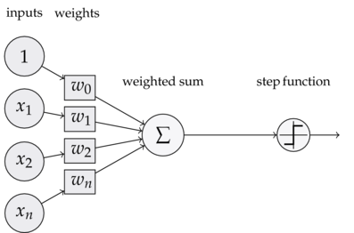

## [感知器-神经元](https://www.zybuluo.com/hanbingtao/note/433855)

- **输入权值** 一个感知器可以接收多个输$(x_1, x_2,...,x_n\mid x_i\in R)$(特征)，每个输入上有一个**权值**$w_i\in R$。此外还有一个**偏置项**$b$,就是上图中的$w_0$
- **激活函数** 感知器的激活函数可以有很多选择，比如我们可以选择下面这个**阶跃函数**$f$来作为激活函数：
$$f(z)=\left\{\begin{matrix}
1&\: \, z>0\\
0&\: \,otherwise
\end{matrix}\right.$$
- **输出** 感知器的输出由下面这个公式来计算
$$y=f(\mathrm{w}\bullet\mathrm{x}+b)\qquad $$
偏置项$b$,就是上图中的$w_0$
$$y=f(\mathrm{w}\bullet\mathrm{x})$$
## [线性单元和梯度下降](https://www.zybuluo.com/hanbingtao/note/448086)
当感知器为线性函数时候
$$y=\mathrm{w}\bullet\mathrm{x}+b$$
偏置项$b$,就是上图中的$w_0$，$y=\mathrm{w}\bullet\mathrm{x}$其优化如下所示
### 梯度下降法
在监督学习下，对于一个样本，我们知道它的特征$x$，以及标记$y$。同时，我们还可以根据模型 $y=\mathrm{w}\bullet\mathrm{x}+b$ 计算得到输出 $\bar{y}$。注意这里面我们用$y$表示训练样本里面的**标记**，也就是**实际值**；用带上划线的 $\bar{y}$ 表示模型计算的出来的**预测值**。我们当然希望模型计算出来的和越接近越好。则损失函数为
$$loss = \frac{1}{2}\sum_{i=1}^{n}(y^{(i)}-\bar{y}^{(i)})^2$$

$$\frac{\partial loss}{\partial w}=\sum_{i=1}^{n}(y^{(i)}-\bar{y}^{(i)})\mathrm{x}^{(i)}$$

$$\mathrm{w}_{new}=\mathrm{w}_{old}+\eta\sum_{i=1}^{n}(y^{(i)}-\bar{y}^{(i)})\mathrm{x}^{(i)} $$

$$\begin{bmatrix}
w_0 \\
w_1 \\
w_2 \\
... \\
w_m \\
\end{bmatrix}_{new}=
\begin{bmatrix}
w_0 \\
w_1 \\
w_2 \\
... \\
w_m \\
\end{bmatrix}_{old}+\eta\sum_{i=1}^{n}(y^{(i)}-\bar{y}^{(i)})
\begin{bmatrix}
1 \\
x_1^{(i)} \\
x_2^{(i)} \\
... \\
x_m^{(i)} \\
\end{bmatrix}$$
