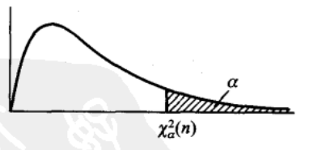
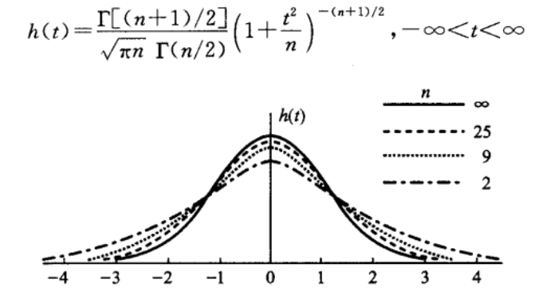
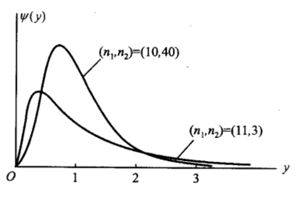
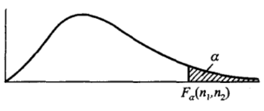

**概率论与数理统计的主要区别为**，在**概率论**中所研究的随机变量，其**分布都是假设已知的**，在这一前提下去研究它的性质（数字特征，分布函数等）；而在**数理统计**中研究的随机变量其**分布是未知的**，通过对所研究的随机变量进行**重复独立的试验和观察**，得到许多观察值，再对观察值进行分析，从而**对所研究的随机变量的分布做出各种推断**

因此数理统计的主要内容包括两部分，一是如何收集，整理数据资料，二是如何对得到的数据资料进行分析和研究，从而对所研究的对象的性质和特点做出推断。第二部分其实就是统计推断的问题，也是后面主要讲述的内容。本文主要讲述数理统计中的两个基本概念：**样本和抽样分布**。

<!--more-->

# 样本
从前面可知，数理统计就是通过数据来推断变量的分布，比如说现在要求求出全国成年男人的身高的一个分布，那只需要测出每个成年男人的身高后进行统计即可。

但是在实际中，受限于人力物力和测试的难度，我们往往不会对每个成年男人进行身高的测试，而是在全国男人中选择部分的男人进行测试(如根据每个地区的人口数量按比例测试)，然后用这部分男人的身高分布来推断全国男人的分布，这样的推断肯定会存在误差，但是通过增加样本的数量，可以减少这种误差(大数定理)。

上面其实就是一个很简单的数理统计过程，当中有几个概念需要注意，例子中的全国男人的身高是一个**总体**，选择出来实际测试身高的男人是一个**样本**，测试得到的身高称为**样本值（观测值）**，总体和样本中的数目分别称为他们的**容量**。

其严格定义如下：

设 $X$ 是具有分布函数 $F$ 的随机变量, 若 $X_1, X_2, …,X_n$ 是具有同一分布函数 $F$ 的相互独立的随机变量，则称 $X_1, X_2, …,X_n$ 为从分布函数 $F$ 得到的容量为 $n$ 的简单随机样本，简称样本，他们的观测值 $x_1, x_2,…x_n$ 称为样本值，又称为 $X$ 的 $n$ 个独立的观测值。

由定义可知样本 $X_1,X_2,…,X_n$ 相互独立，且他们的分布函数均为 $F$ , 所以 ( $X_1,X_2,…,X_n$ )的分布函数为

$$F^*(x_1,x_2,…,x_n) = \prod_{i=1}^nF(x_i)$$
同样,(X1,X2,…,Xn)的概率密度函数为：

$$f^*(x_1,x_2,…,x_n) = \prod_{i=1}^nf(x_i)$$

# 抽样分布
## 统计量
样本是进行统计推断的依据，但是在应用中，往往不是直接使用样本本身，而是**针对不同问题构造适当的样本的函数，利用这些样本的函数进行统计推断。**

当这些样本的函数中不含未知变量时，我们称其为统计量，如下面就是几个常用的统计量，其中 $X_1,X_2,….,X_n$ 为总体的一个样本。

样本平均值：
$$\overline X = \frac{1}{n} \sum_{i=1}^{n} X_i$$
样本方差：
$$S^2 = \frac{1}{n-1} \sum_{i=1}^{n} (X_i - \overline X)^2$$
样本标准差：
$$S = \sqrt {S^2}$$
样本 k 阶原点矩：
$$A_k = \frac{1}{n} \sum_{i=1}^{n} X_i^k (k=1,2,…)$$
样本 k 阶中心矩:
$$B_k = \frac{1}{n} \sum_{i=1}^{n}(X_i - \overline X)^k (k=2,3,4…..)$$
这些统计量的定义与概率论中的基本相似，唯一比较奇怪的是为什么样本方差的分母是 $n−1$ 而不是 $n$，原因是通过数学证明可以得到只有当分母取n-1时，用样本来估计总体才是无偏的(无偏指的是估计量的期望与总体的参数一致)，下面是分母取n时得到的有偏估计的证明过程（$S^2_1$为样本方差）

## 统计量的分布
使用统计量进行统计推断时，常常需要知道其分布，**统计量的分布也称为抽样分布**，下面介绍三种来自正态分布的抽样分布： $χ^2$ 分布，$t$ 分布和 $F$ 分布。

### $χ^2$ 分布
$χ^2$ 分布的定义如下

设 $X_1, X_2,…X_n$ 是来自总体 $N(0,1)$ 的样本，则称统计量
$$\chi^2 = X_1^2 + X_2^2 +….X_n^2$$
为服从自由度为 $n$ 的 $χ^2$ 分布

上面的自由度指的是右端独立变量的个数。

$χ^2(n)$ 的概率密度函数为

$$f(y) = \begin{cases}  \frac{1}{2^{\frac{n}{2}}\Gamma(n/2)}y^{n/2-1}e^{-y/2} &{y>0} \\ 0&{其他}\end{cases}$$

上式的 $Γ$ 函数定义为

$$\Gamma = \int_{0}^{\infty} \frac{t^z - 1}{e^t} dt$$

$f(y)$ 的图像如下所示

关于 $χ^2(n)$ 有以下几个有用的结论：

- 可加性
设 $\chi_1^2$~$\chi^2(n_1), \chi_2^2$ ~ $\chi_2^2$ , 并且 $\chi_1^2, \chi_2^2$ 相互独立，则有
$$\chi_1^2 + \chi_2^2 \sim \chi^2(n_1 + n_2)$$
- 期望和方差
若$\chi^2(n)$，则χ2的期望和方差如下所示
$$E(\chi^2) = n, D(\chi^2)=2n$$
- 分位点
分位点的定义如下，给定正数 $a,0<a<1$, 称满足下面条件

$$P(\chi^2 \gt \chi_a^2(n)) = \int_{\chi_a^2(n)}^{\infty}f(y)dy= a$$

的 $\chi_a^2(n)$ 为 $\chi^2(n)$ 上的 $a$ 分位点，其图像如下所示

由定义可知，分位点由 $a,n$ 共同决定，因此对于不同的 $a，n$ 可以查阅表格得到其 $a$ 分位点。

### $t$ 分布
t分布的定义如下：

设 $X \sim N(0,1), Y \sim \chi^2(n)$, 且 X,Y 相互独立，则称随机变量
$$t = \frac{X}{\sqrt{Y/n}}$$
服从自由度为 $n$ 的 $t$ 分布, 记为 $t∼t(n)$
其概率密度函数和对应的图像如下所示：

其分位点的定义与上面讲述的一样，

$$P(t \gt t_a(n)) = \int_{t_a(n)}^{\infty}h(t)dt= a$$

且由于其概率密度函数的对称性可知,总是存在这样对称的两个分位点 ： $t_{1-a}(n) = -t_a(n)$
### $F$ 分布
$F$ 分布的定义如下

设 $U∼χ^2(n_1),V∼χ^2(n_2$， 且 $U,V$ 相互独立，则称随机变量
$$F = \frac{U/n_1}{V/n_2}$$
服从自由度为 $(n_1,n_2)$ 的 $F$ 分布，记为$F∼F(n_1,n_2)$
其概率密度函数为：

$$\psi(y) = \begin{cases}  \frac{\Gamma((n_1+n_2)/2)(n_1/n_2)^{n_1/2}y^{n_1/2-1}}{\Gamma(n_1/2)\Gamma(n_2/2)[1+(n_1y/n_2)]^{(n_1+n_2/)2}} &{y>0} \\ 0&{其他}\end{cases}$$

概率密度函数的图像如下所示

其分位点定义同上
$$P(F \gt F_a(n_1,n_2)) = \int_{F_a(n_1,n_2)}^{\infty}\psi(y)dy= a$$

且具有以下性质

$$F_{1-a}(n_1,n_2) = \frac{1}{F_a(n_2,n_1)}$$

上面只是简单地介绍了三大抽样分布，并未介绍其作用，**实际上三大抽样分布主要用于参数的区间估计中，而这主要基于从正态分布中抽取的样本所构造的统计量服从这三大分布这一事实，从下面要介绍的定理中可以看到了这三大抽样分布的作用**。更详细的作用会在区间估计中进一步体现。

### 正态总体的样本均值与样本方差的分布(统计量的应用)

由于正态分布的普遍性，这里特意指出从服从正态分布的总体中抽取出的样本的所服从的分布。

假设上面的 $X$ 服从正态分布 $N(μ,σ^2)$, 则有以下几条定理，这几条定理在数理统计的区间估计中起了重要作用。

#### 定理一
- 定理一： 设 $X_1, X_2,….X_n$ 服从 $N(μ,σ^2)$，$\overline X$是样本均值，则有
$$\overline X \sim N(\mu,\sigma^2/n)$$

证明如下：
$$E(\overline X) = E(\frac{1}{n}\sum_{i=1}^{n} X_i) = \frac{1}{n}E(\sum_{i=1}^{n} X_i) = \frac{1}{n}n E(X) = \mu$$
$$D(\overline X) = D(\frac{1}{n}\sum_{i=1}^{n} X_i) = \frac{1}{n^2}D(\sum_{i=1}^{n} X_i) = \frac{1}{n}n D(X) = \sigma^2/n$$

**定理一通常用于区间估计中已知总体（服从正态分布）的期望$μ$来估计其未知的方差 $σ^2$ ,或已知方差 $σ^2$ 来估计未知的期望 $μ$。**

#### 定理二
- 定理二 ：设 $X_1, X_2,….X_n$ 服从 $N(μ,σ^2)$，$\overline X$是样本均值，$S^2$ 是样本的方差，则 $\overline X$ 和 $S^2$ 相互独立，且有
$$\frac{(n-1)S^2}{\sigma^2} \sim \chi^2(n-1)$$

由于该定理的证明部分较为冗长，这里略去证明过程，感兴趣的读者可参考相关书籍。**定理二主要用于区间估计中总体（服从正态分布）的期望、方差均未知时，估计其方差的范围，这也是 $χ^2$ 分布的作用之一。**

#### 定理三
- 定理三：设 $X_1, X_2,….X_n$ 服从 $N(μ,σ^2)$，$\overline X$是样本均值，$S^2$ 是样本的方差，则
$$\frac{\overline X - \mu}{S/\sqrt{n}} \sim t(n-1)$$

**定理三主要用于区间估计中总体（服从正态分布）的期望、方差均未知时，估计其期望的范围，这也是 $t$ 分布的作用之一,注意前面讲到的 $χ^2$ 分布估计的是方差。**

证明：
根据定理一，易知 $\overline X - \mu \sim N(0, \sigma^2/n)$ , 则 $\frac{\overline X - \mu}{\sqrt{\sigma^2/n}} \sim N(0,1)$ , 从定理二可知
$$\frac{(n-1)S^2}{\sigma^2} \sim \chi^2(n-1)$$

则根据t分布的定义有
$$\frac{\frac{\overline X - \mu}{\sqrt{\sigma^2/n}}} {\sqrt{\frac{(n-1)S^2}{\sigma^2(n-1)}}} \sim t(n-1)$$
化简可得
$$\frac{\overline X - \mu}{\sqrt{\sigma^2/n}} \sim t(n-1)$$
**定理三主要用于区间估计中总体（服从正态分布）的期望、方差均未知时，估计其期望的范围，这也是 $t$ 分布的作用之一,注意前面讲到的 $χ^2$ 分布估计的是方差。**

#### 定理四
- 定理四：设 $X_1, X_2…X_n$ 与 $Y_1,Y_2,…Y_n$ 分别是来自正态总体 $N(\mu_1, \sigma_1^2)$ 和 $N(\mu_2, \sigma_2^2)$ 的样本, $\overline X, \overline Y$ 分别是其样本均值，$S_1^2, S_2^2$ 分别是其样本方差。则有
$$\frac{S_1^2/S_2^2}{\sigma_1^2/ \sigma_2^2} \sim F(n_1 - 1, n_2 - 1)$$
且当 $\sigma_1^2 = \sigma_2^2 = \sigma^2$ 时，
$$\frac{(\overline X - \overline Y) - (\mu_1 - \mu_2)}{S_w\sqrt{1/n_1+1/n_2}} \sim t(n_1+n_2-2)$$
其中，$S_w = \sqrt{\frac{(n_1 -1)S_1^2+(n_2 -1)S_2^2}{n_1+n_2-2}}$

**定理四的作用是在区间估计时估计两个均服从正态分布的总体的方差的比值（期望未知）以及两者期望的差距（方差未知）**
证明如下:
由定理二可知
$$\frac{(n_1-1)S_1^2}{\sigma_1^2} \sim \chi^2(n_1-1), \frac{(n_2-1)S_2^2}{\sigma_2^2} \sim \chi^2(n_2-1)$$
由 $F$ 分布的定义可知
$$\frac{(n_1-1)S_1^2}{\sigma_1^2(n_1-1)} / \frac{(n_2-1)S_2^2}{\sigma_2^2(n_2-1)} \sim F(n_1-1, n_2-1)$$
化简可得
$$\frac{S_1^2/S_2^2}{\sigma_1^2/ \sigma_2^2} \sim F(n_1 - 1, n_2 - 1)$$
当 $\sigma_1^2 = \sigma_2^2 = \sigma^2$ 时,

易知 $$(\overline X - \overline Y) \sim N(\mu_1 - \mu_2,\sigma_1^2/n_1 + \sigma_2^2/n_2)$$
则 $\frac{(\overline X - \overline Y)- (\mu_1 - \mu_2)}{\sqrt{\sigma_1^2/n_1 + \sigma_2^2/n_2}} \sim N(0,1)$
由定理二可知
$$\frac{(n_1-1)S_1^2}{\sigma_1^2} \sim \chi^2(n_1-1), \frac{(n_2-1)S_2^2}{\sigma_2^2} \sim \chi^2(n_2-1)$$
, 由 $χ^2$ 分布的可加性可知：
$$\frac{(n_1-1)S_1^2}{\sigma_1^2} + \frac{(n_2-1)S_2^2}{\sigma_2^2} \sim \chi^2(n_1+n_2-2)$$
由t分布的定义可知：
$$\frac{(\overline X - \overline Y)- (\mu_1 - \mu_2)}{\sqrt{\sigma_1^2/n_1 + \sigma_2^2/n_2}} / (\sqrt{(\frac{(n_1-1)S_1^2}{\sigma_1^2} + \frac{(n_2-1)S_2^2}{\sigma_2^2})/(n_1+n_2-2)}) \sim t(n_1+n_2-2)$$
将 $\sigma_1^2 = \sigma_2^2 = \sigma^2$ 代入到上式化简即可得到
$$\frac{(\overline X - \overline Y) - (\mu_1 - \mu_2)}{S_w\sqrt{1/n_1+1/n_2}} \sim t(n_1+n_2-2)$$
其中，$S_w = \sqrt{\frac{(n_1 -1)S_1^2+(n_2 -1)S_2^2}{n_1+n_2-2}}$

# 小结

$χ^2$ 分布主要解决总体期望未知时估计其方差的问题， $t$ 分布主要解决总体方差未知时估计其期望的问题，$F$ 主要解决期望未知时两个正态分布的方差比值问题。需要注意的是上面估计的前提是总体服从正态分布
