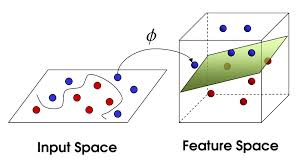
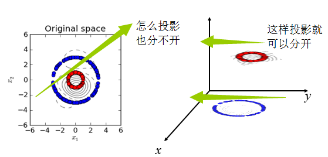
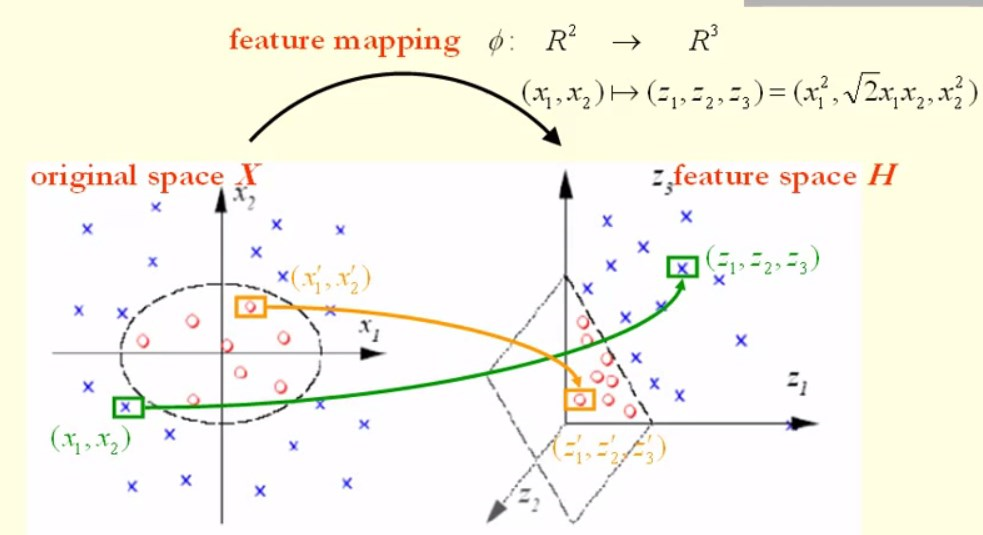

之前分析的感知机、主成分分析（Principle component analysis, PCA）包括后面看的支撑向量机（Support vector machines, SVM），都有用到核函数。核函数是将信号映射到高维，而PCA一般用来降维。这里简单梳理一下核函数的知识：

# 核函数基本概念
## 定义
设$\chi $是输入空间(欧氏空间$\mathbb{R}^{n}$的子集或离散集合)，又设$\mathbb{R}^{H}$为特征空间(希尔伯特空间)，如果存在一个从$\chi $到$\mathbb{R}^{H}$的映射$$\phi  (x):\chi \rightarrow \mathbb{H}$$使得对所有$x,z\in \chi $，函数$K(x,z)$满足条件$$K(x,z)=\phi  (x) \cdot \phi  (z)$$则称$K(x,z)$为核函数，$\phi  (x)$为映射函数，式中$\phi  (x) \cdot \phi  (z)$为$\phi  (x)$和$\phi  (z)$的内积

核函数：是映射关系$\phi  (x)$的内积，映射函数本身仅仅是一种映射关系，并没有增加维度的特性，不过可以利用核函数的特性，构造可以增加维度的核函数，这通常是我们希望的。
## 核函数的作用
- 聚类、分类

二维映射到三维，区分就更容易了，这是聚类、分类常用核函数的原因。为什么PCA这样一个降维算法也用核函数呢？
- 降维

左图为原数据，右图为映射到三维的数据，可以看出：同样是降到1维，先通过Kernel映射到（Kernel是映射的内积，不要弄乱了）三维，再投影到1维，就容易分离开，这就是Kernel在PCA降维中的应用，本质还是对原有数据增加维度。

# 核函数为什么可以映射到高维
## 为什么实现数据映射到高维

- 设原空间数据点$a_1=(x_1,x_2)；a_2=(x_1',x_2')$；
- 设高维空间的数据点为$A_1 =\phi (a_1)=(z_1,z_2,z_3)；A_2=\phi (a_1)=(z_1',z_2',z_3')$

$\left \langle a_1,a_2 \right \rangle$为两点之间的内积$\left \langle a_1,a_2 \right \rangle = \left \langle (x_1,x_2),(x_1',x_2') \right \rangle =x_1x_1'+x_2x_2'$

$<\phi (a_1),\phi (a_2)>=<\phi (x_1,x_2),\phi (x_1',x_2')>=<(z_1,z_2,z_3),(z_1',z_2',z_3')>=<(x_1^2,\sqrt{2}x_1x_2,x_2^2),({x}_1'^2,\sqrt{2}x_1'x_2',{x}_2'^2)>=x_1^2x_1'^2+2x_1x_2x_1'x_2'+x_2^2x_2'^2=(x_1x_1'+x_2x_2')^2=(<a_1,a_2'>)^2=k(a_1,a_2)$

## 为什么不用映射函数$\phi  (x)$，而用他们的内积形式$K(x,z)$，即Kernel函数？
因为$(x,z)$一起出现的时候，$K(x,z)=\phi  (x) \cdot \phi  (z)$有许多固定的形式可以调用，而不必求解或者关心$\phi  (x)$的具体形式，这大大简化了求解。
## 核函数的用法
1. 两点之间的距离
$$\begin{align*}
\left \| \phi (x)-  \phi (x')\right \|^2
&=(\phi (x)-  \phi (x'))^T(\phi (x)-  \phi (x'))\\
&=\phi (x)^T\phi (x)-2\phi (x)^T\phi (x')+\phi (x')^T\phi (x')\\
&=<\phi (x),\phi (x)>-2<\phi (x),\phi (x')>+<\phi (x'),\phi (x')>\\
&=K(x,x)-2K(x,x')+K(x',x')
\end{align*}$$

1. 两点之间的角度
$$<\phi (x),\phi (x')>=\left \| \phi (x)\right \|\cdot \left \| \phi (x')\right \|cos\theta \\
\Rightarrow cos\theta =\frac{<\phi (x),\phi (x')>}{\left \| \phi (x)\right \|\cdot \left \| \phi (x')\right \|}=\frac{<\phi (x),\phi (x')>}{\sqrt{<\phi (x),\phi (x)>}\sqrt{<\phi (x'),\phi (x')>}}$$

## 什么样的函数才可以叫做核函数？
对称函数$K(x,z)$为正定核的充要条件如下：对任意$x_i\in \chi ,i=1,2,\cdots ,m$,任意正整数$m$,对称函数$K(x,z)$对应的Gram矩阵是半正定。
$$Gram = \begin{bmatrix}
K(x_1,x_1) & \cdots  & K(x_1,x_n)\\
\vdots  & \ddots  & \vdots \\
K(x_n,x_1) & \cdots  & K(x_n,x_n)
\end{bmatrix}$$
半正定：$x^T\: Gram\; x\geqslant 0$

## 常用核函数
核函数 | 英文 | 公式
- | - | -
线性核函数 | Linear Kernel | $K(x, z) = x \cdot z$
多项式核函数 | Polynomial Kernel | $K(x, z) = （\gamma x \cdot z  + r)^d$
高斯核函数 | Gaussian Kernel | $K(x, z) = exp(-\gamma$&#124;&#124;$x-z$&#124;&#124;$^2)$
Sigmoid核函数 | Sigmoid Kernel | $K(x, z) = tanh（\gamma x \cdot z  + r)$

- 线性核函数
线性核函数（Linear Kernel）其实就是我们前两篇的线性可分SVM，表达式为：$$K(x, z) = x \cdot z$$也就是说，线性可分SVM我们可以和线性不可分SVM归为一类，区别仅仅在于线性可分SVM用的是线性核函数。
- 多项式核函数
多项式核函数（Polynomial Kernel）是线性不可分SVM常用的核函数之一，表达式为：$$K(x, z) = （\gamma x \cdot z  + r)^d$$其中，$γ,r,d$都需要自己调参定义。
- 高斯核函数
高斯核函数（Gaussian Kernel），在SVM中也称为径向基核函数（Radial Basis Function,RBF），它是非线性分类SVM最主流的核函数。libsvm默认的核函数就是它。表达式为：$$K(x, z) = exp(-\gamma||x-z||^2)$$其中，$γ$大于0，需要自己调参定义。
- Sigmoid核函数
Sigmoid核函数（Sigmoid Kernel）也是线性不可分SVM常用的核函数之一，表达式为：$$K(x, z) = tanh（\gamma x \cdot z  + r)$$其中，$γ,r$都需要自己调参定义。
