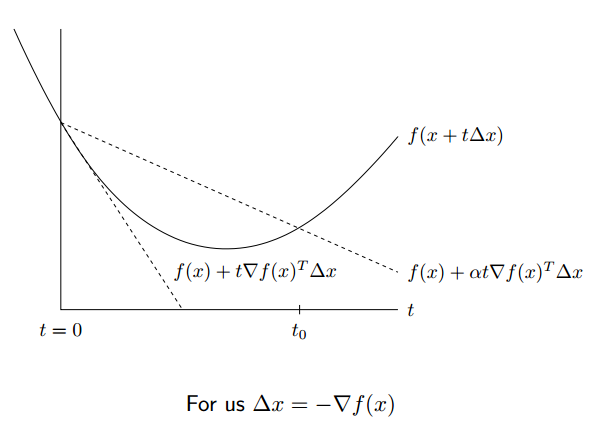

# 梯度类方法
梯度类方法是无约束优化中非常常用的方法，其依据的最根本的事实就是梯度的负方向是函数值下降最快的方向。但是常用的 **gradient descent 必须要求函数的连续可导**，而对于某些**连续不可导**的问题（如lasso regression），gradient descent 无能为力，这是需要用到**subgradient descent**和**proximal gradient descent**.
<!--more-->
## gradient descent
梯度下降法的迭代公式为
$$x^{(k)} = x^{(k-1)} - t_k\nabla f(x^{(k-1)} )$$
上式中上标 $(k)$ 表示第 $k$ 次迭代, 而 $t_k$ 表示步长，$\nabla f(x^{(k-1)})$表示在点 $x^{(k-1)}$ 的梯度。

这里对于梯度下降主要讨论其步长选择的问题， 最简单直接的方式是固定每次的步长为一个恒定值，但是如果步长过大或过小时，可能会导致结果难以收敛或者收敛速度很慢。因此提出了可变长步长的方法，可变长步长的方法指的是根据每次迭代依照一定的规则改变步长，下面介绍两种：backtracking line search 和 exact line serach。

### backtracking line search

backtracking line search 需要先选择两个固定的参数 $α,β$ , 要求 $0<β<1,0<α<1/2$每次迭代的时候，假如下式成立

$$f(x - t\nabla f(x)) > f(x) - \alpha t||\nabla f(x)||_2^2$$
则改变步长为 $t=βt$, 否则步长不变。

这种方法的思想是当步长过大的时候(即跨过了最优点)，减小步长，否则保持步长不变，如下式是一个简单的例子

### exact line serach

exact line serach 则是得到先计算出梯度 $\nabla f(x^{(k-1)} )$,然后代入下面的函数中，此时只有步长 $t_k$ 是未知，因此可对 $t_k$ 进行求导并令其为0，求得的 $t_k$ 即为当前的最优的步长，因为这个步长令当前迭代下降的距离最大。
$$f(x^{(k-1)} - t_k\nabla f(x^{(k-1)} ))$$
这种方法也被称为最速下降法。

# 对偶类算法

## 拉格朗日
拉格朗日对偶性是**解决带约束的最优化问题**的方法，在实际应用中，通过拉格朗日对偶原理将原始问题转换成对偶问题，将原来不容易解决的问题转化为一个容易解决的问题，如支持向量机。

### 拉格朗日函数

假设 $f(x)，c_i(x),h_j(x)$ 是定义在 $\mathbb{R}^{n}$ 上的连续可微函数。我们需要求解约束最优化问题：

$$\underset{x\in \mathbb{R}^n}{min} \;  f(x)  \tag 1$$

$$\begin{align}
\mathbb{s.t.}\quad &c_i(x) \le 0,\quad i=1,2,\cdots,k  \tag 2\\
&h_j(x)=0,\quad j=1,2,\cdots,l \tag 3
\end{align}$$

为了求解原始问题，我们首先引入广义拉格朗日函数(generalized Lagrange function)：
$$L(x,\alpha,\beta)=f(x)+\sum_{i=1}^k \alpha_ic_i(x) + \sum_{j=1}^l\beta_jh_j(x) \tag{4}$$
其中，$x=(x_1,x_2,\cdots,x_n)^T \in \mathbb{R}^n$，$\alpha_i$和$\beta_j$是拉格朗日乘子，特别要求$\alpha_i\geqslant 0$

### 极小极大问题

如果把$L(x,\alpha,\beta)$看作是$\alpha、\beta$的函数，求其最大值，即
$$\theta_p(x)=\max_{\alpha,\beta:\alpha_i\ge0}L(x,\alpha,\beta) \tag 5$$

确定$\alpha、\beta$使$L(x,\alpha,\beta)$取得最大值，（此过程中把$x$看做常量）下面通过$x$是否满足约束条件两方面来分析这个函数

- 如果 $x$ 满足原始问题中约束，
由(2)、(3)、(4)、(5)可知 $θ(x)=f(x)$。（少的两项一个是非正的，一个是0，要取最大值的话当然得令两者都为0

- 如果$x$不满足原始问题中的约束，那么$θ(x)=+∞$。若某个$i$使约束$c_i(x)>0$，则可令则可令$\alpha \rightarrow +∞$，若某个$j$使得$h_j(x)\neq 0,$,则可令$\beta_j h_j(x) \rightarrow +∞$，而将其余各$\alpha _i、\beta_j$均取为0。

综上：
$$\theta_p(x)=\left\{\begin{matrix}
f(x),&x 满足原始问题约束\\
+\infty,&其他
\end{matrix}\right.$$

**求解原问题的最小值**

$$\underset{x\in \mathbb{R}^n}{min}; \theta_p(x)=  \underset{x\in \mathbb{R}^n}{min}\; f(x)=\underset{x\in \mathbb{R}^n}{min}\;\max_{\alpha,\beta:\alpha_i\ge0}L(x,\alpha,\beta)$$

### 极大极小问题（对偶问题）

$$\theta _D(\alpha ,\beta )=\underset{x\in\mathbb{R}^{n}}{min}\; L(x,\alpha,\beta)$$

$$\max_{\alpha,\beta:\alpha_i\ge0}\theta _D(\alpha ,\beta )=\underset{\alpha,\beta:\alpha_i\ge0}{max}\; \underset{x\in\mathbb{R}^{n}}{min}\; L(x,\alpha,\beta)$$
可以将广义拉格朗日函数的极大极小问题表示为约束最优化问题：
$$\begin{align*}
&\underset{\alpha,\beta}{max}\; \min_{x\in\mathbb{R}^{n}}L(x,\alpha,\beta) \\
\mathbb{s.t.}&\quad\alpha_i\ge0,\quad i=1,2,\cdots,k
\end{align*}$$

### 原始问题和对偶问题的关系
#### 定理1
若原始问题和对偶问题都有最优值，则
$$\underset{x\in\mathbb{R}^{n}}{min}\; L(x,\alpha,\beta) \leqslant L(x,\alpha,\beta) \leqslant \max_{\alpha,\beta:\alpha_i\ge0}L(x,\alpha,\beta) $$

$$\underset{\alpha,\beta:\alpha_i\ge0}{max}\; \underset{x\in\mathbb{R}^{n}}{min}\; L(x,\alpha,\beta) \leqslant \underset{x\in \mathbb{R}^n}{min}\;\max_{\alpha,\beta:\alpha_i\ge0}L(x,\alpha,\beta) ={min}\; f(x)$$

**推论**：设 $x^{\ast}$ 和 $a^{\ast},β^{\ast}$ 分别是原始问题 $\underset{x\in \mathbb{R}^n}{min}\;\max_{\alpha,\beta:\alpha_i\ge0}L(x,\alpha,\beta) $ 和对偶问题 $\underset{\alpha,\beta:\alpha_i\ge0}{max}\; \underset{x\in\mathbb{R}^{n}}{min}\; L(x,\alpha,\beta) $ 的可行解，并且 $\underset{x\in \mathbb{R}^n}{min}\;\underset{\alpha,\beta:\alpha_i\ge0}{max}L(x,\alpha,\beta) =\underset{\alpha,\beta:\alpha_i\ge0}{max}\; \underset{x\in\mathbb{R}^{n}}{min}\; L(x,\alpha,\beta)$，则 $x^{\ast}$和 $a^{\ast}$,$β^{\ast}$ 分别是原始问题和对偶问题的最优解。

#### 定理2：KKT条件(原始问题与对偶问题的解相等的条件)
假设函数$f(x)$和$c_i(x)$是凸函数，$h_j(x)$是仿射函数，并且不等式约束$c_i(x)$是严格可行的，则$x^{\ast}$和$a^{\ast},β^{\ast}$分别是原始问题和对偶问题的解的充分必要条件是$x^{\ast},a^{\ast},β^{\ast}$满足下面的Karush-Kuhn-Tucker(KKT)条件：（判断极值、其余项为0）
$$\begin{align*}
\nabla_xL(x^*,\alpha^*,\beta^*)&=0\\
\nabla_{\alpha}L(x^*,\alpha^*,\beta^*) &=0 \\
\nabla_{\beta}L(x^*,\alpha^*,\beta^*)&=0
\end{align*}$$
$$\begin{align*}
\alpha_i^*c_i(\boldsymbol{x}^*)&=0,\quad i=1,2,\cdots,k\\
c_i(\boldsymbol{x}^*)&\le0,\quad i=1,2,\cdots,k \\
\alpha_i^*&\ge0,\quad i=1,2,\cdots,k  \\
h_j(\boldsymbol{x}^*)&=0,\quad j=1,2,\cdots,l
\end{align*}$$
 - 仿射函数
$$f(x)=A\cdot x+b$$仿射函数就是一个线性函数，其输入是$n$ 维向量，参数 $A$ 可以是常数，也可以是 $m×n$ 的矩阵，$b$ 可以是常数，也可以是 $m$ 维的列向量，输出是一个 $m $维的列向量。在几何上，仿射函数是一个线性空间到另一个线性空间的变换。
