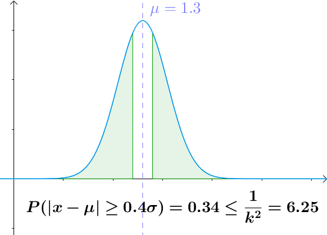

# 随机变量与概率
## 概率密度函数的积分
- 离散随机变量
假设随机变量 $X$ 的取值域为 $Ω = \{x_i\}_{i=1}^\infty$，那么对于任何一个 $x_i$，事件 $X = x_i$ 的概率记为 $P(x_i)$. 对于 $Ω$ 的任何一个子集 $S = \{x_i\}_{i=1}^\infty =1$，事件 $X ∈ S$ 的概率为
$$P(S) = \sum_{i=1}^{\infty }P(x_1)$$
对于离散随机变量，概率为概率函数的求和

- 连续随机变量
假设随机变量 $X$ 的取值域为 $\mathbb{R}$，那么对于几乎所有 $x ∈R$, 事件 $X = x$ 的概率 $P(X = x)$ 都等于 0. 所以我们转而定义概率密度函数 $f : \mathbb{R}→ [0,∞)$. 对于任何区间 $(a,b)$, 事件 $X ∈ (a,b)$ 的概率为
$$P((a,b)) = \int_{a}^{b}f(x)dx$$

<!--more-->

## 条件概率与贝叶斯公式
### 条件概率
条件 $A$ 下事件 $S$ 发生的概率
$$P(S|A) = \frac{P(S\cap A)}{P(A)}$$
### 贝叶斯公式
$$P(A|B) = \frac{P(B|A)P(A)}{P(B)}$$

# 大数定律和中心极限定理
## [随机变量的矩 ](https://www.jianshu.com/p/c4aaa8ddb02f)
设 $X,Y$ 为随机变量,则
$E(X^k), k=1,2,3….$ 称为 $X$ 的 $k$ 阶原点矩，简称 $k$ 阶矩
$E((X-E[X])^k), k=1,2,3….$ 称为 $X$ 的 $k$ 阶中心距
$E(X^kY^l),k,l=1,2,…$ 称为 $X$ 和 $Y$ 的 $k+l$ 阶混合矩
$E((X-E[X])^k(Y-E[Y])^l)),k,l=1,2,…$称为 $X$ 和 $Y$ 的 $k+l$ 阶混合中心矩

- 当 $n = 1$ 时，$E(X)$ 为随机变量的期望
- 当 $n = 2$ 时，$Var(x)=\int_{-\infty }^{\infty }[x_i-\mu ]^2f(x)dx=E(X^2)−E(X)^2=\sum_{i=1}^nx_i^2p_i-\mu ^2$ 为随机变量的方差 特征函数，
- 当 $n=3$时，偏度$S(x)=\int_{-\infty }^{\infty }[x_i-\mu ]^3f(x)dx$
- 当 $n=4$时，峰度$K(x)=\frac{\int_{-\infty }^{\infty }[x_i-\mu ]^4f(x)dx}{\sigma ^2}-3$
- 归一化n阶中心矩为 $\frac{E[(x-\mu)^n ]}{\sigma ^n}$
- 混合矩：混合矩是多个变量的矩，比如协方差，协偏度，协峰度。虽然协方差只有一个，但协偏度和协峰度存在多个

### 几何意义
- 一阶矩：矩可以描述随机变量的一些特征，期望是 $X$ “中心”位置的一种 描述，
- 二阶矩：方差可以描述 $X$ 的分散程度, 特征函数可以全面描述概率分布.
- 三阶矩：任何对称分布偏态为0，向左偏斜（分布尾部在左侧较长）具有负偏度；向右偏斜分布（分布尾部在右侧较长）具有正偏度

- 四阶矩：峰度表示分布的波峰和尾部与正态分布的区别。完全符合正态分布的数据峰度值为0,且正态分布曲线被称为基线。如果样本峰度显著偏离0，就可判断此数据不是正态分布。

## 切比雪夫不等式
设 $X$ 为随机变量，期望值为 $µ$, 标准差为 $σ$, 对于任何实数 $k > 0$
$$P(|X −µ|≥ kσ) ≤\frac{1}{k^2} $$

## [随机变量的协方差与相关系数](https://www.zhihu.com/question/20852004)
- X、Y的协方差： $cov(X,Y ) =E\left ( (X-\mu _x)(Y-\mu _y) \right )= E(XY )−E(X)E(Y ) $
协方差就是衡量两个变量相关性的变量。当协方差为正时，两个变量呈正相关关系（同增同减）；当协方差为负时，两个变量呈负相关关系（一增一减）
- X、Y的相关系数： $cov(X,Y)/\sqrt{Var(X)Var(Y)}$
协方差的标准化

## 特征函数

## 重要极限
$\underset{n→∞}{lim}(1 + 1/n)^n$存在，且定义 $e = \underset{n→∞}{lim}(1 + 1/n)^n$ 于是定义 $e = \underset{n→∞}{lim}(1 + x/n)^n$

## 大数定律
$X$ 是随机变量，$µ$ 是 $X$ 的期望，$σ$ 是 $X$ 的方差.$\{X_k\}^∞ _{k=1}$ 是服从 $X$ 的独立同分步随机变量，那么 $\overline{X}_k=\frac{\sum_{k=1}^{n}X_k}{n}$  依概率收敛于 $µ$. 也就是说对于任何 $ϵ > 0$ 有
$$\lim_{n\rightarrow \infty }P(|\overline{X}_n-\mu |>\epsilon )=0$$
- 当大量重复同一个实验时，实验的平均结果会接近于期望值
- 重复次数越多越接近

## [中心极限定理](https://zhuanlan.zhihu.com/p/25241653)
中心极限定理指的是给定一个任意分布的总体。我每次从这些总体中随机抽取 n 个抽样，一共抽 m 次。 然后把这 m 组抽样分别求出平均值。 这些平均值的分布接近正态分布

# [几种常见的分布](https://wenku.baidu.com/view/8133c0056edb6f1aff001f1c.html)
- 离散概率分布（Discrete）
离散均匀分布（discrete uniform）、伯努利分布（Bernoulli）、二项式分布（Binomial）、泊松分布（Poisson）、超几何分布（Hypergeometric）
- 连续概率分布（continuous）
均匀分布（Uniform）、正态分布（Normal/Gaussian）、指数分布（Exponential）、Gamma分布 、Beta分布、Gumbel分布
- 抽样分布
卡方分布、F分布、t分布
