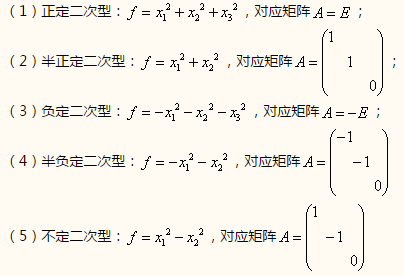
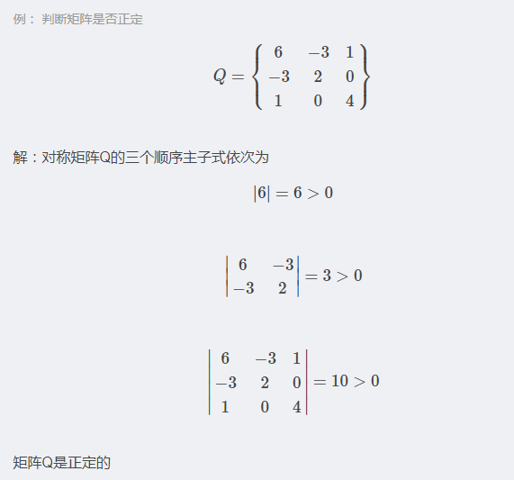

# 二次型矩阵
对于一个方阵$A∈ R^{n×n}$和一个向量$x∈ R^n$，标量$x^TAx$被称作一个二次型。显式地写出来，
$$x^TAx=\sum_{i=1}^{n}x_i(Ax)_i=\sum_{i=1}^{n}x_i\left ( \sum_{j=1}^{n}A_{ij}x_j \right )=\sum_{i=1}^{n}\sum_{j=1}^{n}A_{ij}x_ix_j$$
上式实际为一个二次多项式例如：
$$\left [ x_1 x_2 \right ]
\begin{bmatrix}
1 & 3\\
2 & 4
\end{bmatrix}\begin{bmatrix}
x_1\\
x_2
\end{bmatrix}=[x_1,x_2]
\begin{bmatrix}
x_1+3x_2\\
2x_1+4x_2
\end{bmatrix}=x_1^2+5x_1x_2+4x_2^2
$$

<!--more-->

# 分类

对于任一个n元实二次型 $f(x_1,x_2,\cdots ,x_n)=X^TAX$，作为一个 $n$ 元二次齐次多项式，我们往往需要考虑它的取值问题，显然当 $x_1=x_2=\cdots=x_n=0$ 时，二次型 $f$ 的值为 $f(0,0,\cdots,0)=0$ ，下面我们根据当 $x_1,x_2,\cdots,x_n$ 取不全为零的 $n$ 个数时，即当 $X$ 为任一个非零列向量时，取值的不同情况，给出以下定义：

定义2.1：设有n元实二次型 $f(x_1,x_2,\cdots ,x_n)=X^TAX$。
 1. 如果对于任何非零列向量 $X$ ，都有 $X^TAX>0$，则称为正定二次型，称对称矩阵 $A$ 为正定矩阵。
 2. 如果对于任何非零列向量 $X$ ，都有 $X^TAX\geqslant 0$，则称为半正定二次型，称 $A$ 为半正定矩阵。
 3. 如果对于任何非零列向量 $X$ ，都有 $X^TAX<0$，则称为负定二次型，称 $A$ 为负定矩阵。
 4. 如果对于任何非零列量 $X$ ，都有 $X^TAX\leqslant  0$，则称为半负定二次型，称 $A$ 为半负定矩阵。
 5. 其它的实二次型称为不定二次型，其矩阵称为不定矩阵。

- 例子

# 正定矩阵性质
1. 正定矩阵的行列式恒为正；
1. 两个正定矩阵的和是正定矩阵；
1. 正实数与正定矩阵的乘积是正定矩阵。
## 正定等价命题
1. $A$是正定矩阵；
1. $A$的一切顺序主子式均为正；
1. $A$的一切主子式均为正；
1. $A$的特征值均为正；
1. 存在实可逆矩阵$C$，使$A=C'C$；
1. 存在秩为$n$的$m×n$实矩阵$B$，使$A=B'B$；
1. 存在主对角线元素全为正的实三角矩阵$R$，使$A=R'R$

# 正定矩阵判别方法
1. 求出A的所有特征值。若A的特征值均为正数，则A是正定的；若A的特征值均为负数，则A为负定的。

1. 计算A的各阶顺序主子式。若A的各阶顺序主子式均大于零，则A是正定的；若A的各阶顺序主子式中，奇数阶主子式为负，偶数阶为正，则A为负定的。

# 半正定矩阵性质
1. 半正定矩阵的行列式是非负的；
1. 两个半正定矩阵的和是半正定的；
1. 非负实数与半正定矩阵的数乘矩阵是半正定的。
## 半正定等价命题
1. $A$是是半正定的；
1. $A$的一切顺序主子式均为非负的；
1. $A$的一切主子式均为非负的；
1. $A$的特征值均为正；
1. 存在$n$阶实矩阵$C$，使$A=C'C$；
1. 存在秩为$r$的$r×n$实矩阵$B$，使$A=B'B$
