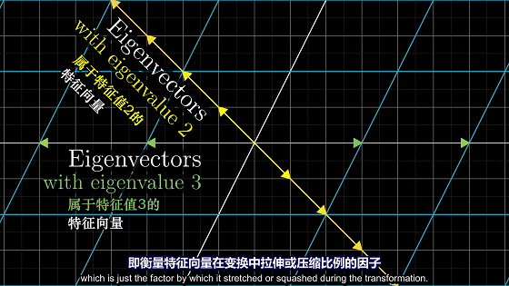
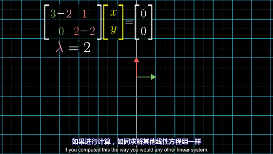
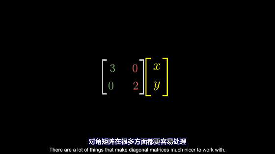

# 定义
## 特征向量
矩阵在空间变换过程中，没有发生旋转的向量。因此特征向量可以看过空间变换的旋转轴。
## 特征值
特征向量在变换中拉伸或压缩比例的因子

<!--more-->

# 计算
$\vec{v}$为特征向量，$\lambda $为特征值。求解如下所示：
$$\begin{align*}
A\vec{v}&=\lambda \vec{v} \\
A\vec{v}- \lambda \vec{v} &= \vec{0}\\
(A- \lambda I)\vec{v} &= \vec{0}
\end{align*}$$
存在一个非零向量 $\vec{v}$ 使得 $(A- \lambda I)\vec{v} = \vec{0}$ 则
$$det(A- \lambda I)=0$$
求出$\lambda $即特征值，带入特征值$\lambda $解得特征向量$\vec{v}$。

# 对角矩阵
对角矩阵的所有基向量都是特征向量
$$\begin{bmatrix}
-5 & 0 & 0 & 0\\
0 & -2 & 0 & 0\\
0 & 0 & -4 & 0\\
0 & 0 & 0 & 4
\end{bmatrix}$$
## 对角矩阵的优势

## 对角矩阵的使用
求出特征向量，利用基变换将原空间变换为以特征向量为基的空间，再利用基变换将以特征向量为基的空间变换为原空间
