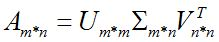

# 零向量
变换后落在原点的向量的集合被称为矩阵的‘零空间’或者‘核’。

- 零向量一定在列空间中
- 对于一个满秩变换来说，唯一能在变换后落在原点的就是零向量自身
- 对于一个非满秩的矩阵来说，它将空间压缩到一个更低的维度上，变换后的已给向量落在零向量上，而“零空间”正是这些向量所构成的空间

# 对角矩阵

在方阵中，对角线（从左上到右下）上的值称为对角元素。
非对角元素全部为0的矩阵称为对角矩阵。
对角矩阵表示的映射是沿着坐标轴伸缩，其中对角元素就是各坐标轴伸缩的倍率

# 矩阵的秩

矩阵的秩，为变换后的空间的维数

# 单位矩阵

方阵中，如果除了对角线（从左上到右下）上的元素为1，其余元素都为0，则该矩阵称为单位矩阵，记为 $I$ 。 $I_{n}$ 表示 $n$ 阶单位矩阵。**单位矩阵表示的映射是“什么都不做”的映射。**
$$I_{n}=\begin{bmatrix}
1 & 0 & \cdots  & 0\\
0 & 1 & \cdots  & 0\\
\vdots  & \vdots  & \ddots  & \vdots \\
0 & 0 & \cdots  & 1
\end{bmatrix}$$

# 奇异矩阵
行列式为零的矩阵

# 逆矩阵
$$AA^{-1}=A^{-1}A=I$$

# 零矩阵

所有元素都为0的矩阵称为零矩阵，记为 $O$ 。**零矩阵表示的映射是将所有的点都映射到原点的映射**

# 行列式

线性变换的行列式即线性变换改变面积的比例。
$$det(M_1M_2) = det(M_1)det(M_2)$$
-  检验一个矩阵的行列式是否为0，就能了解这个矩阵所代表的变换是否将空间压缩到更小的维度上
- 在三维空间下，行列式可以简单看作这个平行六面体的体积，行列式为0则意味着整个空间被压缩为零体积的东西，也就是一个平面或者一条直线，或者更极端情况下的一个点

# 特征分解

如果说一个向量 $v$ 是方阵 $A$ 的特征向量，将一定可以表示成下面的形式：
$$Av=\lambda v$$
$\lambda$ 为特征向量 $v$ 对应的特征值。特征值分解是将一个矩阵分解为如下形式：
$$A=Q\Sigma Q^{-1}$$
其中， $Q$ 是这个矩阵 $A$ 的特征向量组成的矩阵， $\Sigma$ 是一个对角矩阵，每一个对角线元素就是一个特征值，里面的特征值是由大到小排列的，这些特征值所对应的特征向量就是描述这个矩阵变化方向（从主要的变化到次要的变化排列）。也就是说矩阵A的信息可以由其特征值和特征向量表示。

对于矩阵为高维的情况下，那么这个矩阵就是高维空间下的一个线性变换。可以想象，这个变换也同样有很多的变换方向，我们通过特征值分解得到的前N个特征向量，那么就对应了这个矩阵最主要的N个变化方向。我们利用这前N个变化方向，就可以近似这个矩阵（变换）。

总结一下，特征值分解可以得到特征值与特征向量，特征值表示的是这个特征到底有多重要，而特征向量表示这个特征是什么。不过，特征值分解也有很多的局限，比如说变换的矩阵必须是方阵。

# 奇异值分解

特征值分解是一个提取矩阵特征很不错的方法，但是它只是对方阵而言的，在现实的世界中，我们看到的大部分矩阵都不是方阵，比如说有N个学生，每个学生有M科成绩，这样形成的一个 $N \ast  M $的矩阵就不可能是方阵，我们怎样才能描述这样普通的矩阵呢的重要特征呢？奇异值分解可以用来干这个事情，奇异值分解是一个能适用于任意的矩阵的一种分解的方法：

分解形式：

假设A是一个 $M*N$ 的矩阵，那么得到的U是一个$M\ast M$ 的方阵（称为左奇异向量），$Σ$ 是一个 $M\ast N$ 的矩阵（除了对角线的元素都是0，对角线上的元素称为奇异值），$V^T$ ($V$的转置)是一个 $N\ast N$ 的矩阵（称为右奇异向量）。

# LU分解
给定矩阵 $A$，将$A$表示成下三角矩阵L和上三角矩阵U的乘积，称为LU分解
