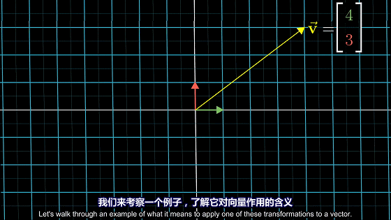
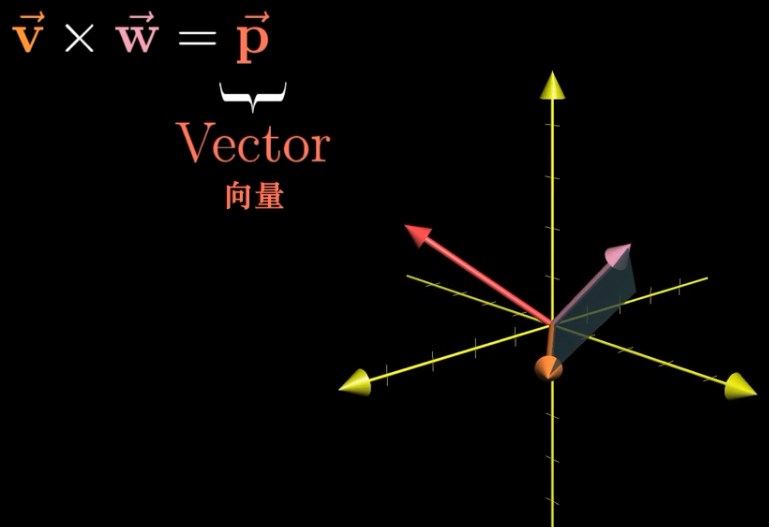
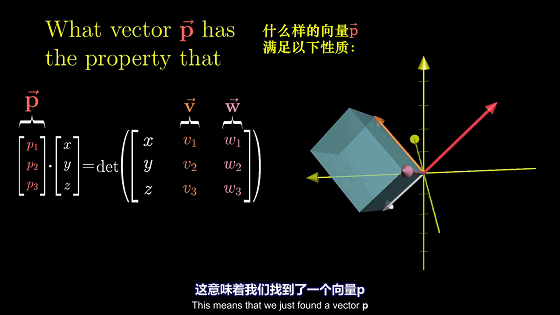
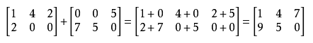
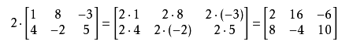
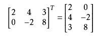
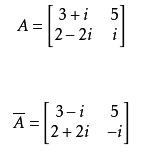
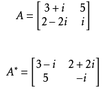

# 标量，向量，矩阵和张量
**标量（scalar）**：一个标量就是一个单独的数。用斜体表示标量，如 $s∈R$.

**向量（vector）**：一个向量是一列数，我们用粗体的小写名称表示向量。比如 $x$，将向量x 写成方括号包含的纵柱：
$${\bf x}=  \begin {bmatrix} x_1\\x_2\\ \vdots \\x_n\\ \end{bmatrix}$$

**矩阵（matrix）**：矩阵是二维数组，我们通常赋予矩阵粗体大写变量名称，比如 $A​$ 。如果一个矩阵高度是 $m​$，宽度是 $n$​，那么说 $\bf A\in \bf R ^{m \times n}​$​ 。一个矩阵可以表示如下：
$${\bf A}= \begin{bmatrix} x_{11} &x_{12}\\ x_{21} & x_{22}\\  \end{bmatrix}$$

**张量（tensor）**：某些情况下，我们会讨论不止维坐标的数组。如果一组数组中的元素分布在若干维坐标的规则网络中，就将其称为张量。用 $A$​ 表示，如张量中坐标为 $(i,j,k)$ ​的元素记作 $A_{i,j,k}$ ​。
**转置（transpose）**：矩阵的转置是以对角线为轴的镜像，这条从左上角到右下角的对角线称为主对角线（main diagonal）。将矩阵 $A$ 的转置表示为 $A^⊤$ 。定义如下：
$$({\bf A^\top})_{i,j}=\bf A_{j,i}$$
$${\bf A} = \begin{bmatrix} x_{11} &x_{12}\\ x_{21} & x_{22}\\ x_{31} & x_{32} \end{bmatrix} \implies {\bf A^\top}= \begin{bmatrix} x_{11} &x_{21}&x_{31} \\ x_{21} & x_{22}& x_{32} \end{bmatrix}$$

<!--more-->

# 向量运算

## 加法

设 $\overrightarrow{v}=\begin{bmatrix} 1 \\ 2 \end{bmatrix}$，$\overrightarrow{w}=\begin{bmatrix}3\\ -1\end{bmatrix}$则$ \overrightarrow{v}+\overrightarrow{w}=\begin{bmatrix}4\\ 1\end{bmatrix}$

## 数乘

设 $\overrightarrow{v}=\begin{bmatrix} 3 \\ 1 \end{bmatrix}$，则$2\overrightarrow{v}=\begin{bmatrix} 3\times 2 \\ 1\times 2 \end{bmatrix}=\begin{bmatrix} 6 \\ 2 \end{bmatrix}$

## 矩阵-向量的乘积

矩阵是空间的线性变换，矩阵与向量相乘便是将向量进行线性变换的结果。

$$A\overrightarrow{v}=\begin{bmatrix}
\overset{i}{1} & \overset{j}{3}\\
-2 & 0
\end{bmatrix}\begin{bmatrix}
-1\\
2
\end{bmatrix}=\begin{bmatrix}
-1\times 1+2\times 3\\
-1\times -2+2\times 0
\end{bmatrix}=\begin{bmatrix}
5\\
2
\end{bmatrix}$$

## 向量-向量的乘积

向量可以看成一个矩阵，这个矩阵将空间压缩到了一维空间。
$$\overrightarrow{w}\cdot \overrightarrow{v}=|\overrightarrow{w}|| \overrightarrow{v}|cos\theta =\begin{bmatrix}
1\\
-2
\end{bmatrix}\cdot\begin{bmatrix}
4\\
3
\end{bmatrix}=4\times 1+3\times (-2)=-2$$

向量$\overrightarrow{v}$在向量$\overrightarrow{w}$上的投影乘以向量$\overrightarrow{w}$的长度

## 向量的叉积
向量的叉积是一个向量，向量 $\overrightarrow{p}$ 的方向垂直于 $\overrightarrow{w}$ 与 $\overrightarrow{v}$ 的平面，向量 $\overrightarrow{p}$ 的模是 $\overrightarrow{w}$ 与 $\overrightarrow{v}$ 所围成平面的面积(行列式)。

$$\overrightarrow{w}\times  \overrightarrow{v}=|\overrightarrow{w}|| \overrightarrow{v}|sin\theta =\overrightarrow{p}$$

### 高维情况

$\overrightarrow{w}\times  \overrightarrow{v}=\overrightarrow{p}$则
$$\begin{align*}
p_1 &=v_2\cdot w_3-v_3\cdot w_2 \\
p_2 &=v_3\cdot w_1-v_1\cdot w_3  \\
p_3 &=v_1\cdot w_2-v_2\cdot w_1
\end{align*}$$

# 矩阵的运算
对向量的线性空间变换

## 矩阵加减法
对应位置的元素相加相减

## 矩阵数乘

## 矩阵转置
把矩阵A的行和列互相交换所产生的矩阵称为A的转置矩阵

## 矩阵共轭

## 矩阵共轭转置

## 矩阵-向量的乘积
矩阵是空间的线性变换，矩阵与向量相乘便是将向量进行线性变换的结果。
$$A\overrightarrow{v}=\begin{bmatrix}
\overset{i}{1} & \overset{j}{3}\\
-2 & 0
\end{bmatrix}\begin{bmatrix}
-1\\
2
\end{bmatrix}=\begin{bmatrix}
-1\times 1+2\times 3\\
-1\times -2+2\times 0
\end{bmatrix}=\begin{bmatrix}
5\\
2
\end{bmatrix}$$

## 矩阵-矩阵的乘积
矩阵是一种线性变换，矩阵与矩阵相乘便是将空间进行线性变换之后再次进行线性变换。矩阵与矩阵的乘积是一种对于空间的复合线性变换。变换吸纳从右侧开始一次向左侧进行变换。线性变换的过程如下图所示：

矩阵-矩阵的计算过程如下所示$$\begin{bmatrix}
0 & 2\\
1 & 0
\end{bmatrix}\begin{bmatrix}
1 & -2\\
1 & 0
\end{bmatrix}=\left\{\begin{matrix}1\times \begin{bmatrix}0\\ 1\end{bmatrix}+1\times \begin{bmatrix}2\\ 0\end{bmatrix} \\-2\times \begin{bmatrix}0\\ 1\end{bmatrix}+0\times \begin{bmatrix}2\\ 0\end{bmatrix}\end{matrix}\right.=\begin{bmatrix}
2 &0 \\
1 & -2
\end{bmatrix}$$
计算过程去下图所示

### 矩阵-矩阵乘积的性质
- 结合律即 $(AB)C = A(BC)$
- 分配率即 $A(B + C) = AB + AC$
- 注意哦，矩阵乘法没有交换律，即 $AB ≠BA$

## [矩阵的逆](/2017/08/17/矩阵的逆)
矩阵$A ∈ R^{n×n}$的逆,写作$A^{−1}$，是一个矩阵，并且是唯一的。是对矩阵$A$空间操作的逆变换。同时$AA^{−1}$也可以理解为矩阵$A$除以矩阵$A$ 等于单位矩阵$I$，$$A^{−1}A = I = AA^{−1}.$$

注意不是所有的矩阵都有逆。**例如非方阵，是没有逆的。然而，即便对于一些方阵，它仍有可能不存在逆。如果$A^{−1}$存在，我们称矩阵$A$ 是可逆的或非奇异的，如果不存在，则称矩阵$A$不可逆或奇异。如果一个方阵$A$有逆$A^{−1}$，它必须满秩**

## 矩阵的秩

**矩阵的秩实际上的经过矩阵操作后空间的维数**。在矩阵A中，非零子式的最高阶数称为矩阵A的秩，记为或秩。规定零矩阵的秩为零。

### 求解思路

$矩阵A\xrightarrow{初等行变换}阶梯形矩阵B。$则$r(A)=r(B)=$($B$中非零行的行数)
- 例子
-
求矩阵$$A=\begin{bmatrix}
2 &-3  &8  & 2\\
2 &12  &-2  & 12\\
1 &3  & 1 & 4
\end{bmatrix}$$的秩。

解：
$$A= \begin{bmatrix}
2 &-3  &8  & 2\\
2 &12  &-2  & 12\\
1 &3  & 1 & 4
\end{bmatrix}\rightarrow  \begin{bmatrix}
1 &3  &1  & 4\\
2 &-3  &8  & 2\\
2 &12  &-2  & 12
\end{bmatrix}\rightarrow  \begin{bmatrix}
1 &3  &1  & 4\\
0 &-9 &6  & -6\\
0 &6  &-6 & 4
\end{bmatrix}\rightarrow  \begin{bmatrix}
1 &3  &1  & 4\\
0 &3 &-2  &2\\
0 &0  &-0 & 0
\end{bmatrix}$$

因此$r(A)=2$
## 矩阵的迹
方阵$A ∈ R^{n×n}$的迹，记作$tr(A)$，或可以省略括号表示成$trA$，是矩阵的对角线元素之和:$$trA=\sum_{i=1}^{n}A_{ii}$$

- 性质
 1. 对于$A ∈ R^{n×n}， trA = trA^T .$
 1. 对于$A，B ∈ R^{n×n}， tr(A + B) = trA + trB.$
 1. 对于$A ∈ R^{n×n}， t ∈ R， tr(t\ast A) = t\ast trA.$
 1.对于方阵 $A,B,C，trABC = trBCA = trCAB$，即使有更多的矩阵相乘，这个性质也不变.

## 正交矩阵
如果$x^Ty = 0$，则两个向量 $x，y ∈ R^n$是正交的。对于一个向量$x ∈ R^n$，如果 $|x|=1$ 则是 $x$ 归一化的。对于一个方阵$U ∈ R^{n×n}$，如果所有列都是彼此正交和归一化的，（列就称为标准正交）则这个方阵是正交的（注意在讨论向量或矩阵时，正交具有不同的含义）。 根据正交和归一化的定义可得：

$$U^T U = I = UU^T$$

一个正交矩阵的逆矩阵的是它转置,正交矩阵必须是方阵
