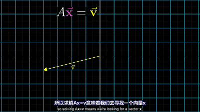
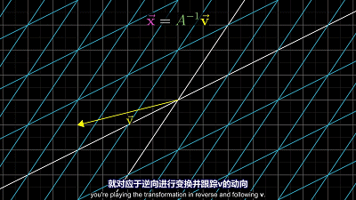
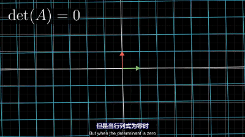
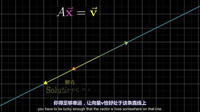

$$\begin{align*}
2x+5y+3z &= -3\\
4x+8z &= 0\\
x+3y &= 2
\end{align*}\Leftrightarrow \overset{A}{\overbrace{\begin{bmatrix}
2 & 5 & 3\\
4 & 0 & 8\\
1 & 3 & 0
\end{bmatrix}}}\overset{\overrightarrow{x}}{\overbrace{\begin{bmatrix}
x\\
y\\
z
\end{bmatrix}}}=\overset{\overrightarrow{v}}{\overbrace{\begin{bmatrix}
-3\\
0\\
2
\end{bmatrix}}}$$
$$A\overrightarrow{x}=\overrightarrow{v}$$

可以看做向量 $\overrightarrow{x}$ 经过空间变换后变为向量 $\overrightarrow{v}$ ，矩阵 $A$ 的变换过程有两种情况
1. 空间变换之后，空间没有发生压缩。即$det(A)\neq0$ ，矩阵 $A$ 满秩
2. 空间变换之后，空间发生压缩，即$det(A)=0$ ，矩阵 $A$ 不是满秩

<!--more-->

# 空间变换之后，空间没有发生压缩
空间变换之后，空间没有发生压缩。即 $det(A)\neq0$ ，矩阵 $A$ 满秩。
$$\begin{align*}
A\overrightarrow{x}&=\overrightarrow{v} \\
\overrightarrow{x} &= A^{-1}\overrightarrow{v}
\end{align*}$$

# 空间变换之后，空间发生压缩
空间变换之后，空间发生压缩，即 $det(A)=0$ ，矩阵A不是满秩。此时你不能通过矩阵的逆变换将空间从一个低维状态复原到高维状态（即原空间）。

此时方程的解如下，当 $\overrightarrow{v}$ 在压缩的平面上方程有解，此时方程组可能有无穷个解；当 $\overrightarrow{v}$ 不在压缩的平面上方程无解

