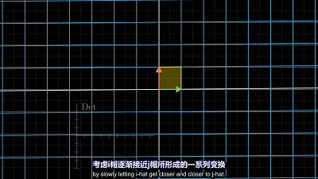
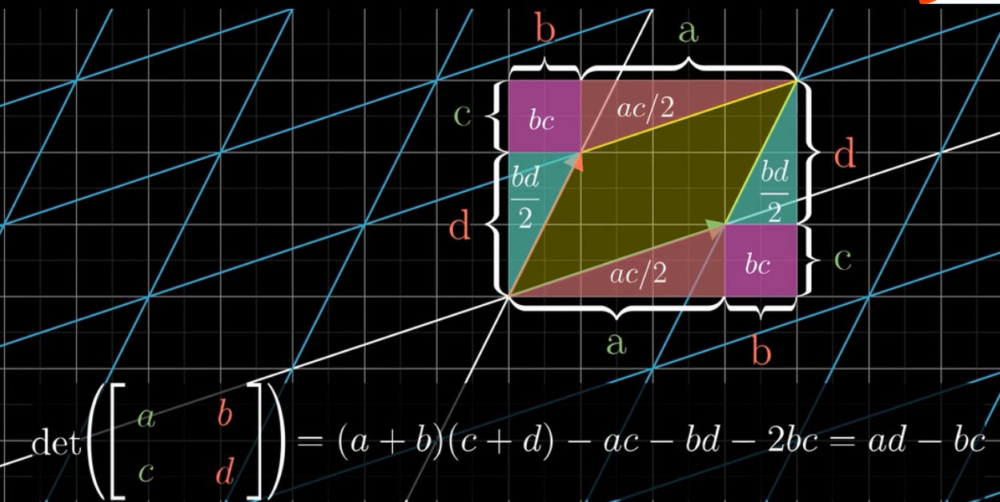
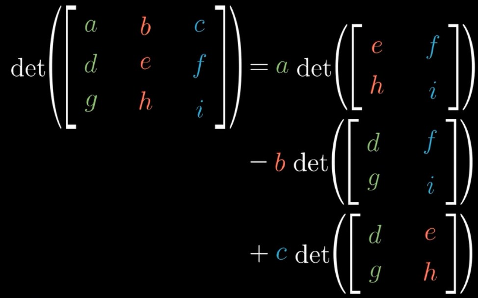
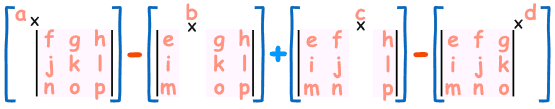
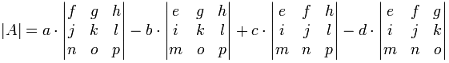

# 行列式
行列式在数学中，是一个函数，其定义域为det的矩阵A，取值为一个标量，写作$det(A)$或 $| A |$。对于行列式的几何描述如下所示：
1. 行列式求得是矩阵的面积。
1. 行列式等于0时候，说明矩阵的空间操作把空间压缩为低维空间
1. 行列式为负数的时候，说明空间发生了翻转
1. 方阵特征值之积等于行列式值也可以如下这样理解

<!--more-->

## 行列式的计算

