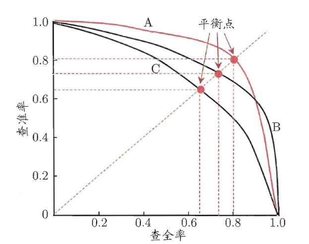
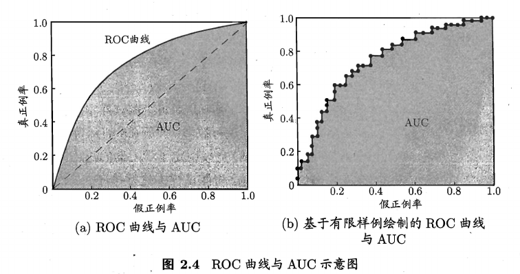
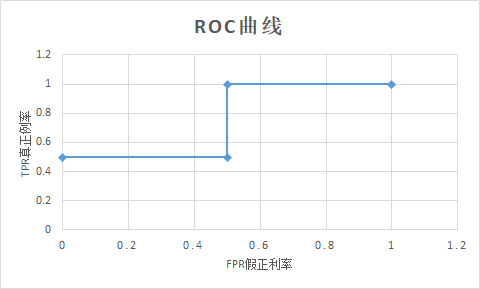
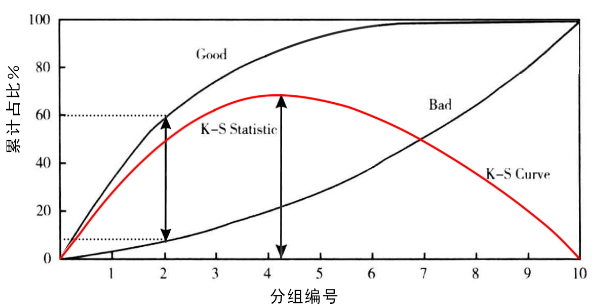

| 真实类别 | 预测为正例 | 预测为反例 |
| :------: | :--------: | :--------: |
|   正例   | TP(真正例) | FN(假反例) |
|   反例   | FP(假正例) | TN(真反例) |

<!--more-->

# 准确率、错误率、召回率、查准率

| 名称                         | 公式                        | 说明                                                   |
| ---------------------------- | --------------------------- | ------------------------------------------------------ |
| 准确率（$Accuracy$）         | $\frac{TP+TN}{TP+TN+FP+FN}$ | 预测正确的比例                                         |
| 错误率（$Error$）            | $\frac{FP+FN}{TP+TN+FP+FN}$ | 预测错误的比例                                         |
| 召回率/查全率（$Recall$）    | $\frac {TP}{TP+FN}$         | 真正例被预测正确的比例。有多少好瓜被选出来             |
| 精确率/查准率（$Precision$） | $\frac{TP}{TP+FP}$          | 预测为正例中正确的比例。预测为的好瓜的类别中有多少好瓜 |

# P-R曲线、F1指数

一般来说， 查准率高的时候，召回率偏低；召回率高的时候，查准率往往降低。以西瓜问题为例：查准率指的是所有预测为好瓜的西瓜中，真正的好瓜所占的比例；召回率指的是真正的好瓜中，有多少好瓜被挑出来了。如果所有西瓜都预测为好瓜则召回率为1，但是查准率就会降低因为所有坏瓜也预测为了好瓜。

## P-R曲线

以查准率P为纵轴，召回率R为横轴作图，就得到了查准率-召回率曲线，称为“P-R曲线”。

 
$$
y轴-查准率（精确率）P = \frac {TP} {TP+FP} \\ 
x轴-查全率（召回率）R = \frac {TP} {TP+FN}
$$
在比较两个模型的性能时，**如果一个学习器的P-R曲线被另外一个学习器P-R曲线包住，那么后者的性能优于前者（此时后者的查全率跟查准率都高于前者）**，如上图，A的性能优于C，B的性能也优于C；如果两个学习器的曲线有交叉点（如A和B），那么难以断定两个学习器性能的优劣，只能在具体的查准率或者查全率条件下进行比较。

## 平衡点

如果两个学习器的P-R曲线有交叉点（如A和B），那么通过平衡点或者F1度量断定两个学习器性能的优劣 
**平衡点**(Break-Even Point，简称BEP)指得是“P=R”时候的取值，如上图，C的的BEP是0.64,。基于BEP的比较，可以认为学习器A优于B。

## F1指数

如果两个学习器的P-R曲线有交叉点（如A和B），那么通过平衡点或者F1指数断定两个学习器性能的优劣。BEP过于简单，更常用的是F1指数。F1指数实际为查准率和召回率的调和平均数。例如小明跑步10公里，前面5公里用了1小时，后面5公里用了2小时，其平均速度为$\frac{10}{v}=(\frac {5}{1}+ \frac {5}{2})$
$$
\frac 1 {F1} =\frac 1 2 (\frac 1{P}+\frac 1 R)
$$

## $F_\beta$指数

对于特定的应用场景，查准率和查全率的重视度是不一样的。例如在追捕逃犯时，希望尽可能的不遗漏逃犯，因此查全率较为重要；而在搜索引擎的搜索过程中，希望给用户精准的搜索信息，因此查准率更为重要。F1度量的更一般形式——$F_β$，修改了路程 
$$
\frac{1}{F_\beta }=\frac{1}{1+\beta ^2}(\frac{1}{P}+\frac{\beta ^2}{R})\\
$$
$β=R/P$ ，其中$β$值越大召回率越重要，$β$值越小查准率越重要。$β$值为两者重要性的比例

# G-mean指数

G-mean是正例准确率与负例准确率的综合指标。**与F1的比较**：在数据平衡度不是很大的情况下，F1和G-mean可以作为较好的评测指标，但是当训练样本很不平衡时，F1更好。
$$
G - mean = \sqrt{\frac {TP}{TP+FN}\times \frac {TN}{TN+FP}} = \sqrt {查全率（召回率）真正例率 \times 真负例率}
$$

# ROC曲线与AUC

## ROC曲线

$$
y轴-真正例率 TPR = \frac {TP}{TP+FN} \\
x轴-假正例率 FPR = \frac {FP}{TN+FP}
$$
真正例率指的是真实正例中有多少被预测为正例，假正例率指的是真实反例中有多少被预测为正例。**可以看出TPR和Recall的形式是一样的，就是查全率了，FPR就是保证这样的查全率你所要付出的代价，就是把多少负样本也分成了正的了。**如果所有西瓜都预测为好瓜则查全率为1，但是假正例率也会升高因为所有坏瓜也预测为了好瓜。

### 举例计算

假设有4个样本，样本的标签分别为 $0,1,0,1$；模型的预测概率分别为$0.1,0.35,0.4,0.8$；

| label | 0    | 1    | 0    | 1    |
| ----- | ---- | ---- | ---- | ---- |
| pred  | 0.1  | 0.35 | 0.4  | 0.8  |
| 阈值  | 0.1  | 0.35 | 0.4  | 0.8  |

那么在阈值分别取$0.1, 0.35, 0.4, 0.8$的时候。分别判断出每个`pred`是`TP/FP/TN/FP`中的哪个，进而得出当前阈值下的`TPR`和`FPR`，也就是`(FPR, TPR)`这一ROC曲线图上的点；对于所有阈值都计算相应的`(FPR, TPR)`,则得到完整的ROC曲线上的几个关键点。

| 阈值 | 样本1 | 样本2 | 样本3 | 样本4 | $TPR=\frac {TP}{TP+FN}$ | $FPR\frac {FP}{TN+FP}$ |
| ---- | ----- | ----- | ----- | ----- | ----------------------- | ---------------------- |
| 0.1  | FP    | TP    | FP    | TP    | $\frac{2}{2+0}=1$       | $\frac{2}{0+2}=1$      |
| 0.35 | TN    | TP    | FP    | TP    | $\frac{2}{2+0}= 1 $     | $\frac{1}{1+1}=0.5$    |
| 0.4  | TN    | FN    | FP    | TP    | $\frac{1}{1+1}=0.5$     | $\frac{1}{1+1}=0.5 $   |
| 0.8  | TN    | FN    | TN    | TP    | $\frac {1} {1+1}=0.5$   | 0                      |

## AUC指数

AUC：**ROC曲线的线下面积。**与P-R曲线类似，如果学习器A的ROC曲线被学习器B完全“包住”，那么后者性能优于前者（相同的假正例率，其真正例率更高）。但是当两个曲线有交点时，则需要比较曲线下的面积AUC(Area Under ROC Curve)。

# k-s指标

K-S(Kolmogorov-Smirnov)统计量越大，表示模型能够将正、负客户区分开的程度越大。KS值的取值范围是[0，1] 

## ks曲线
$$
TPR = TP/(TP+FN) \\
FPR = FP/(FP+TN)
$$
洛伦兹线：两条线，其横轴是模型评分的阈值，纵轴是$TPR$（真正类率）与$FPR$（假正类率）的值

K-S曲线：洛伦兹线中两条线的差值（$TPR-FPR$），值范围[0，1] 。

我们用一个风控模型预测一个人是好人的概率，图中黑线的洛伦兹线（$TPR$与$FPR$）、红线的ks曲线。横坐标是模型评分的阈值，当阈值为0时，所有的用户被预测为坏用户，$TPR=FPR=0$；当阈值为1时，所有用户被预测为好用户，$TPR=FPR=1$。

这两条曲线之间的差值（$TPR-FPR$），就是K-S曲线。如图所示，给定一个通过率20%（拒绝率80%），则该模型可以挑出来60%的好人，同时漏进来8%的坏人（92%的坏人都被拒绝掉了）。那么K-S曲线在这个通过率上的值，就是60%-8%=0.52。

## K-S统计量

K-S曲线中的最大值被称为K-S统计量。其取值在0到1之间。如果是随机抽样，好人的洛伦兹曲线跟坏人的是重合的，K-S统计量为0。而最理想的风控模型，好人和坏人完全分开，K-S统计量的值为1。

